# 子連れコモドダイビングクルーズagain　その20　南エリアのヤマ場！

📅 投稿日時: 2011-09-18 02:27:00

🏷️ カテゴリ: [ダイビング日記](ce3a7a8d424d112fce83ee85c81a0e344.md)

で．

食っちゃ寝…ならぬ，食っちゃ潜りのダイビングクルーズ生活ですから．

朝ごはんを食べたら，今度は今日2本目のダイビング．

本日2本目は．

南エリアの目玉ポイント，「Carnival Rock」です．

このポイント．私は好きです．

透明度はあんまり良くないけど，ソフトコーラルがカラフルで．

小物もいっぱいいて（私はあんまり撮らないけど），

魚影が濃くて…

この1本だけ，ガイドはメインガイドのK澤さん．

併走する船と，ガイドを入れ替えて臨みます．

…なんだか．

ブリーフィングに使うホワイトボードの書き込み量が，

なんだか他のガイドと違うんですけど．

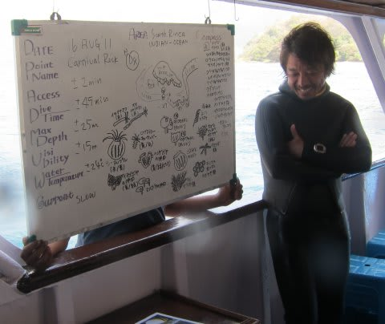

で．娘は．

今回も，ダイビング前に一人DVDを見ていたので．

リンダさんにあとをお願いして，両親はそっとダイビングデッキに消えたのですが…

泣き声も聞こえず，無事ブリーフィング終了．

うん．大丈夫だったみたい．

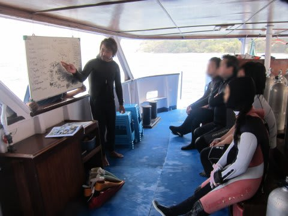

というわけで，このダイビングも夫婦そろって，いってきま～す．

あー．

さすが，南エリアの目玉ポイント．

カラフルですねぇ．

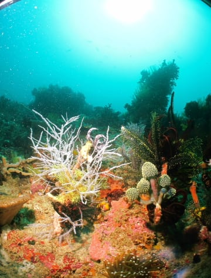

んで，ここでしか見られない「キノコカイメン」

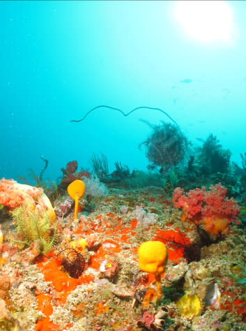

あー．この，棒の先に丸いのがついたオレンジの奴ですね．

普通は深度200mとかにいるらしく，ダイビングでは

ここでしかみれないそうで…

クダゴンベ．

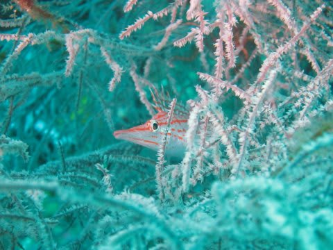

カエルアンコウ．

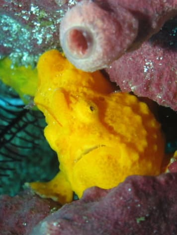

こうやってみると，ちょっと怖い顔してるなぁ．

しかし．

南エリアにしては透明度が良かったですかね…ところによって，20mは見えてた感じ．

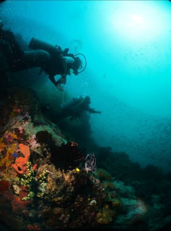

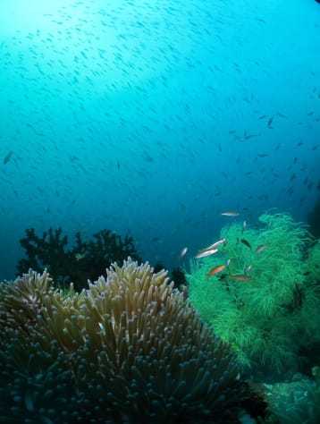

頭上には，

ずっと魚の群れがついて来てます

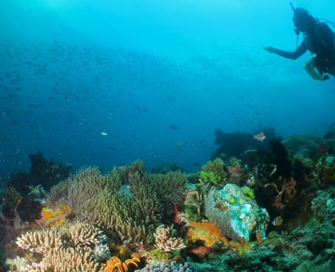

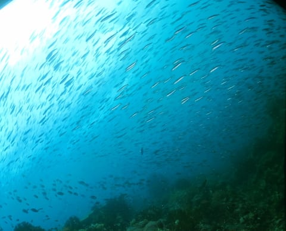

でも．透明度はいいけど水温は24度．

さすが南エリア．ちょっと寒い…

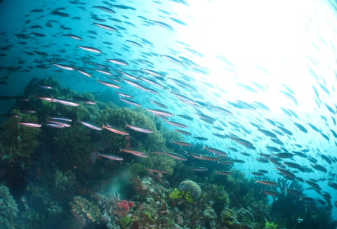

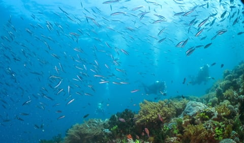

クマザサハナムロの群れが，川のように連なってましたね～．

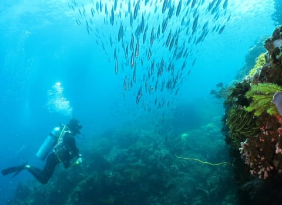

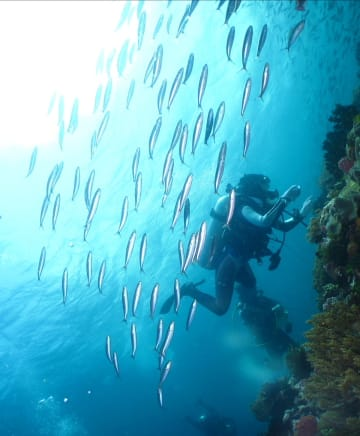

最後は浅瀬で安全停止．

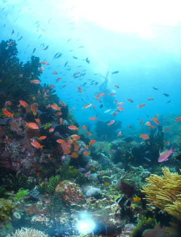

いやいや．

さすが南エリアの目玉ポイント．

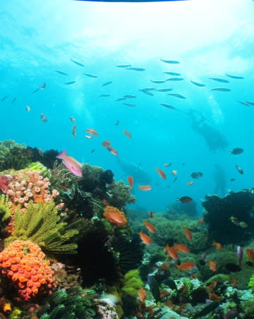

満喫して，エグジット．

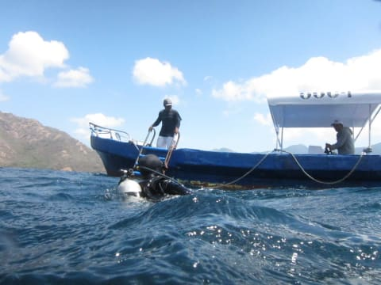

本船に戻ると．

娘は，ボートスタッフにかわいがられていました．

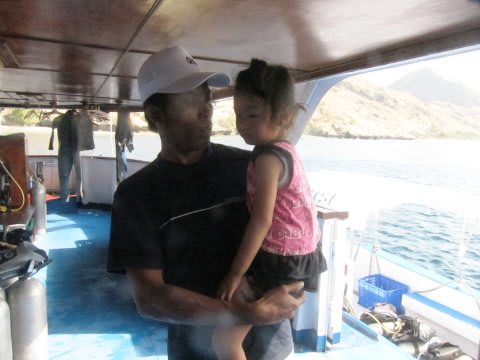

ボートスタッフ，子供好きなんだなぁ．

両親のダイビング中，娘も退屈せずに過ごせたようです…

いやー．

3歳児の子連れダイビングクルーズで，

夫婦揃ってこんなに潜れて良いんだろうか？？
