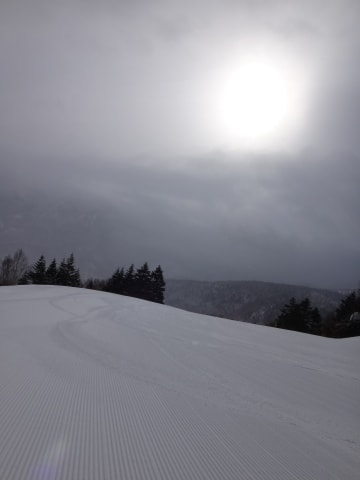

# 3月1日の志賀高原，速報モード…雨にはならなかったけど…強風の一日

📅 投稿日時: 2015-03-02 01:32:19

…今日も帰宅が遅く．

そのうえ，帰宅してからエッジを研いでワクシングして…

とかやっていたら，こんな時間に…

いや，今日はほぼ一日，アイスバーンを滑りつづけてたので．

ちょっとエッジを研いどかないと…と，ついつい…

んだもんで．

今日も速報モードで…

えー．

予想では昼頃から強まると思っていた風ですが．

なんだか，朝イチから，結構強い風が吹き．

な，なんと！！！

朝から，第1，第2ゴンドラともに運休っ！？？

なんて日だ…（激烈な涙）．

涙をぬぐいつつ，第2高速リフトでゲレンデに出てみると…

薄日が差し，バーンはしっかり締まった，

ちょうどい感じのシマシマバーン！

こ，これでゴンドラさえ動いていれば…

さぁ．

気を取り直して気持ちいいシマシマを滑るぞ！

と，思っていたら．

ゴンドラが動いてない焼額は，リフトがかなり混んだので（涙）．

気持ちよいバーンを後にして，一の瀬へ脱出…

一の瀬ファミリーのメインバーンは，

アイスバーンとモサモサのまだらで

滑りにくかった…（泣）．

でも．

寺子屋も東館も朝から強風で動いてなくて，

午後からは一の瀬ダイヤモンドも西館フードクワッドも

次々止まっていくという状況で（涙）．

…まともに滑れるのって，一の瀬ファミリーと高天くらいか…

なので．

一の瀬ファミリーをぐるぐるしてましたが．

午前中からチラチラ降り続いていた雪は．

昼過ぎから，かなり強くなり…

夕方3時過ぎからは，強風に吹き付けられるように，

すごい勢いで降り始めて．

すごい強風＆雪の中，アイスバーン＆もさもさミックスを滑り続けるという．

「…これって，何かの修行？？」

って感じの一日だったのでした…

…でも．

せめてもの救いは．

降ったのは，一日中雪で．

雨にならなかった，ってことかな～．

また，詳細レポートは明日に…（かなり疲れてる）

## 💬 コメント一覧

### 💬 コメント by (すぎぃ)
**タイトル**: Unknown
**投稿日**: 2015-03-02 12:03:08

＞なんて日だ…（激烈な涙）．

またまた笑ってしまいました。

なんて日だ(朝から，第1，第2ゴンドラともに×）

今日はなんて日だ(寺子屋も東館も朝から×）

 今日はいったいなんて日だ(午後からは一の瀬

ダイヤモンドも西館フードクワッドも×)

夕方3時過ぎからの猛吹雪＆アイスバーン＆

もさもさミックス修行滑走本当に

お疲れーライスでした。

### 💬 コメント by (はなげ親分)
**タイトル**: 修行僧
**投稿日**: 2015-03-02 17:38:41

S様だけではありません。

土曜日は出勤のため、北の空を遠く眺めながら日曜日に思いを馳せてお祈りを捧げておりました。

なのに～っ!! 

志賀高原日帰りをあきらめて、エコーバレーに到着したときには、すでに強風と水っぽい雪の競演でした。そして雲の中に居るような真っ白の世界。

幸い最上部のクワッドリフトは減速せ

ず運行していましたが、氷のつぶてとの戦いでした。

撤収時の16:00頃も強風は止むこともなく吹き荒れていました。

ずぶ濡れのウェアを脱ぎながら、

「誰だ～！心がけの悪いヤツは～!!」

と、心の中で叫びながらグショグショに濡れたパンツの上にズボンを履いていた私がいました。

### 💬 コメント by (Skier_S)
**タイトル**: 修行な一日
**投稿日**: 2015-03-03 02:50:01

＞すぎぃさま

狙ってしまいました（笑）．

もう，今日はなんて日だ…って一日だったので（＾＾；

でも，このセリフを使わなくて済むコンディションで

あってほしいものです…

＞はなげ親分さま

あー．

エコーバレー，かなりのウェットな雪でしたか…

志賀は，多少気温が高めだったものの．

びしょびしょになるほどでもなかったので…

これは，きっと．

日ごろの行いの差でしょうかっ！？←行ったスキー場の違いだけだって

