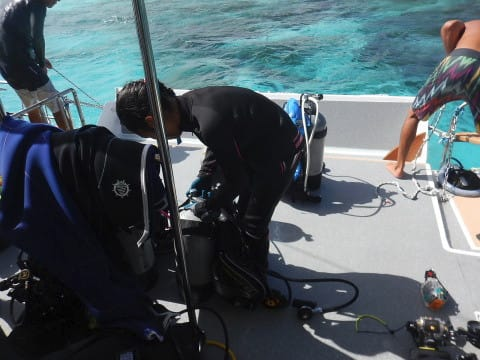
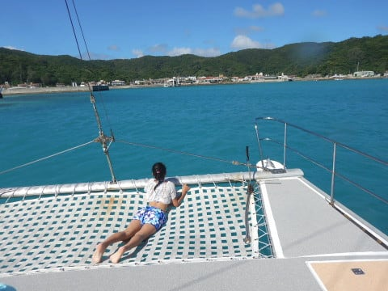
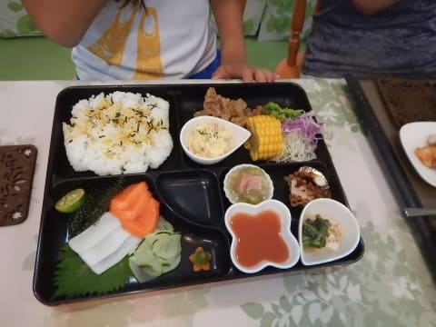

# 2018年8月，子連れ座間味で小5の娘とファンダイビング！その6…ダイビング初日は1本だけで終了（涙）

📅 投稿日時: 2019-09-06 01:12:49

ということで．

座間味での1本目のダイビングが終了しましたが…

フェリーで座間味到着が昼過ぎだった本日．

午後1本潜っただけで，本日のダイビングは

終了です（涙）

あぁ…

ホントなら，高速船で朝10時ごろには

座間味に着いて，午前から潜っていた

はずなのに…

…

でも．

まぁ．

昨日の段階では，海が荒れて座間味に

渡れないかもと思ってたんだから．

座間味に渡れて潜れただけ，

良かったということにしておこう…

ってなことで．

器材を片づけたら．

ボート常備のシークヮーサージュースを

飲んで，くつろぐ娘…

ジュースを飲んだら，

ウェットスーツも脱いで．

いつもの特等席へ！

…しかし．

慶良間諸島の内海は穏やかで．

天気も良く．

ホントに今日，フェリーが出航するかどうか

ギリギリの海況には見えませんね…

ってことで．

穏やかな海を走り．

ボートは午後3時半ごろ，

港に戻ってきました．

港に着いたら．

いつものこんな道を歩いて，

港からすぐのペンション星砂さんに

戻り…

宿の器材洗いスペースで，ウエットスーツやら

水中カメラやらを洗います．

器材はボートに置きっぱなしなので，

洗うのはスーツとブーツ，カメラのみ．

そして，

シャワーブースで塩水を洗い流し，

さっぱりしたら…

夕食までまだ2時間近くありますね…

では，座間味の町中をお散歩に

出かけますか…！

いつもの105ストア前で，

猫を見つけた娘．

猫好きの娘は，すかさず

かわいがってますが…

えらく危機意識に欠けるネコさんの

ようで，全然逃げません．

そのあとは，海辺をぶらついたりして…

夕日が暮れるまで，のんびり過ごして．

宿に戻ったら，夕食タイム！

星砂さんの夕食，お皿が大きいから

写真で見ると，量が少なく見えますが，

実際はかなりのボリューム！

子供用の娘の料理も，

大人に負けない，かなりの

ボリュームです…

とりあえず．

無事本日座間味に渡り，

ダイビングができたことに乾杯して．

夕食を食べたあと，夜9時ごろには

寝てしまったのでした…

## 💬 コメント一覧

### 💬 コメント by (おおすぎ)
**タイトル**: Unknown
**投稿日**: 2019-09-09 15:15:10

お久しぶりです。

わたしは、夏のスキューバー日記も楽しみにしていますよ！

昨年の様子でも、うちにとっては参考になることばかりで大変ありがたいです（娘が１つ違いなんで・・・）

うちの方は、生憎今夏台風に睨まれ、2つも食らってしまい、海はおろか宿から１歩も出られませんでした（トホホ）

また（シュノーケルですが）来年チャレンジで・・・

でもS様の”継続は力なり”を実践されているのにホント頭が下がります・・・

綺麗なお写真を見ながら、懐かしんでおりました。

### 💬 コメント by (Skier_S)
**タイトル**: ＞おおすぎさま
**投稿日**: 2019-09-10 01:41:59

お久しぶりです～！

ダイビング旅行記，楽しみにしてくださっているようで

嬉しいです…

スキーネタと違って，コメントも少ないですし，

明らかにアクセス数が違うので(涙）．

しかし，今年の夏は残念でしたね…

台風2連発ですか…

また来年リベンジしてください～！

