# 2014年9月　3連休，子連れ石垣ダイビング　その2

📅 投稿日時: 2014-11-05 02:40:58

🏷️ カテゴリ: [ダイビング日記](ce3a7a8d424d112fce83ee85c81a0e344.md)

なんだか…

せっかくの3連休だというのに．

全くスキーに行かなかった，この週末．

…だめだ．

あと4日間，仕事に耐えられるのか…

とりあえず．

今週はスキーネタが無いので．

ダイビング日記へ，Go!

---

って感じで．

那覇に前泊した，次の朝．

朝7:45の朝イチ便で石垣に向かうため．

朝6時半にホテルを出て…

モノレールに乗って，空港へ向かいます．

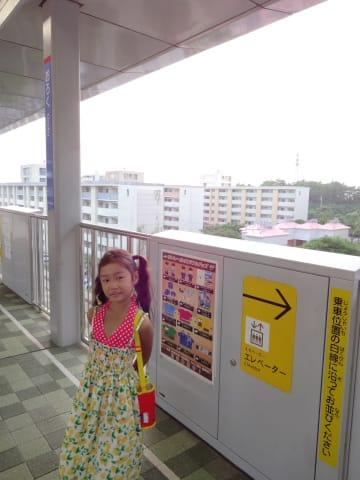

で．

7時半には，飛行機に搭乗！

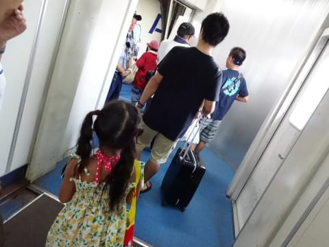

もう，あれですね．

娘にとって，1時間もかからない那覇ー石垣便なんて．

飛行機に乗っているうちに入らない感じですか…

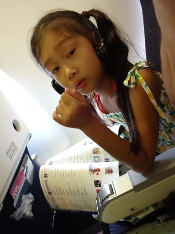

ってことで．

朝の8:35には，石垣島に到着！

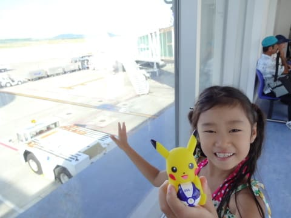

「到着後，すぐボートに向かうので，

　水着を着て，荷物も船に積む器材類とそれ以外で

　分けておいてください！」

と，言われていたくらいなので．

もう，空港を出たすぐに，

「待ってました」とばかりに，

ダイビングショップの人が迎えに来ていて…

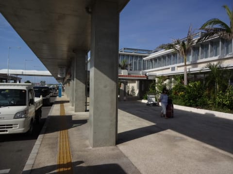

ただちに港へ連れて行かれます…

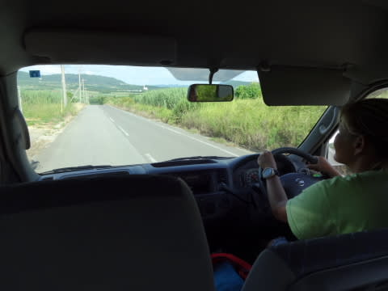

…新しくなった石垣空港，初めて利用したけど．

やっぱり，街中からちょっと遠くなったな～．

んで．

港に着いたら．

我々の到着を待っていたボートに，わらわらと

ダイビング器材が積み込まれ…

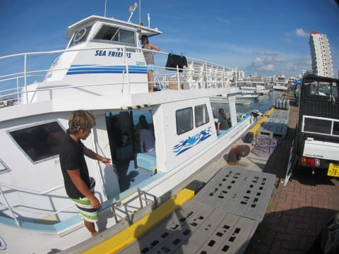

自分たちが乗り込んだら．

あわただしく出航！

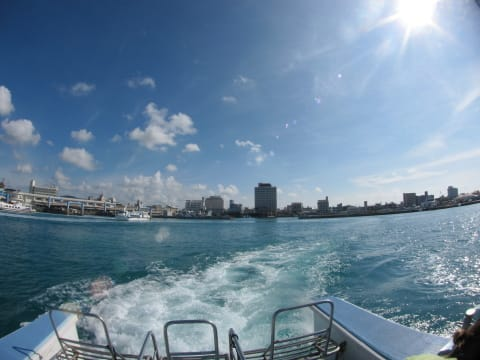

…今回のダイブショップは．

石垣でも数少ない，子連れ乗船をOKしてくれた

ショップで．

船も大きめで，船の上でも窮屈せずに過ごせそう…

と，選んだ，シーフレンドさん．

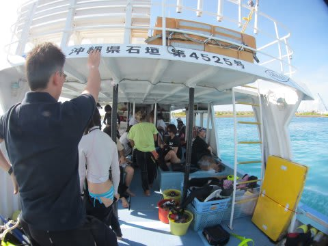

さすが3連休なので，ちょっと混んでますが．

船はそこそこ大きいですね～．

天気は晴天！

海はべたなぎ！

絶好のダイビング日和で．

船の上から，きれいな海の色が見えます…

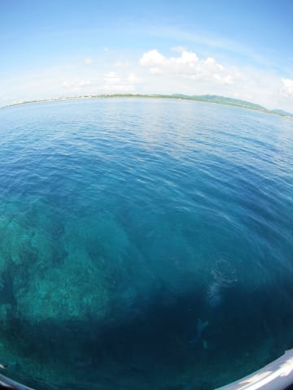

ってことで．

港を出ること，約20分．

石垣の南エリアのダイビングポイントへ到着したようです．

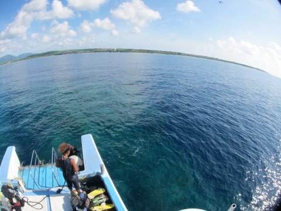

…

ふむ．

まずは，島の南側エリアでのダイビングですな．
