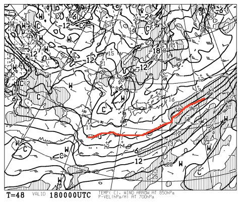
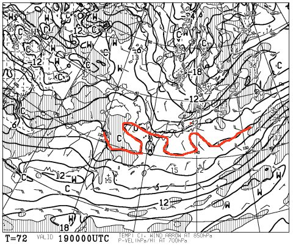
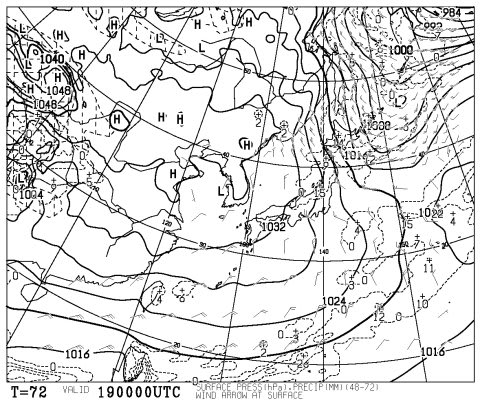
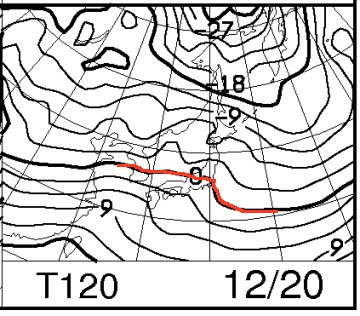
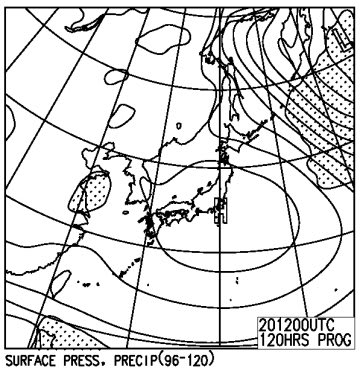

# 今週末の志賀高原の天気は…ようやく雪の気配…！

📅 投稿日時: 2015-12-17 01:47:28

🏷️ カテゴリ: [スキー天気予想](c6554f5c3c106093b511a8daae23757e8.md)

えー．

この土曜日朝に，雪が降って以来．

しばらく雨が続き，またゲレンデが壊滅状態に

なりつつある，今日この頃ですが…（涙）．

でも．

本日昼過ぎから，ようやっと雪が降り始めたようで…

17日は，かなり冷えた雪降りの一日になりそう！

…そして．

18日の金曜日も．

850hpa予想図を見ると…

をを！？？

赤くマークした，850hpaの0℃線．

今年最も南下してるんじゃないかな！？？

金曜も，朝は-7～8℃といった感じの冷え込みになりそう！

…ただ．

18日は，それほど雪が降らなさそうかな…（残念）．

でも．

昼間も人工雪がガンガン打てるほど，しっかり冷え込むので，

ゲレンデ状況は一気に回復するはずなのだ！

木曜17日から，天然雪+人工雪で，少なくとも人工降雪機が

あるバーンは，かなり雪が回復するはずなのだ！！

そして，19日の土曜日ですが．

この日も，850hpa天気図はこんな感じで，

0℃線は変な形してるけど，大体日本より南まで下がってくれて．

ふむ．

この日の朝も，志賀高原はしっかり冷え込みますね！

で，この日の地上天気図は…

をを！

志賀高原近辺，久しぶりの縦縞天気図！

…これは…

土曜は一日，冷えた雪降りの日になりそうです！

そして，20日，日曜の850hpa気温を見てみると…

うーむ．

0℃線はちょっと北上するけど，志賀高原はぎりぎり0℃以下．

そして，日曜の地上天気図を見ると…

ふむ．

日本全域，すっぽり高気圧に覆われるので，

すっきり晴れそうな感じ！

土曜に雪が降ったあと，晴天の日曜になってくれれば…

日曜は，結構いいかも？？

ってことで．

まとめると．

土曜：朝から雪．道路はしっかり積雪があるのでご注意を．

　終日雪がチラチラ，時々強く降る感じで，太陽は拝めず．

　昼間も気温はそんなに上がらず，ようやっと冬らしい天気に…

　ゲレンデは，先日までに積もった天然雪が圧雪された，

　柔らかいコンディション．

　雪が終日積もり続けるので，午後にはゲレンデは

　ちょっと荒れちゃうかな？

日曜：早朝まで雪が降っているけど，朝には晴れてそう．

　前日から積雪があり，朝に晴れるといういいパターンになりそう！

　ゲレンデは，柔らかい新雪がきれいに圧雪された，

　トップシーズンのバーン状況に！

　…雪が止むタイミングが遅いと，圧雪の上に数cmの

　新雪が乗ってるかも．

　この日は基本的に晴れ．

　気温も終日マイナスキープで，冷え冷えってほどではないけど

　雪は溶けず，いいコンディションをキープ．

　この日も雪が柔らかいので，午後遅くはちょっとコースが

　凸凹してくるだろうけど…

　でも，いい感じの日曜になりそう！

うーむ．

木，金の積雪次第では．

上手くいけば，日曜には焼額第2ゴンドラ動くんじゃないかな？

と，期待…

久しぶりに，冷えた週末になりそう！

「木，金は冷えたけど，積雪があんまりなかった！」

とかいうことにならないよう．

とりあえず，祈っておきます…

…焼額のゴンドラ，動きますように…
