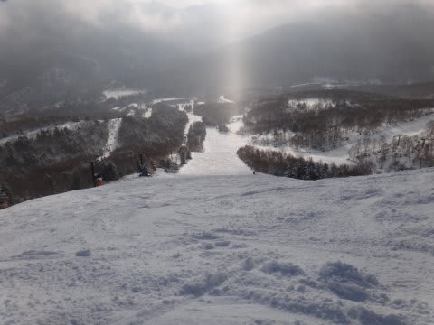
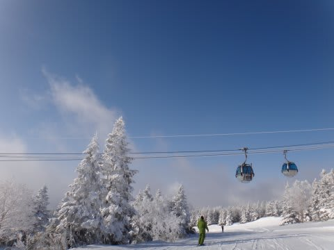
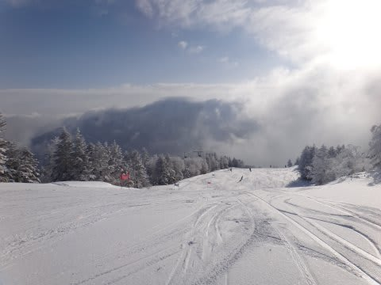
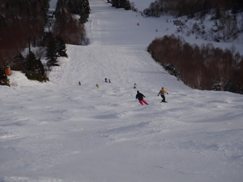

# 天気予報また外した…12月23日，3連休中日の志賀高原は晴れ！

📅 投稿日時: 2012-12-23 17:27:19

とりあえず．

22日一晩雪で，パウダー祭りかも…

って言ったのはまぁ当たって．

志賀高原，朝は20cmくらいのパウダーだったみたいで．．．

パウダー祭りってほどではなかったですが（汗）．

非圧雪コースでこんな感じ．

で．

朝まで降ってたらしいんですが…

日中は．

すっきり晴れました．

ほぼ一日，晴れました．

本来，北風だった予報が，

北アルプスに見事に雪雲がブロックされる西風に回ってしまい．

昼間は，晴れましたっ！

外れたっ！

…でも，良かった．

雪質は，冷えたパウダー．

気温も，昼間で山頂がマイナス3度程度だったので．

そこそこの冷え．

雪質はまーまー良かったです．

斜度があるところは，上の柔らかい雪が

削れて下地のアイスバーンが出てましたが…

(これは非圧雪だったオリンピックコース） 

ゴンドラ待ちは，そこそこ．

最長5分，最短0，という感じで．

そろそろ人も増えてきましたね～．

という感じで．

本日の志賀，速報でした．

## 💬 コメント一覧

### 💬 コメント by (雪上の翁)
**タイトル**: 天気良かったですね
**投稿日**: 2012-12-24 21:48:56

こんばんは。

私も昨日滑ってました～(^^;;

まさに焼額山にいました。

寒くもなく暑くもなく、穏やかなスキー日和でしたよね。

### 💬 コメント by (Skier_S)
**タイトル**: またいらっしゃいましたか…
**投稿日**: 2012-12-24 22:50:14

おや．

また焼額にいらっしゃいましたか…

この日は天気予報がいい方向に外れてよかったですよね．

私はウェアを3着ほど持っており，今回は前回と

全く違う格好をしていたので，おそらく発見できなかった

のではないかと思います…

＃滑りを見れば分かるかもしれませんが(汗)．

正月休みも1月3連休も，ひたすら焼額にいますので，

またこれからも同じ日に滑ってるかもしれませんねっ！

