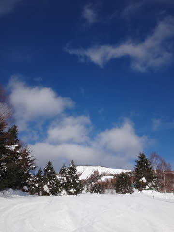
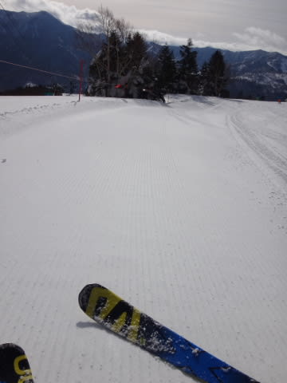
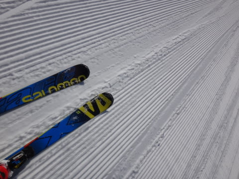
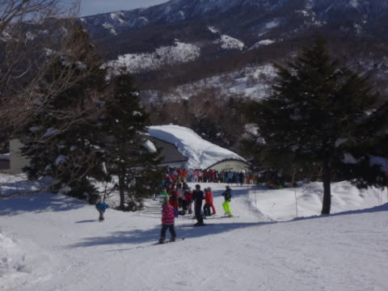
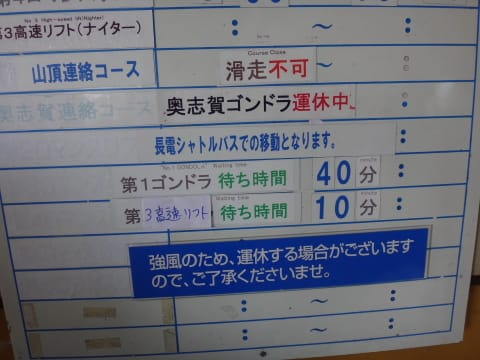
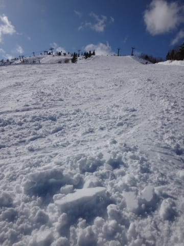
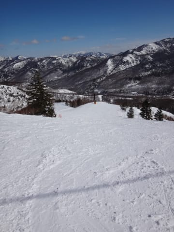
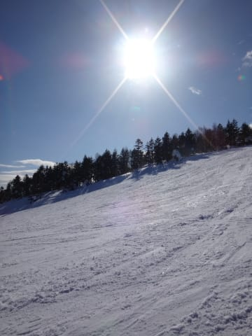
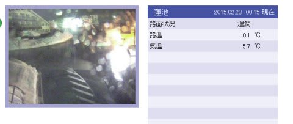

# 2月22日，日曜の志賀高原，速報モード…意外にも，終日晴れたよっ！…だけど…

📅 投稿日時: 2015-02-23 00:40:26

あー．

今日も帰宅が遅く．

板のワクシングその他をしたら，こんな時間なので．

いつも通り，速報モードで…

本日．

朝起きると…

ふおぉ！

晴天ではないかっ！

そして，ゲレンデは…

最高シマシマっ！

超快適ゲレンデっ！！

なんだけど…

強風のため．第2ゴンドラと，奥志賀ほぼ全面が運休（泣）．

さらに，第1ゴンドラも減速運転ということで…

なんじゃーーーーっ！！！！！こりゃーっ！！！

ゴンドラ待ちの列が，ありえないところまで伸びてるんですが？？

ここ10年での，最高クラスの混雑では…っ！？？

…ゴンドラ40分待ちって，どゆこと？？？？（激烈な涙）．

さらに，気温がすごく高く，日が射したこともあって…

…

なんだ，これは．

雪質は，もう，3月下旬の雪ですな…（強烈な涙）．

ただ，第2ゴンドラも動かず，第1ゴンドラも減速運転だったため．

ゲレンデそのものはすごく空いていて，

営業終了まで，フラットな無人大回りバーンだったのが救いか…

＃でも，午後もゴンドラ5分ほど待ったし，ゴンドラが強烈な

＃減速運転だったので，1本滑るのに30分近くかかったよ…（悲）．

って感じで．

時折雲がかかることもあったけど，

なんだか，夕方まで晴れるという…

いい方向に，大きく予想を外してしまった感がある今日一日．

晴天の中，やっぱりリフトストップまで滑ってきたのでした～

でも．

志賀高原．

今は，残念ながら雨になっちゃってるようで…（悲しみの涙）．

つーか，

2月の夜に，志賀高原の気温が+5度って，どゆこと？？？？？

うーん．

今週末の雪の状態が心配…

とりあえず，詳細はまた明日！←これで，十分詳細なレポートでは？

## 💬 コメント一覧

### 💬 コメント by (Goku)
**タイトル**: Unknown
**投稿日**: 2015-02-23 22:22:35

真夜中に帰ってワクシングって凄い！

それにしても凄いゴンドラ待ちですね。

志賀でこんなの2度とないと思っていました。

あと、雪が心配ですね。

寒の戻りに期待しましょう。

### 💬 コメント by (Skier_S)
**タイトル**: Gokuさま
**投稿日**: 2015-02-24 00:38:07

いや…

平日は帰宅が遅すぎて，ワクシングする暇が

ないので…

でも，ホントに10年に1度レベルのゴンドラ待ち

でしたよ！

晴天なのに，奥志賀も2ゴンも動かず，

1ゴンがかなりの減速運転で，さらに

搬器もいくつか飛び飛びでフルピッチで

入っていない…

という，複数の条件の重なり合いのせいで．

もう，プリンス東館の入り口まで列が伸びて

ましたから…

しかし，昔のスキーバブルのころはこのくらいが

当たり前だった気がするんですけどね～

