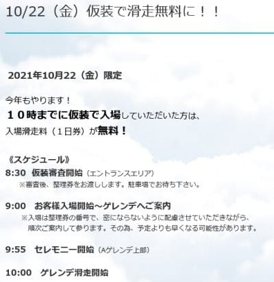
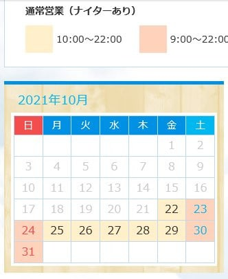

# え？2021/2022シーズンのYetiのオープン日，10月22日(金)！？？予想，外した…

📅 投稿日時: 2021-10-16 00:23:52

本日．

Yetiのホームページを見に行くと…

ん？

10月22日からコラボイベント？？

([スノーパークYetiホームページ](https://www.yeti-resort.com/)より，以下同じ）

…でも．

10月22日オープンとは書いてないし．

まだオープン日発表までもうしばらく

待てって書いてあるし…

オープン前にイベントするのかな？？

…と，思っていたところ．

イベント通知ページに，22日に仮想で

滑走無料と書かれているんですが…！？？

これは，22日から滑れるってことか？？

そして．

営業カレンダーを見ると…

あああ！！

10月22日から営業することに

なってるじゃないですか！！

それも，22日初日からちゃんと

10時までナイター営業じゃないですかっ！！！！

…ということで．

なんと．

2021/2022シーズンのイエティは，

10月22日オープンです！！！！！

…予想，外した…(涙)

まだ，狭山のオープン日も発表されて

ないし．

昨シーズンも10月最終週オープンだったし．

さらに例年は1週間以上前にオープン日の

案内があり．

昨日，オープン通知がない時点で

今シーズンのYetiは，絶対に29日オープンと

信じ込んでいたのに…

予想，外しました…

でも．

オープンが早くなる，嬉しい方向に予想が

外れたので，良しとしよう…

ということで．

あと1週間後．

来週土曜日に，初滑りに行く予定です…！！

2022シーズンまで，残り1週間か…
