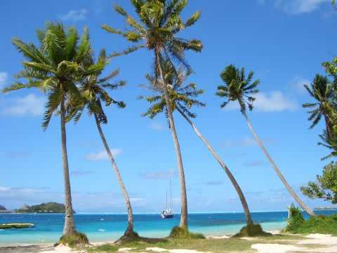
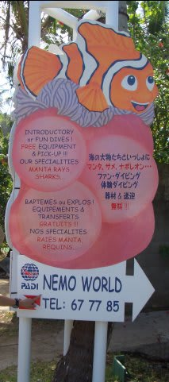
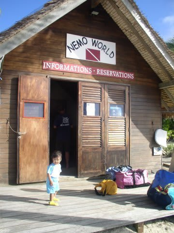
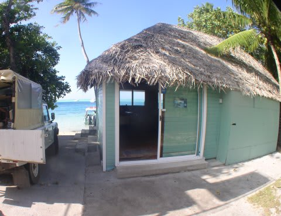
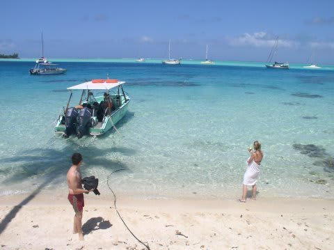

# 2009年　初の海外子連れダイビング旅行記　5　Dive shop

📅 投稿日時: 2012-08-31 01:04:48

うーーーむ．

今回の日記．

ボラボラのきれいな風景が出てくるわけでもないし，

あんまり面白くないですね～

…期待しないで読んでくださいネ

（何の意味もないハートマークでごまかす）

------------

さて．

2日目の朝がやってきました．

昨晩からの娘は．

夜，なかなか寝付かなかったものの．

家から持ってきたアンパンマンのDVDを見ている間に寝てくれて．

その後は夜中に起きて騒いだり，早朝に起きちゃうことも無く．

危惧された，「時差ぼけ問題」もあっさりクリアしたのでした．

…うむ．

順調じゃ．

で．

今日も晴天っ！

今日がダイビング初日…

っていうか，ボラボラで潜るのは今日だけです．

昨年，ボラボラとランギロアを2日ずつ潜ったけど，

ボラボラよりランギロアのダイビングが面白かったので，

今回はボラボラ1日，ランギロア3日としたんです…

＃今から考えるとこれで正解だと思う

さてさて．

今回利用したショップは「BORA DIVING CENTER」．

以前は，私が泊まったノボテルの中に，「NEMO WORLD」ってダイビングショップが

あって，ホテルの桟橋からすぐボートに乗れて，さらに日本人のガイドが常駐

していたんですが…

(2005年当時の看板)

今は，このショップはBORA DIVING CENTERに吸収されちゃいました．

あ，日本人ガイドの中村さんも，NEMO WORLDからBORA DIVING

CENTERへ移ってます．

今，ボラボラで日本人ガイドがいるダイビングショップは，

このBORA DIVING CENTERとTOPDIVEの2件でしょうか…(注：2009年当時)

んで，ノボテルの中に旧NEMO WORLDの建物は残っているんですが，

ここは受付業務しかやってません．

ここで受付を済ませると，車で2-3分のBORADIVING CENTERから迎えがきて，

そこからボートが出ます．

以前は，ノボテルに泊まってると，そのすぐ前からボートが出て

楽だったんだけどなぁ…

という感じで．

今回利用したショップはBORA DIVING CENTER．

このショップ前の，こんなきれいな海からボートが出ます．

このショップ，ファンダイブは午前中の2本のみ．

午後は，体験ダイビングやら講習やらのみで，ファンダイビングはやってない，

ってのがちと悲しいところ．

ということで，今回の滞在で，ボラボラでのダイビングは．

今日の午前の2本こっきりです．

で．

なんと．

今回．

ガイドの中村さんから，非常に魅力的だけど，悩ましい提案が…

「今回，子供を預かることもできますが…どうしますか？」

え？

ええっ！？

こ，子供預かってもらえるの？？

…でも，これまで，子供を他人に預けたことは一度も無いんだけど…

(続く)
