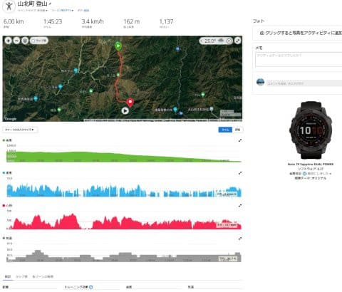
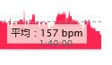
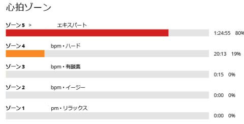
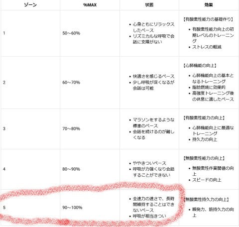
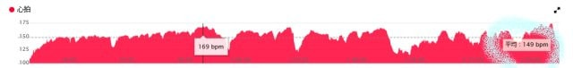
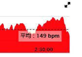
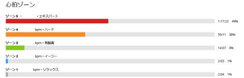

# Garmin Fenix7Xを買っていろいろ遊んでるんだけど…山歩きのデータで意外な事実発覚？ちょっと負荷かけすぎなのかも

📅 投稿日時: 2022-07-21 03:33:29

🏷️ カテゴリ: [日記](cc4b5682fb7b8b144980957a978653fb0.md)

そういえば．

物欲に負けてGarmin の時計を買ってから，

山歩きの友として思いきり使い倒していて．

いろんなデータが取れるこの時計．

データマニアの私としては，いろいろな

データを見て楽しんでいるわけなんですが…

（Garmin Connectの画面…Garminの時計をスマホで

　同期しておけば，いろんなデータがPCで見られます！)

つい先日のこと．

自転車をやる知り合いと会ったときに，

お互いGarminを使っているという

ことで思わず話が盛り上がって．

「いやー．ロードバイクのトレーニングに

　Garmin愛用してますよ」

ということだったので，

「私も山歩きの際に使ってますよ～！」

と，私の山歩きの時のいろんなデータを

見せてた時．

その知り合いの反応が…

「え…！？なにこれ！！！」

「平均心拍157！！？？？

1時間40分の平均が157って何？？？」

…え…？？

私は山登りはトレーニングだと思って，

心拍計を見ながら平均心拍150くらいを

狙って歩いてて，

この時はちょっとだけ上げすぎたかな…

と思ってたくらいなんだけど…

「自分が自転車とかローラーで走るとき，

　心拍160キープはできないです…

　160まで上げたら，10分くらいで

　バテます」

え…？

そうなの…？

「そして，ゾーン5に1時間24分も入れてる…（汗）」

…この心拍ゾーン５ってのは，Garminの

サイトによると，

最大心拍数の90％以上のエリアで．

・全速力の速さで，長時間持続できないペース

・呼吸が相当きつい

ってことみたいですけど．

…長時間維持できないペースを，

1時間24分維持しちゃってるんですが…

とりあえず．

このデータ．

下りだけのデータで．

登りのデータを見てみても…

2時間半以上活動しての平均心拍149で．

そして，ゾーン5に1時間17分入れ続けているので…

この日は上り下り合わせて，ゾーン5を

2時間40分以上維持してます．

そして，ゾーン4が1時間20分ほど…

まぁ，そもそも私は長距離走や

自転車をやるわけじゃなく．

全くトレーニングしてない人間なので，

心拍が簡単に上がっちゃうってのも

あるんだろうけど．

心拍数150なら止まらず歩き続けられる

という経験則があったので．

自分にとってはトレーニングのつもりの

山歩き．あまり遅いペースにならないよう，

Amazfitのスマートウォッチを使っていた

時から，いつもだいたい心拍150を狙って

歩いてたんだけど…

うーん．

いくらなんでも，最大心拍数の

90％を数時間維持し続けるのは，

普通の人間には無理だろうし…←私は一部のスキーサイボーグと違って，血の通った人間なので

Garminの時計は年齢から標準的な

最大心拍を計算してるだけなので，

この計算値より，私の実際の最大心拍が

高いってことかなぁ．

…でも．

スキーは運動が続くのがせいぜい数分間．

持続運動じゃないから，心肺機能の

トレーニングにならないはずだし．

一体どこで最大心拍数を高める

ような運動をしてたんだろう…？

心肺能力を高めるようなトレーニングを

した思い出はないなぁ…

…あるいは単に自分がオーバーワークを

しているだけなのかな？

…うん．

ありうる．

大いにありうる．

10月から6月ごろまで毎週末，

体中の筋肉に乳酸が溜まりまくっても

最後の最後まで滑り続ける

という，謎のトレーニング（？）を

続けていることで，疲れに鈍感になって，

ホントはバテてるのに根性で動き続け

られるように精神が麻痺している

可能性が…←ヤバい．それはヤバいトレーニングだ…

## 💬 コメント一覧

### 💬 コメント by (マルハバ)
**タイトル**: 20000mな方々は皆・・
**投稿日**: 2022-07-21 07:18:43

冬場に過激な高地トレーニングを繰り返しているじゃありませんか！(笑)

### 💬 コメント by (副院長)
**タイトル**: Unknown
**投稿日**: 2022-07-21 08:55:05

ロードバイク始めませんか？かなりいけると思います。これまた、物欲の世界が深いですよ。とてつもなく深いですよ。例えばサドル4万円。

### 💬 コメント by (おおすぎ)
**タイトル**: Unknown
**投稿日**: 2022-07-21 11:19:59

ようこそロードバイクの世界へ♪

S様なら、かな～り行けると確信しております！

結構日帰り４００Kmも行けそうですよ。

カーボンホイール、1本20万の世界へ・・・

（でもこれは極端な例ですからね！わたしは安い2万円のアルミで十二分に楽しんでおります！！）

### 💬 コメント by (you160)
**タイトル**: Unknown
**投稿日**: 2022-07-22 00:43:24

Sさま

久々にコメントさせて頂きます。

ズバリ、焼額山の謎の高地トレーニング効果かと。

Sさまを含む？20000メートルなサイボーグ、いや超人に比べれば、月とすっぽんな私ですが、

私もシーズン前後の焼額山＆渋峠、シーズン中の万座で鍛えられたらしく、Apple Watchで計測している最大酸素摂取量もシーズン中から今に至るまで高レベルであり、

かつ先日、会社の定期健康診断で心電図を測定したところ、「何かスポーツしてます？心拍がスポーツ選手並みです」と言われ、あっ、年間40日の滑走と在宅勤務対策の日々のランニングの相乗効果と気がつきました。

なので、Sさまのストイックな、そして自覚していない滑走マシーン化した成果！？かと。

### 💬 コメント by (Skier_S)
**タイトル**: ロードバイクはやらないですよ…
**投稿日**: 2022-07-22 03:57:33

＞マルハバさま

スキーは筋力トレーニングにはなりますが…

運動持続はせいぜい3-4分，短ければ1-2分なので，あまり心肺機能のトレーニングにはならないはず

なんですけどね～…

スキーの時の心拍記録を見ると，せいぜい最高150，行って160なので，スキーでそんなに

心肺が鍛えられるのかな…？？

＞副院長さま

いや…やりません．

これ以上お金がかかる趣味は増やさないぞ～！！

…サドル4万円って…（戦慄）

＞おおすぎさま

やばい．

ホイール1本20万！！

傷つけたり割れたりしたら，精神的に再起不能になりそうですね…

しかし，日帰り400kmは無理じゃないかな？

学生時代の記録は1日250kmです…（ランドナーでツーリング）

＞you160さま

スキーって，心肺トレーニングになるんですか…

スキーシーズンでそんなに鍛えられたんですね！！

でも，実は日々のランニングが効いているんじゃないでしょうか…

ただ，私も安静心拍は50程度，低い時は46とか出るので，

割と心臓は強いのかも…？？←メンタル的にはガラスのハートなんだけど

