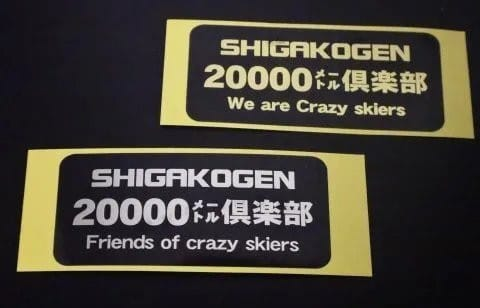

# 猿でもできる20000m？…志賀高原で実際に20000mチャレンジした読者さんからの投稿！その1，計画編

📅 投稿日時: 2020-04-27 03:31:46

🏷️ カテゴリ: [スキー雑談](c1f9d2cb7478308da16419928ea3945e9.md)

20000mクラブ…

それは，一日の滑走標高差20000mを超えたことがある，

おかしい突き抜けた人たちが集う，

危ない素晴らしい団体．

20000mを超えていなくても，準会員として

シルバーステッカーをもつ人は多いけど．

ゴールドステッカーは，

普通の人ならやろうとは思わない普通の人間では達成できない，

一日滑走標高差20000mを超えた人のみが

受け取ることのできる，

自分は終わった人ですということを示す素晴らしい記録を

達成した人であることを示す証．

今シーズンも，なんと．

焼額朝礼メンバーから3人，

志賀高原超常連さんから2人，

もももさん一家3人（うち娘さんとお母さんは2度チャレンジ！）

そして，西館さん＆パートナーの2人…

などなど，女性4名を含む10人以上の方が

20000m達成しています．

未だに20000mにチャレンジしようという

終わった人チャレンジ精神にあふれる人が

こんなにいるということが驚きなのですが…

とりあえず．

もしかしたら．

まだこれから，一日滑走標高差20000mに

チャレンジしてやろう…

という何か勘違いした人挑戦心を持った人に

向けて．

何と．

今シーズン，20000mにチャレンジした西館さんが，

本Blogに原稿を送ってくれました～！

この好意を謝して，

今回はこの原稿を掲載させてもらいます！←一回分記事を書くのが浮いた…と喜んでいるのでは？？

…緑で書いたのは西館さんの本文ではなく，

私のツッコミ文書です．

長編なので，前編と後編に分けてお送りします…

まずは前編，計画編です！！

【猿でもできる20000m！】

思い返せば３シーズン前、１ゴン乗車時に

20000mクラブのゴールドステッカーを

目撃していたのでした。

「なんか格好良いよね、←この時点で，何か大いなる勘違いをしてる気が…

ところでどんなクラブなんだろ。←危ないクラブです．近づかない方がよいです

どっかのショップのクラブなのかな？」

その謎が解けたのは今シーズン、このブログとの

出会いでした。

えっ、skilineで見たことあるよSkier_Sって人。

そしてKon Sukeさん！。

見てました最初skilineのバグかと思った

滑走履歴保持者の方。←私もご本人に会うまで，バグか何かかと思ってました…

このブログって何なのーーー ｵｵｰw(*ﾟoﾟ*)we　←ちょっとスキー好きな一般人が書いてる，普通のブログです（笑）

読む、読むせっせと読む、すると出てくる出てくる

若杉勲さん、BEAT5653さん、他にも恐らく

名前を変化させたであろうskilineで

凄い履歴を残した方々がこのブログには

生息しているらしい。←確かに…ここ数年，このBlogは危ない人ホイホイと化してます．

というか，このBlogの読者で声をかけてくれる人は，かなりの確率でスキー沼にズッポリはまった人です

こうなるとやってみたい20000m。←あぁ…危ない．発想が危険すぎるっ！！

しかしどうやら私にとって一番怖い

「一の瀬ファミリー正面ゲレンデ」を

私の周回記録7.5分/周で8時間滑り

続けないと突破できないのだそうで｡｡｡

しかしどうやらお助けルールがあって、

現状では早朝営業もナイターも含めての

突破でもOKとのこと。←…私も昼間だけで20000m突破したことは無いですから．昼間だけで達成しようと思わない方がシアワセです

だったら私でも達成できる方法があるのでは？。

「西館さんなんだから西館でやった方がいいんでない？」

と相棒君が提案してくれました。

２シーズン前は、林間コースでも7分/周だったっよと。←こういうふうに，どのリフトが1サイクルに何分かかるかということを測り出したら危ない人です（笑）

ところが西館フーディは減速運転になってしまっただけでなく、

営業開始時間も8:50～って知ってました？

私は1ヶ月前まで知りませんでした　Σ(￣ロ￣lll)

しかも今シーズンは台風の影響でできた

陥没によって中級下部がコース閉鎖。

2シーズン前は中級コース滑降は6分/周

だったので、270m×10本×8時間＝21,600ｍ で

日中だけで達成できたのに！←よく調べてますね…西館フーディー，減速が無い昔なら，20000m達成できたんです

仕方が無いので、

西館 → 高天原 → 一の瀬 ＋ ダイヤモンドナイター 

での達成を計画しました。←普通は一の瀬グルグル，あるいは奥志賀ゴンドラグルグルパターンがほとんどで，

例外的に焼額早朝からラストまで…ってのもありますが．西館＋一の瀬＋ナイターパターンは初ですね…！

8:30～8:50は西館山クワッドを5分/周の計画で、

　188m×4本＝752ｍ

フーディに移動して7.75分/周  

　270m×40本＝10,800ｍ

一の瀬へ向かうため高天原へ。

この時、フーディ41本目に乗らなくては

ならないけど滑降距離は標高差から

第2トリプルの64mのみ。

高天原クワッド　

　233m×1本＝233m　

で一の瀬第3クワッドまで移動、

第3クワッド8分/周 

　315m×16本=5,040m。

おまけの延長時間で

一の瀬クワッド

　312m×1本

で日中の合計は、17,201ｍ。

ダイヤモンドナイター18:30～21:00を5分/周

　105m×27本＝2,835ｍ

を足せば、20,036ｍで達成！←素晴らしい…ここまで綿密に計画を練ってチャレンジした人はほとんどいないのでは…？？

それぞれ練習時の周回タイムよりも

ゆとりをもって計画しました。←そうです．ゆとりが大事なのですが…

明確なトイレや休憩時間を取ってないこのプラン，一般人には余裕があるように見えないのでは…？？（笑）

ってなことで，かなり綿密な計画を練ってチャレンジされた

西館さんだったのですが．

前編の「計画編」はここまでです．

果たして，チャレンジ当日の天気はどうだったのか？

雪質は20000mチャレンジが行けるレベルだったのか？？

果たして，無事一発で20000mを達成できるのか…？？

次回，後編「実行編」へ続きます！

こうご期待！

## 💬 コメント一覧

### 💬 コメント by (西館)
**タイトル**: Unknown
**投稿日**: 2020-04-27 05:56:09

ただいま4日に1回の出勤日で始発電車乗車中です。

Sさん掲載ありがとうございます。

我が家にとっては、今までに最高に楽しいシーズンとなりました。

それもこれもSさん始め、お声掛けして下さった皆々様のおかげ。ほんの少しでもご恩返しになればと厚かましく掲載お願いしてしまいました。

西館はトイレが近くてフーディ降車建屋の側面に有って、ステップ4段上がると直ぐなので、少しずつ貯金してゲレンデが混んでる時にささっと行く計画でした。

3月下旬で暖かければ日中2回くらいしか行かないからなんとかなるかな、と。(更に私は秘密のアイテム使いました。)

少しでも速く済ませられるようにサスペンダーは外しました。

あ、もうすぐ電車降りるのでまた夜に

### 💬 コメント by (Northfox)
**タイトル**: Unknown
**投稿日**: 2020-04-27 16:16:10

大変有益な情報をありがとうございます。

西舘コースでのチャレンジは興味があります。

以前に西舘さんに教えて頂いたフーディトイレ（早速利用しました）も便利なので有利ですね。

ただ中級下部コースが滑られないのは残念ですが。

後はブーツの足の痛みが解消できていれば．．．

しかしあの崩落箇所何とかならないものか。。。

コース補修作業のボランティアの募集があればお手伝いするのですが。

### 💬 コメント by (Skier_S)
**タイトル**: コメント遅れてゴメンナサイ
**投稿日**: 2020-04-29 04:23:43

＞西館さま

原稿，ありがとうございました～！

かなりのボリュームで，前編，後編に分けての掲載と

なりましたが，皆さんの参考になると思います！

西館のフーディー降り場にトイレがあるってのは

かなりの参考になりますね．

あと，秘密のアイテムってのが気になります（笑）．

＞Northfoxさま

そうですね…

西舘中級コース下部が滑れればいいんですけど…

ちなみに，崩落個所は埋めることに決定したようですが，

このコロナ騒ぎでどうなることか…

### 💬 コメント by (urawa_skier)
**タイトル**: Unknown
**投稿日**: 2020-04-29 19:48:28

横から失礼します。

３月２２日に実施し、翌日奥志賀からのバスで西館さんと御一緒した者です。西館で拝見したお二人の滑りの速さに、ただ、ただ驚きました。また機会がありましたらお声掛けください。

お邪魔いたしました。

### 💬 コメント by (Skier_S)
**タイトル**: ＞urawa_skierさま
**投稿日**: 2020-04-29 22:34:04

あら！

20000m達成者ご本人様からコメントがいただけるとは…！！

20000m達成おめでとうございます．

私は西館での西館さんの滑りを見てないのですが，そんなにすごかったんですね…

20000mチャレンジを通じ，いろんな出会いがあるのは嬉しいことです．

今後もいろいろ仲間を増やしていきましょう…！

