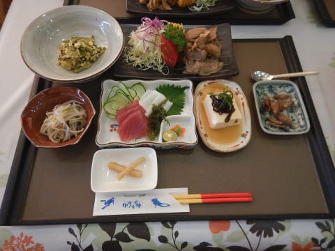

# 2017年8月，小学生の子連れで座間味でダイビングその13…ダイビング2日目終了！

📅 投稿日時: 2018-07-24 04:56:39

あれ？

今日はプロジェクトXの，ナビ取り付け

記事の続きじゃないの…？

と，お思いでしょうが．

なんだか今日はご無体時間になってしまったので（涙）．

書きためておいたダイビング旅行記です…

でも．

その前にちょっと車関係のネタを．

例の，[バンパー保護用カーペット](e32db460b5c5b29b1057fdd0e1172d050.md)ですが．

長さ70cmほどのカーペットをトランクから

垂らせるようにしておくと．

こんな感じでスキーをトランクに

立てかけられるようになるので．

駐車場の地面に板を置かなくて済み．

板が駐車場の雪に埋もれるとか，

舗装されていない駐車場で，板を下に

置くと汚れちゃう…

ってのを避けることができます．

そのほか，トランクに座ったりしても，

バンパーが傷つかないので．

トランクに座ってブーツを脱ぎ履き

するにも使えるので．

便利ですよ～！

ってところで，本題のダイビング旅行記です．

では，どうぞ～！

ーーー

ってな感じで．

本日2本目のダイビングが終了したわけで…

子供が多かった本日．

海で遊ぶ時間もいっぱい取ったし．

娘の体験ダイビングもあったので．

もう，時間は午後3時過ぎ…

だもんで，今日はこの2本目でダイビング終了！

器材を片づけて，港へ戻ります…

で．

港への帰り道の途中．

遊び疲れた子供たちは…

この船の特等席，舳先の

ネット部分でみんな寝ちゃってます．

港まで，約40分ほど．

その間，ずっと子供たちは寝てました…

よっぽど遊び疲れたんでしょうね～…

午後4時ごろ，港へ到着！

いやー．

今日も遊びました．

港から歩いて宿へ戻ります…

いつも通り，星砂さん入口の機材洗い場で…

ウェットスーツやらカメラやらを洗って．

シャワーを浴びて，すっきりしたら．

また，夕食まで．

座間味の町中をぶらぶらお散歩します．

うーむ．

港のすぐそば，去年まであった

パーラー座間味さんが営業やめてますね…（涙）

意外と座間味のお店，入れ替わりが激しいのかも…

そして，夕暮れを眺めたあと．

宿に戻ると，ちょうど夕食タイム！

このほか，ゆし豆腐のお吸い物とご飯が

着くので．

一見少なそうに見えますが，かなりのボリュームです…

そして．

小学生の娘にも…

大人と変わらないくらいの量の食事が（笑）．

やっぱりこの宿の食事，いいですね～．

って感じで．

たらふく夕食を食べたあと．

ログづけをして．

今日も早めに布団に入ったのでした…

## 💬 コメント一覧

### 💬 コメント by (michi)
**タイトル**: バンパー保護カーペット
**投稿日**: 2018-07-24 22:41:02

質問です。

バンパー保護のカーペットのクルマ側は何かで留めているのですか？ただ丸めておくのはかさばるだろうし、何も留めないと動いてしまうだろうと思い、どうしているのかと思いました。

### 💬 コメント by (Skier_S)
**タイトル**: michiさま
**投稿日**: 2018-07-25 00:41:15

このカーペット，車には全く固定していません…

トランクに敷いてあるカーペットの下に，

このバンパー保護カーペットを30cmほど

差し込んでおけば，上のカーペットとの摩擦が

あるのでそんな簡単に動かなくなります．

トランクに荷物が入っていれば，荷物の重みで

しっかり固定されます…

リアゲートを閉める際は，垂れ下がっているカーペットを

トランク側に折り返してゲートを閉めるだけです．

固定だとか，毎回丸めるみたいなめんどくさい

ことは，全く何もしていないです…

### 💬 コメント by (michi)
**タイトル**: なるほど、、
**投稿日**: 2018-07-25 10:43:36

そうだったんですね。

てっきり固定してるのかと思いました。

ありがとうございました😊

### 💬 コメント by (Skier_S)
**タイトル**: michiさま
**投稿日**: 2018-07-26 00:29:50

そうなんですよ…

だもんで，純正オプションのラゲッジトレイとか

ラゲッジマットとか使っているなら，

その下に挟み込んでおけば大丈夫かと．

安いものですから，ぜひ一度お試しください．

