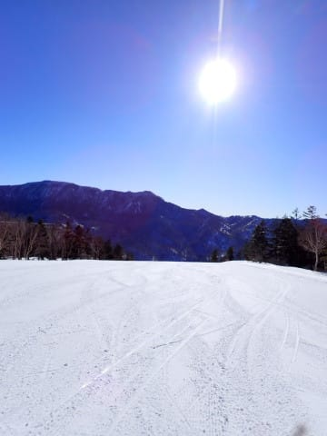
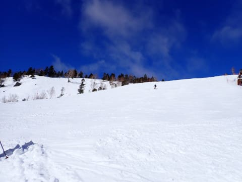
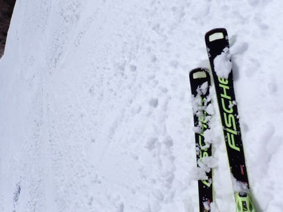
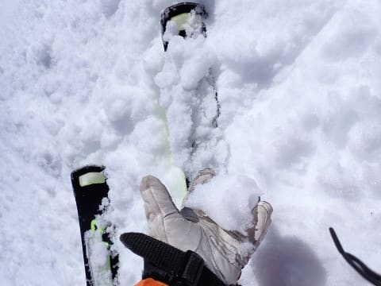
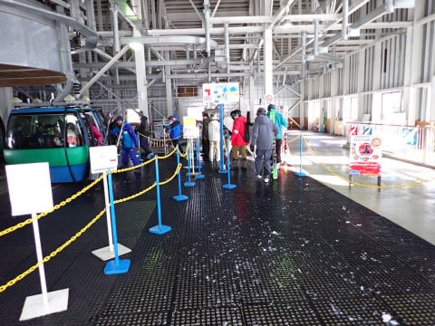
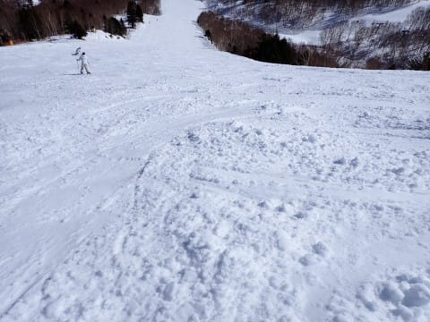
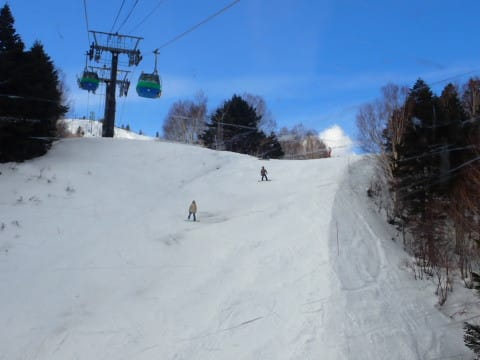
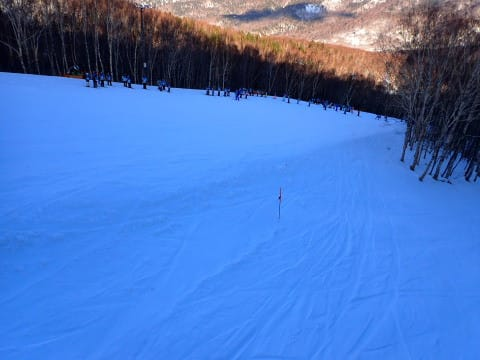

# 2024/2/18(日)の志賀高原焼額山スキー場，速報レポート！…山頂で＋5℃という2月と思えない高温で，4月並みの雪（涙）．でも空いてて晴天で春スキーと思えばいい感じ

📅 投稿日時: 2024-02-19 03:18:02

🏷️ カテゴリ: [2024スキー滑走日記](c453f687e8a0f05679e95831d0a02cd0c.md)

ってなことで．

本日もラストリフトまで滑って，

買い物やら夕食やら洗車やらして

帰宅するともう12時過ぎ…(涙)

片付けやらなにやらしていると

もう2時を過ぎてしまったので，

今日も本日の志賀高原レポート，

いつも通りの速報モードにて！！

えー．

まず．

本日も朝から雲一つない快晴で

スタート！！

…でも．

あさイチから山頂の気温が‐1℃と，

ほぼ0℃に近い，4月下旬並みの

気温で…

さらに日差しも強かったこともあり．

雪は朝から柔らかめ．

あさイチは良かったけど，10時ごろ

には，早くも3月下旬並みの

湿った緩んだ雪に…（涙）

終日日差しが強く，

気温も山頂で＋5℃を越えるほどで．

2月下旬としてはあり得ない雪質

なんですけど（涙）

ただ，雪は緩んで，湿って重い，

荒れそうな雪になったものの．

今日はそれほど混まず．

ゴンドラもピークでゲートを越えるか

越えないか程度．

10時から11時までのピークを外すと，

大体こんな感じの待ち時間で…

人が少なかったこともあり，

雪は多少凸凹したものの，ひどい

コブになることなく，夕方まで

大回り板で乗り越えられる程度の

荒れ方で済みました…

ただ．

今日の高温＆日差しで．

バーンの数か所，雪が薄いところが

出てきました…（涙）

いや…まだ2月なんですが！？？

とはいえ．

雪が薄いところは焼額全体でも

数か所だけで，そこ以外はまだ

全然大丈夫で．

人が少なかったので，柔らかい春雪の

わりにそこまでひどく荒れなかったバーンを，

いつもより営業終了時間が30分伸びた

第4ロマンスの最終16:45まで，

ひたすら滑り倒したのでした…

ってなことで．

本日は，4月並みの暖かさだった

志賀高原だったのですが．

今後の天気は…

19日(月)：異常な高温，曇り，夜から雨．

20日(火)：朝は気温高い．

　曇り時々雨がぱらつく．

　夜は雪になるかも…

　すごい重い雪で，そんなに

　積もらないけど．

21日(水)：雨になるか雪になるか

　微妙な気温．

　曇り時々雨か雪がぱらつく．

　標高が低いところが雨，山頂は

　雪っぽい感じか…

　雪と言ってもウェアやゴーグルに　

　着くとびしょ濡れになる雪．

22日(木)：朝は雨，どこかの段階

　雪になる．朝から雪になるか，

　夜から雪になるかはまだ不明．

という感じで．

今後は22日まで，雨の危機が続くので…

雪がまた融けそう(涙)

とても2月と思えない…（激泣）

さて．

22日の夜の雪が積もって，

23日からの3連休，雪の状態が

良くなるのか？

あるいは22日までの雨で

ゲレンデにかなり穴が開いたうえ，

23日からの冷え込みで全面ガリガリ

アイスバーンになるのか？？

とりあえず．

2億8000万人のこのBlog読者の皆様に

おかれましては．

22日の後半の雪が，冷え冷えのいい雪が

ドサドサ積もるように，これから毎日

ひたすら全力で祈り続けて頂けますよう

お願い申し上げます…

## 💬 コメント一覧

### 💬 コメント by (1kamakura)
**タイトル**: Unknown
**投稿日**: 2024-02-19 06:12:44

江戸の秋

一昨日は札幌国際で滑ってきました。

雪質は良かったです。

下の方で少しガリガリしていましたけど。

気温はマイナス2°でした。

北海道としては高温でしょうね。

冷え冷え踊りと寒寒ギャグを強化しておきます！

みじんもみじんこは食べたくないゾ！

### 💬 コメント by (レインボー76)
**タイトル**: Unknown
**投稿日**: 2024-02-19 16:19:45

月曜日の志賀高原情報

朝の蓮池+6℃。強風で全ゴンドラ運休。ヤケビの三高までも。

ダイヤからファミリーを回したけど、急斜面が終わった所のウェーブが見にくくて怖かった。パーフェクタは膝に悪い硬さとがたがた。高天のNHKは良かったけど、西舘への橋がザクザクで登るのに力尽き。

西舘の雪の薄いこと。地肌も出てるしザクザク。あとはタンネで時間潰しをして11時終了。明日は雨みたいだし、未来は無さそう！

### 💬 コメント by (Skier_S)
**タイトル**: Unknown
**投稿日**: 2024-02-21 08:57:38

コメント回答遅れました

>江戸の秋さま

札幌国際も良くなかったんですね…（涙）

冷え冷えになるよう、寒いギャグ連発お願いします！

>レインボー76さま

雪が一気に減っているみたいですね…

今週末三連休、やばいかな…

### 💬 コメント by (富山県民)
**タイトル**: Unknown
**投稿日**: 2024-02-24 07:03:26

お久しぶりです。

私も2月18日に志賀高原で滑走しました。

私は横手山と渋峠で滑走しました。

雪質ですが横手山上部と渋峠は午前中はそこそこ良かったですが昼からは重くなりました。

樹氷はまったくなく木も雪が被ってなくて2月中旬というのに春スキーのような雰囲気でした。

ただ快晴で視界は良くて妙高山や北アルプスなどの絶景は楽しめました。

今年2回目の志賀高原でしたが前回は山頂のリフトが強風で運休だったので山頂と渋峠には行けませんでさしたが今回は今シーズンで初めて山頂に行けました。

### 💬 コメント by (Skier_S)
**タイトル**: ＞富山県民さま
**投稿日**: 2024-02-25 00:20:49

この日は異常に気温が高かったですよね…

でもすっきり晴れで視界がよかったので，横手からの景色は

良かったでしょうね…

これで気温さえ低ければ…

