# 2018年8月，モアルボアルで小5の娘をダイバー化！その11…ダイビング2日目のスタート

📅 投稿日時: 2019-07-21 00:36:35

この週末．

娘が熱を出してしまい．

どこにも行けない週末になりました…（涙）

ということで．

特に外出ネタもないので．

今日も寂しく，ダイビング日記

です…！←ダイビング日記って，寂しかったんだ…

---

明けて．

ダイビング2日目の朝…

今回泊まったのは，海沿いの部屋なので．

朝起きて，外を見てみると，

すぐ海がみえるのですが．

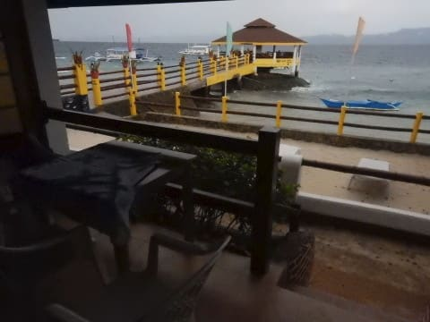

…なんだか，海，荒れてるよ…（涙）

天気も悪いし…

とりあえず，朝ごはんを食べに行きますが．

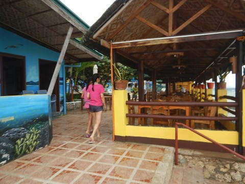

風が強く，寒いので．

いつものテラス席には座らず．

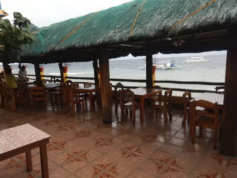

レストランの建物の中で朝ごはんを

食べることに…

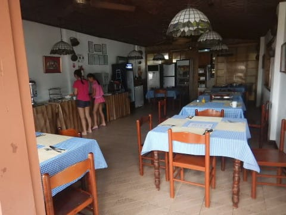

いつものアメリカンブレック

ファーストを食べて．

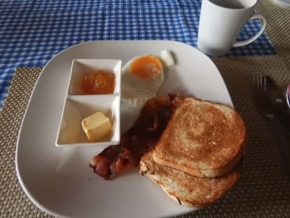

食後，部屋に戻ろうとすると…

風が強い！

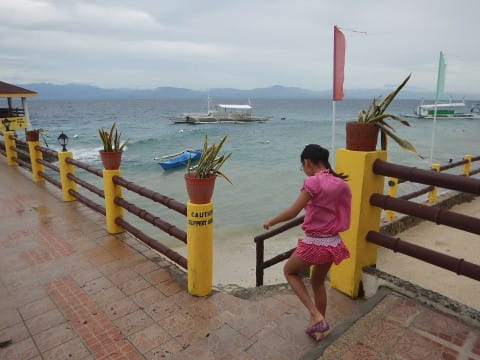

波も高いし．

これ，今日潜りに行けるのかな…？？？

朝食後，水着に着替えたら．

娘はさっそく，ホテルのプールでプール実習の

準備です．

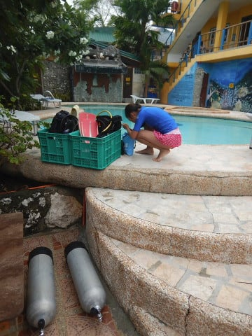

わが娘，今日の午前中の前半は，

最後のプール実習の予定で．

まずは，泳力テストからやるようですね…

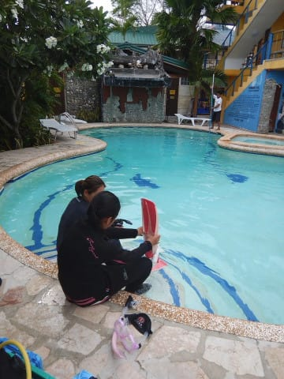

シュノーケル＆フィンを付けて300m泳げる

というのが，Cカード取得の

条件なのですが．

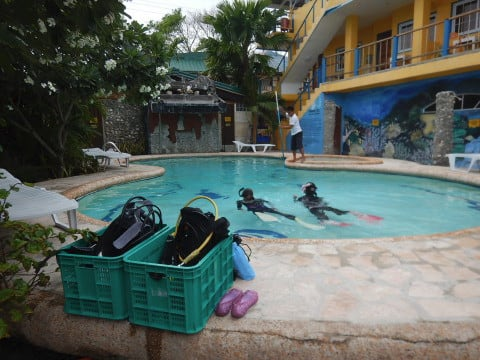

まぁ，スイミングスクールで数百m，

時には数km泳いでいた娘には，

フリッパー300mは余裕ですね．

というか．

フィンとシュノーケルを付ければ，

大体の人は300mくらい余裕だと思うので．

この泳力テストで落ちる人はまずいないかと…

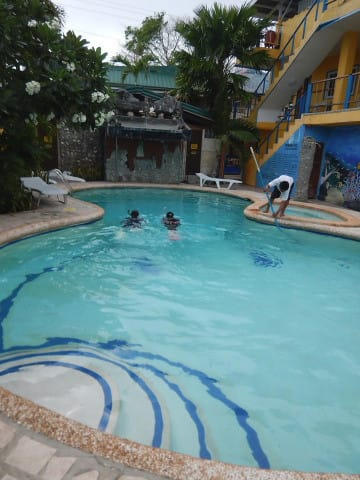

泳力テストのあとは，

10分間，水に浮いてられるかのチェックなども

あったようですが．

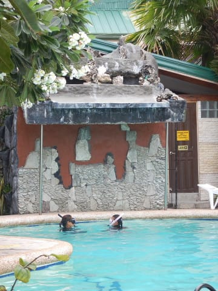

ダイビングの集合時間になったので，

泳力テスト中のプールを後にして，

ダイビングショップへ…

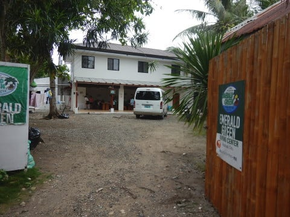

どうやら，今日はちょいと波が

高めながらも．

ギリギリ，ぺスカドール島まで行ける

ようです！

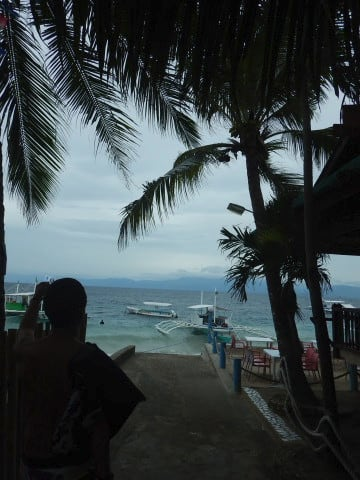

ってことで．

波が高い中ボートに乗って…

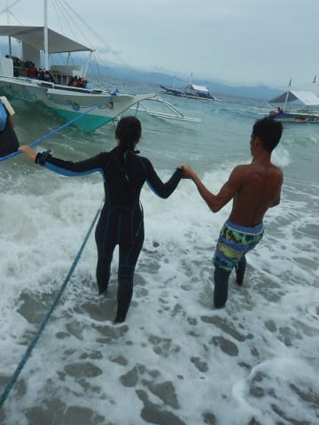

いざ，ぺスカドール島へ！

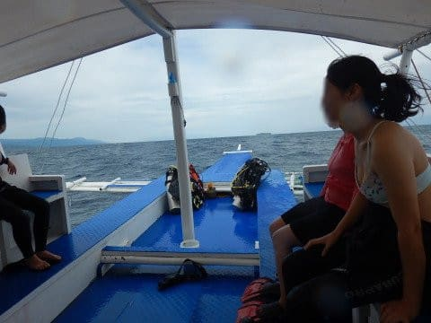

…でも．

ぺスカドール島までの海．

いつもより波が高めです…

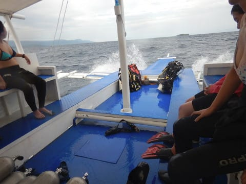

…海が荒れる日本周辺の船とは違って．

アウトリガーなどという，荒波がくれば

一発で破壊しそうなものが着いている，

フィリピンのバンガーボート．

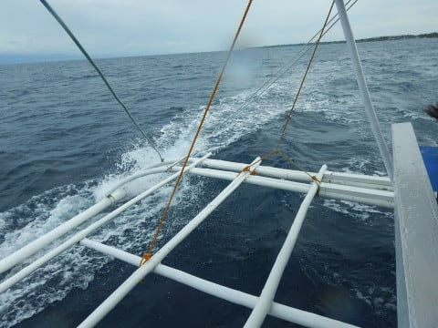

穏やかな海での安定性は優れてますが．

荒れた海の走破性はあまり良くなさそう…

…ってな感じで．

ちょっとした波に何度も減速しながら，

いつもより時間をかけて，

なんとか本日1本目のポイント，

ぺスカドール島へやってきました…！

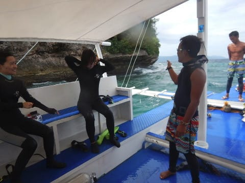
