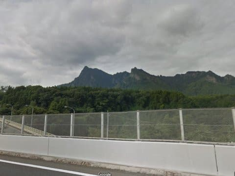
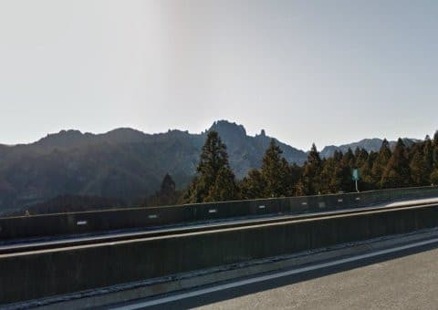
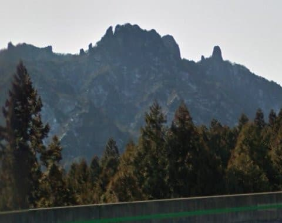
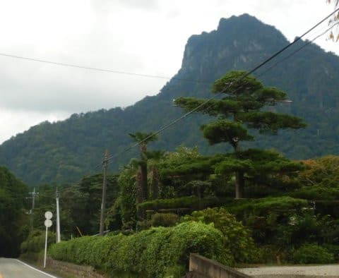

# 上信越道から見える，あの妙義山へ登ってみた，その１

📅 投稿日時: 2020-10-01 00:47:50

なんと．

もう10月．

10月ですよ！！！

10月と言えば，Yetiオープン．

スキーシーズンが始まる月ですよ！！！！！

…

…と言いながら．

まだ，狭山のホームページも，Yetiのホームページも，

今シーズンのオープン情報が全く乗っていないのは

なぜだ…？？？

狭山スキー場，今シーズンホントにオープンするのか？？

そして，Yetiのオープン時期は一体いつになるのか…？

過去，遅くても9月末までには公開されたYetiの

オープン情報．

まだ明らかになってないというのは…

…オープンが例年よりすごく遅くなる…？？？

いや．

よそう．悪い予想はよそう．←まさか，ベタなダジャレ？？

今年も10月，遅くとも23日にはオープンしてくれると

信じよう…

…ってなことで．

本日は，焼額山の歴史最終回を書こうと

思っていたのですが．

…あの記事．

書くのにものすごいエネルギーと時間が必要なので

（過去の写真をひっくり返し，歴史をたどって地図を書いたりなんだり…

　我ながらあんな記事を書いてるのは偉いと思う．偉いぞ！自分！！）

ちょっと今日は，そこまで記事に時間を

かけるパワーとエネルギーが無いです…（ゴメンナサイ）

だもんで．

焼額歴史最終回は次回の楽しみとして．

本日は，この間行ってきた山登りのお話，

ちょっとさわりだけを書いてみます…

ーーー

妙義山．

そう．

それは，上信越道を通ってスキー場に行く人が，

必ず目にする山．

スキーに行くとき．松井田妙義インター付近で

左側を見ると，見える．

あの妙に尖った山々…

拡大すると…山の途中から，岩が

にょっきり突き出したような，

異様な山．

（こっちは，横川を過ぎたあたりから左に見える

　裏妙義山）

こいつも，妙にとんがってるので．

印象に残っている人が多いかと…

あの，尖った山を見ると．

おそらく，100人いれば1万2000人くらいは，

「あのてっぺんに登ったら，どんな感じだろう？」

…と，思うはず．

いや．絶対思う．

思わないわけがない．

ここ何年も，12月からGWまで，志賀高原に

行くときに，ほぼ毎週のようにこの山を眺めて．

「登ってみたい…」

と思っていた，この山．

ついにこの山に，今回チャレンジしてみました．

…まさか，あんな尖がった山に登れるとは

思わず．

調べてみて，多少手ごわい山ながらも．

登っている人はかなり多いみたいで．

かれこれ10年越しに思っていた，

「あの山のてっぺんへ登ってみたい…」

に向かって，ついに登山計画を

実行しました…！

しかし．

鎖場も多く，かなり何ヶ所も切り立った

崖を鎖で登らないといけないらしい，

こんな山に．

私のような，年に数回程度の，お気軽

お散歩登山しかしない素人が果たして

登れるのか？

…と，心配になったけど．

行けるところまで行って，危ないと判断したら

素直に戻ろう

という気分で，チャレンジしたのでした…

で．

車で上信越道の松井田妙義インターから，

妙義山へ近づいていくと…

…

…

なんだか．

これまでの私の経験にはない角度で

切り立っているのですが！？？

ホントにあの山のてっぺんに登るの！？？

と，登る前から，登山者をビビらせるのに

十分な迫力．

わずか標高1100m程度なのに．

なかなか手ごわそうじゃないか…っ！

（[続く](e21484593e8cb0866ad5f3e9ec68ec50c.md)）

## 💬 コメント一覧

### 💬 コメント by (アリス)
**タイトル**: 妙義山気になっています
**投稿日**: 2020-10-01 09:12:39

Skier_S様

お世話になっております。

実は私もスキーシーズンは毎週上信越道を走っていて気になっていました。

あの山には、修験者や仙人でもいるのではないかと本気で思いながら高速道路を走っていました。

登山記事楽しみにしています。

### 💬 コメント by (Skier_S)
**タイトル**: ＞アリスさま
**投稿日**: 2020-10-02 00:05:06

ですよね…やっぱり気になりますよね，あの山．

私も，まさか山頂に行ける登山道があるとは思ってませんでした．

変態ロッククライマーしか登れない山だと思ってました…

でも，なかなかヘビーで，途中何度も「落ちたら死ぬ」と思う

山でしたが（笑）

