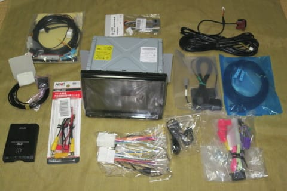

# プロジェクトX2第2章…ナビとETC，バックカメラは通販で購入してみた

📅 投稿日時: 2018-07-19 01:58:08

🏷️ カテゴリ: [車](cba0e8330b3f2ded7c1addfacc75d4547.md)

ということで．

最近は完全に車ブログと化しつつある，

この「徒然スキーヤー日記」ですが．

…ええ．

スキーヤー日記なんですけどね．

本来は．

でも．

今日も車ネタ，行きます！

えー．

貧乏金なしの我が家ですから．

新車を買うというゼイタクをしてしまったので．

それ以外はなるべくなるべく，あらゆるものを

安く上げていきたいわけで…

そういったところで，

カーナビ＋ETC＋リアカメラ．

これを，ディーラーオプションで取りつけてもらうと．

安いナビを選んでも，30万くらいかかってしまいます…

安い通販でこれらを買い揃えて，自分で取りつければ．

その1/3の金額で済むのだ！！

…ということで．

いつも通り．

通販でカーナビ類を買い揃えました～！

まず．

ナビ本体ですが．

LEVORGは，D型から8インチナビ対応になり．

7インチナビが取り付けられなくなったので．

必然的に，8インチナビを選ばなくてはなりません…

で．

8インチナビで一番安かったのが，こいつ．

KENWOODのMDV-M805L．

8万5000円程度と，結構いいお値段がしますが．

今なら．

KENWOODナビは，リアカメラと一緒に買うと，

1万円キャッシュバック！

ってことを考えると…

他の8インチナビと比べて1.5万円くらい安いし．

そのうえ，私がこれまで使ってたナビも

KENWOODなので，操作性も似てていいかな…

ということで．

こいつ一択！

そして．

キャッシュバックをGetするために．

リアカメラはKENWOOD製を選択．

一般的なRCAコネクタじゃなく，

KENWOODナビ専用端子タイプのCMOS-C230です．

テールゲートからナビ背面までつなぐための

7mもの長さのケーブルがついてます…

お値段8700円．

そして．

次はETC．

圏央道割引が効くETC2.0にしようかと一瞬

考えましたが．

我が家から志賀高原まで，いつものルートだと．

ETC2.0割引の有無でお値段が全く変わらないので．

くそ高いETC2.0車載器なんて買ってられるか

と，普通のETCにしました…

KENWOODナビと連動できるのは，このDENSO製の

DIU-5310しかありません．

…ナビ連動無しで，もう少し安いETCにしようかな…

とも思ったけど．

ナビ連動があった方が便利なので，

こいつにしました…

お値段10000円弱．

あとは，取り付け用ハーネス類ですね．

まず，スバル車の

・オーディオ用20Pinコネクタ用変換ハーネス

・車速・リバース・パーキング用15Pinコネクタ用変換ハーネス

・ラジオアンテナ変換ケーブル

がセットになった配線キット．

これは，KENWOOD用として売っているものより，

パイオニア用として売っているこいつの方が

なぜか1000円ほど安かったので．

ジャストフィット社製の，KJ-F22DEを選択．

車両側サービスコネクタから，ギボシ端子に展開

するだけのハーネスなので，別にパイオニア用でも

問題なく使えます…

3000円ちょい．

カナック企画社製の，NKK-F31Pとほぼ同じものです．

注：C型までのLEVORGにはこれが問題なく使えるんですが…

　D型以降のLEVORGでは15Pinコネクタの仕様が

　変わってることが判明（涙）．後日詳細を書きます…

そして．

ETC－KENWOODナビ連動用ケーブル．

このケーブルは，KENWOODナビに接続して，

・ステアリングリモコン接続線

・ETC連動用コネクタ

を取り出すケーブルです．

…本来は，KENWOODの純正オプション（KNA-300EX)があるのですが．

同等のコンパチ品が安売りしていたので購入．

1000円でおつりが来ます．

で．

最後．

これは別になくてもいいかな…

と思ったのですが．

LEVORGにもともと付いている，純正リアカメラ用の

先行配線を，市販リアカメラでも使えるようにする

純正配線利用中継ハーネス，ナビック社製NRC-50F．

3000円と意外と高いので，買おうかどうしようか

悩んだんですが…

これがあれば，リアカメラ取り付け部分の

直近まで先行配線されている純正カメラ用の

コネクタにリアカメラケーブルを差し込むだけで，

ナビの真後ろのコネクタから，カメラの信号を

取り出せるのだ！

リアカメラからナビまでの配線を自分でやろうとすると…

・ゲートからハーネスダクトを通して，トランク

天井内張り内部へ

・トランク天井内張りを剥がして，Dピラーへ

・Dピラー内張りを剥がしてトランクサイドへ

・トランク側面内張りを剥がして，サイドシルへ

・リアサイドシルカバーを剥がして，フロントサイドシルへ

・フロントサイドシルカバーを剥がして，インパネへ…

という，6カ所の内装を剥がす手間が回避できるのだ！

…この手間を惜しんで3000円を払うか．

時間をかけて3000円を惜しむか…

…うーん．

どうしよう…

と，悩んだ結果．

今回は3000円を払って，手間を惜しむことにしました…

まぁ，余計なハーネスを増やしたくないし．

ナビ取り付けで一番大変なのは，リアカメラ配線で

あることを身に染みて知っているので．

ここは先行配線があるなら，それを活用しましょう…

…ここで鋭い人は気づく．

KENWOOD専用配線のCMOS-C230はこの中継ハーネスで

接続できないのでは？？？…と．

はい．

そうです．

普通は，標準RCAコネクタ対応のCMOS-230じゃないと

このNRC-50Fの変換ケーブルにはつながりません．

そこは，配線を解読して繋ぎ替える覚悟で買いました．

注：実はこのリアカメラ先行配線のリアゲート側

　コネクタも，D型以降変わってしまっており．

　NRC-50Fはそのままではつかえないことが判明（泣）．

　これもまた追って詳細レポートします…

ということで．

これで準備は万端っ！！

後は，納車を待って取り付けるだけだな！

…と，この時は思っていたのだった…

## 💬 コメント一覧

### 💬 コメント by (ほっぽ)
**タイトル**: バックカメラ
**投稿日**: 2018-07-19 06:53:41

Ｓさん

私も今乗っているＢＰレガシィの純正バックカメラが壊れた際、

社外品を買って繋ぎなおしました。マジで大変ですよね。

左側側面の内貼り、ほぼ全部剥がして配線通しました。

最初から配線が通っているなら、端子を加工してもその方が楽だと思います。

ＥＴＣのナビ連動も折角新車買うなら、妥協したくない所だと思います。

全体的に見ていて、装備品に対する考え方が良く似ていると思います。

唯一違うのは、私はCD-ROM時代からカロナビなんで、

ナビはカロッツェリアを長年愛用しているくらいでしょうか。

### 💬 コメント by (Skier_S)
**タイトル**: ほっぽさま
**投稿日**: 2018-07-20 03:19:43

いやーーー．

ホントに，リアカメラの取り付けは

内装全部バラシになりますよね…

辛いです．

私もくじけて先行配線を使うことにしました…

先行配線中継ハーネス，3000円の価値はあるかと（笑）

ほっぽさんはカロナビ派ですか！

私は買う時に一番安いナビをつけてきたので，

特にブランドのこだわりはないのですが…

ってか，3度目の新車なので，これがようやく

ナビ選び3回目です（笑）

### 💬 コメント by (ほっぽ)
**タイトル**: Unknown
**投稿日**: 2018-07-20 06:50:21

Ｓさん

酷暑の中の作業を考えたら、3000円の価値はあると思います。

私のカロナビも、ＢＧレガシィでCD-ROMナビ（型落ち新品）、

ＢＨレガシィでＤＶＤサイバーナビ（新品）、

その後は妻の車と自分の車で中古のカロナビ（ＨＤＤ）を何台か使っています。

最終的に地デジ対応のオンダッシュナビ買って、

それがカロナビのオンダッシュタイプ最終型に

なってしまったのでそのままです。

所有しているアルハイとＢＰレガシィ、どちらも純正ライン装着のナビが

ついているので、それはそのままでオンダッシュナビを使っている状況です。

ナビの使い勝手がずっと変わらないので、カロナビに慣れてしまいました。

### 💬 コメント by (Skier_S)
**タイトル**: ほっぽさま
**投稿日**: 2018-07-21 02:04:18

すごい…

ひたすらカロナビですね．

合計で何台になるのやら…すごいです．

最高のインターフェースは使い慣れたインターフェース，

というのが当てはまる典型例ですよね．

しかし，純正ナビ＋オンダッシュナビの2台使いなんですね…

