# 4月23日（日）の志賀高原の詳細レポート…朝はガスってたけど，午前にはすっきり晴れ！午前固めのいいコンディション，午後はザブザブ

📅 投稿日時: 2017-04-25 02:08:00

🏷️ カテゴリ: [2017スキー滑走日記](c7d777cecfc91bdf0fa464ad62c6d49ab.md)

ということで．

昨日速報した，日曜の志賀高原．

本日は，詳細モードのレポートです～！

…えー．

まず．

朝，目覚めたとき．

「ふはは！今日は朝からすっきり晴天のはずなのだ！」

と，ゲレンデを見ると…

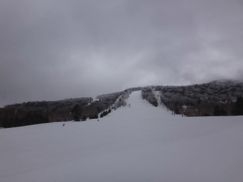

ありゃ？？

曇り…いや，小雪が舞ってるんですが…！？？

ってか，ゲレンデの上の方ガスってない？？

誰だ～！！

日曜は朝から晴れだって適当なこと言った

やつは！←だーかーらー，自分でしょ

で．

今日は一の瀬ファミリーからスタート．

リフトが動き始めた後は，ゲレンデは曇り空だったものの，

幸いガスっておらず…

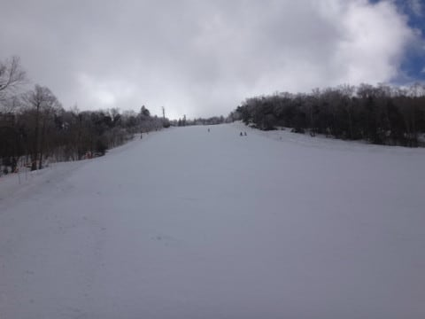

そして，ゲレンデは．

…シマシマに固まってます．

ええ．

朝イチは，いい感じに硬かったです…

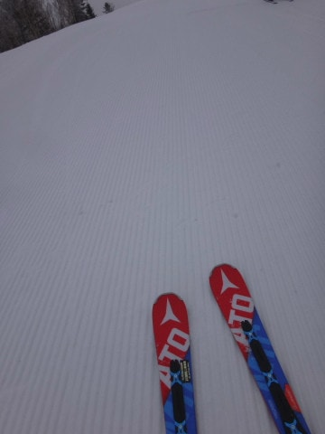

ってか．

ちと硬すぎたかな…

でも．

リフトが動き始めて，30分くらい経ったら…

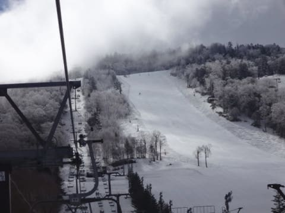

うむむ？？

ちょっと雲に切れ間が出てきたよ！！

…そして．

ゲレンデに日が射してきましたよ！

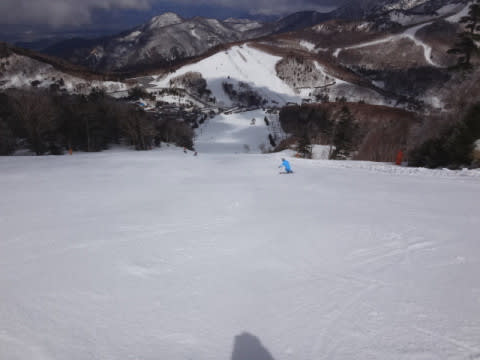

日が射すと．

カチカチに固まっていた雪の表面．

ちょっとだけ緩み始めて…

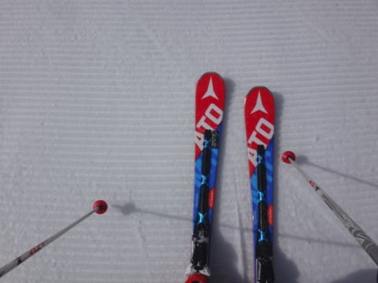

おかげで，ゲレンデは硬めのフラット斜面なのに．

エッジが効いて，すげーーーーーーー気持ちよく

飛ばせる，超快適バーンに！！

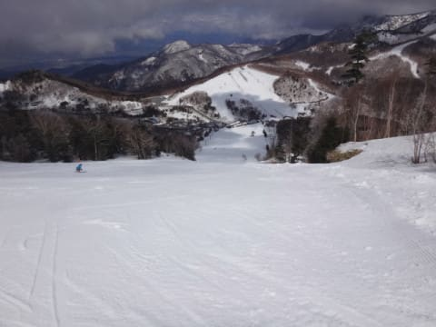

おまけに，人も少なくて．

もう，飛ばし放題なんですけど？？？

いいんですか？？

こんなに気持ちよくて，いいんですか？？

＃エッジをしっかり研いでない人は，ところどころ

＃板が流されたかもしれないけど…

さすがに午前10時に近くなってくると，

ゲレンデの人もちょっと増えてきたけど…

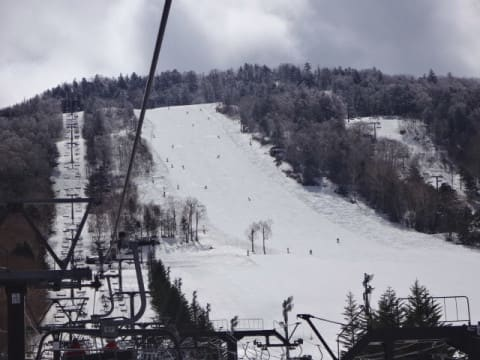

でも，せいぜいこのくらいで，

全然大回り可能．

気持ちよく大回り可能！

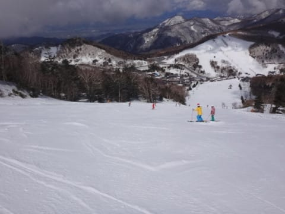

4月の晴天なのに，気温も低めで．

10時を過ぎても，表面がちょっと緩んだくらいで．

気持ちよく大回りができるなんて…

シアワセだよ！！

恵まれてるよっ！！！

パーフェクターコースも…

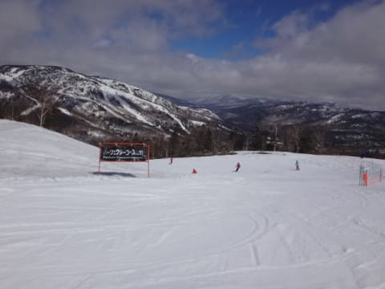

取りつきに一部，ちょっと雪が薄くなりかけた

ところがあるけど…

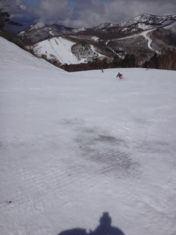

でも，まだまだ全然雪はたっぷりあって．

こちらも気持ちよく滑れます！

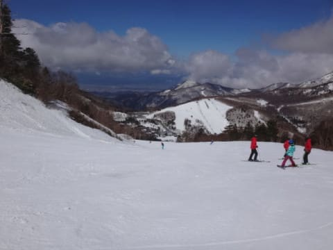

人工降雪の無いパーフェクター．

この時期に全く土が出てないってのは，

初めてかも？？

そして．

一の瀬正面バーンは．

なんと．

12時近くになっても．

表面はちょっとしっとりし始めてきたけど．

下地は固く，まだ大回り可能なフラットバーンっ！！！

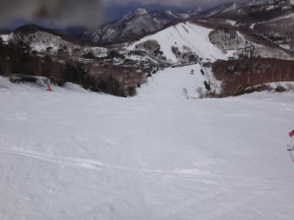

昼休みタイムなので，

ゲレンデはガラガラだし．

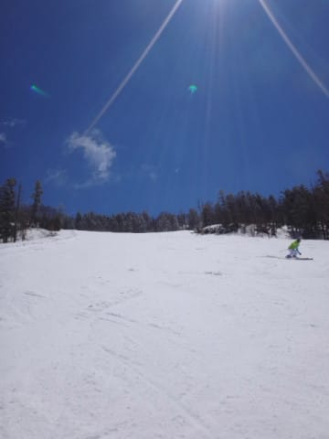

恵まれてる…

恵まれてるよ！！

今シーズン…

高天ヶ原まで足を延ばしてみましたが．

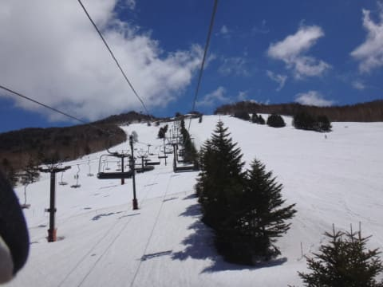

こちらも雪はたっぷり！

モーグルバーンも土はまだ出てきてませんね～．

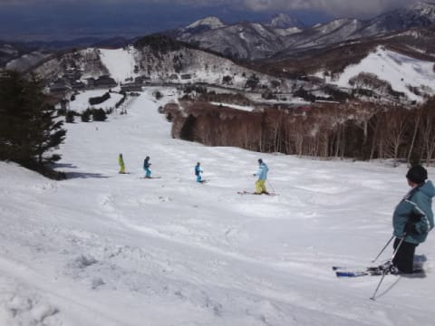

ただ，なぜかコブはそれほどできておらず．

ラインが数本ある以外は平らという，

高天ヶ原モーグルバーンとしては珍しい感じ…

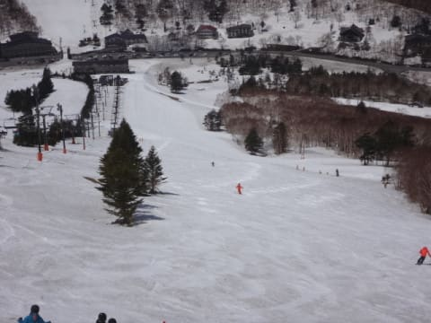

いやーー．

しかし．

今年は雪が多いよ！！

で．

午後は奥志賀に足を延ばしてみましたが…

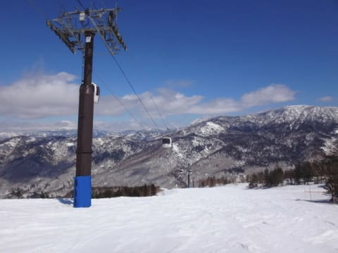

うむ？？

さすがに午後になると，一気に雪が緩み始めて．

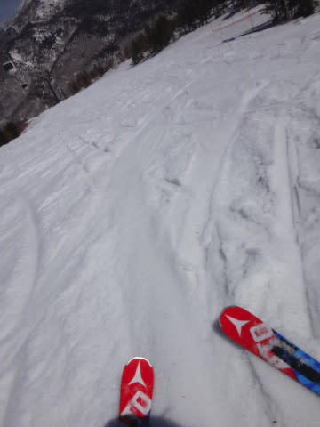

うううーーむ．

ゲレンデ全面，ねっとりと重い，

重量級の春の雪になってきましたよ…（涙）

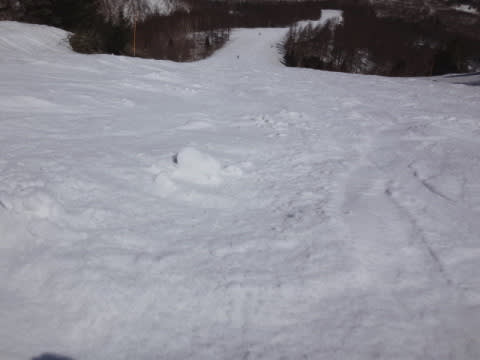

かなりずっしりと重い雪です…（涙）．

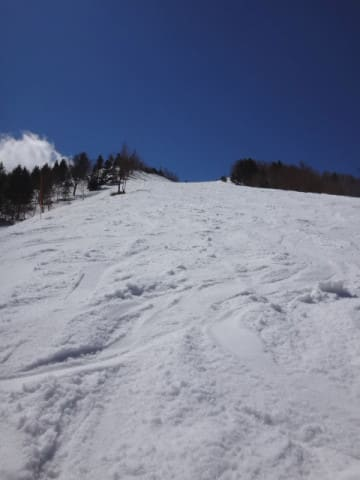

あぁ…

午前中は，シアワセだったのに…

でも．

4月も下旬のこの時期．

すっきり晴天だというのに…

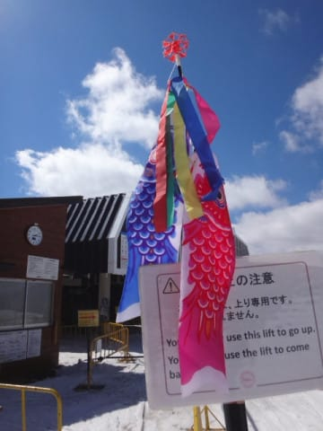

気温はそこそこ低めで．

ウェアのジャケットを着ないと寒い程度

だったので．

板がザブザブに潜ってしまい，

滑りが悪くなるような雪ではなく．

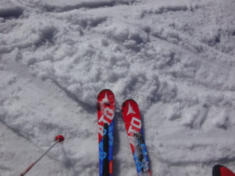

重くはあるけど，板はしっかり滑って

くれる雪だったのが救いかな～．

雪が緩むと，ゲレンデの表面はかなり荒れ始め…

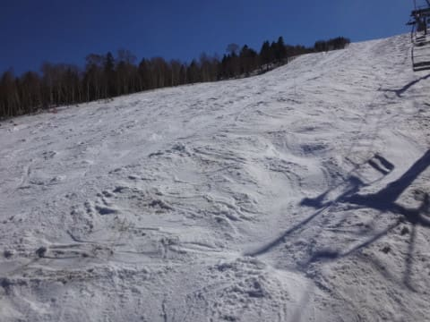

奥志賀エキスパートは，午後3時過ぎで

こんな感じで，ちょいと手ごわい荒れ荒れ斜面に…（涙）．

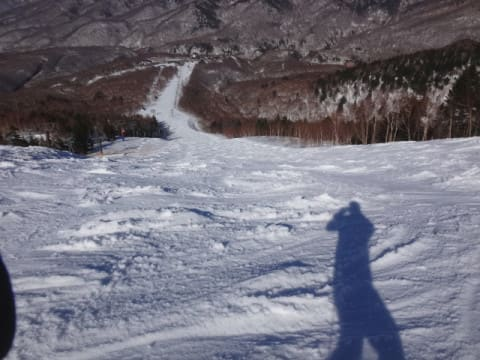

そして．

夕方になり，日が陰ってくると…

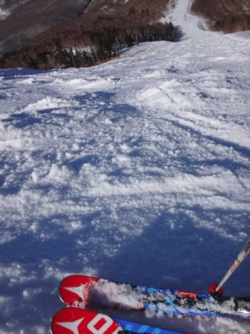

ありりり？

この形のまま，凍り始めてきましたけど…！？？

こんな感じのゲレンデが，このまま固まり始めて

すごい滑りづらくなってきたのですが…！？？

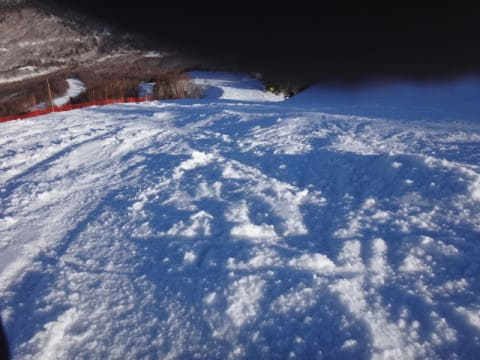

そして，午後4時には．

こんな感じで固まっちゃったので…

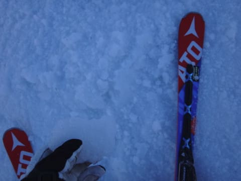

手ごわい…

手ごわいよ…（泣）

とはいえ．

そんな手ごわいゲレンデを．

[まうちゅうさんの指定席](https://blogs.yahoo.co.jp/mouse_tyu/64192011.html)である，

営業終了最終搬器の目印の赤旗ゴンドラに乗車して…

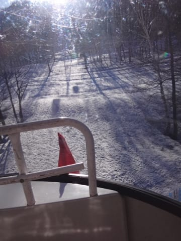

日が傾く営業終了まで，

しっかり滑り倒してきたのでした…

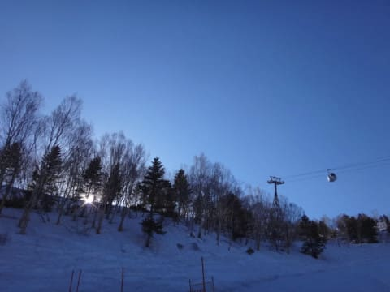

…という感じで．

この日曜日．

午後はかなり重い雪にやられた感じでしたが…

午前中は，4月下旬と思えない，超シアワセ

コンディションで．

かなり満足でした～！

いやーーー．恵まれてる

やっぱり，恵まれてるよ．今シーズン…

だもんで．

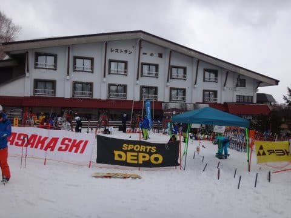

はい．

今回も，板の性能がはっきりわかる，

いい状況で試乗できましたよ～！

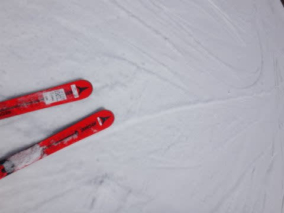

またいろいろ乗ってきたので，

これからの試乗レポート，お楽しみに…

## 💬 コメント一覧

### 💬 コメント by (なちちゃん)
**タイトル**: Unknown
**投稿日**: 2017-04-25 06:09:35

私も（日）（月）の変則日程で行きました。14時に奥志賀から一ノ瀬に移動して、夕方までそれらしい方を探したのですが、お見かけできませんでした。午後は奥志賀にいらしたのですね、残念でした

今シーズン、ブログを楽しみに見させていただいてました。私は昨日でシーズンオフしますが、残り雪を堪能してくださいね

### 💬 コメント by (かず)
**タイトル**: Unknown
**投稿日**: 2017-04-25 13:19:41

チタン入りのアルペン系の板と　安いショートパウダーボードです　今乗ってる板3シーズン前でも10万円位で売れるのでどんどん買い替えです　高い板だと気を使うので安くていい板も必要なんです笑　もし先週以上の寒気が来たらＧＷ行きます笑

### 💬 コメント by (Goku)
**タイトル**: Unknown
**投稿日**: 2017-04-25 19:36:59

日曜日はお世話様でした。

さくらちゃんとも滑れてよかったですね♪

で、決して、決してポチらないですけど、試乗レポート楽しみにしてます。

### 💬 コメント by (いー)
**タイトル**: Unknown
**投稿日**: 2017-04-25 19:57:44

4/23が 自分の、今シーズン最終日でした。

G.Wに行けないのが残念です⤵

15:00以降 一ノ瀬に行ったけども乱斜面でした…

奥志賀の方が良かったかも?

ラストに、ご挨拶出来て良かったです

連休レポ楽しみにしてます❗

### 💬 コメント by (はなげ親分)
**タイトル**: Unknown
**投稿日**: 2017-04-25 21:13:25

先シーズンのことを忘れていたほど、4月のコンディションは良かったですね～

贅沢にもこの状態が当たり前のような錯覚に陥っていました・・・・・

中央エリアは連休でおしまいなんて大変惜しいです！

日曜の朝イチの寺子屋はほとんど人がいない快適な状態で、昼過ぎのパーフェクターも良い状態で楽しめましたョ！

### 💬 コメント by (しんちゃん)
**タイトル**: レポートが楽しみ
**投稿日**: 2017-04-25 21:13:49

来シーズン、アルペン競技の板の規格（FIS規格）が見直されると聞きました。ポチる資金もないですが、ニューモデルの試乗レポート、楽しみにしております。

### 💬 コメント by (Skier_S)
**タイトル**: 春ですねぇ…
**投稿日**: 2017-04-26 07:38:39

＞なちちゃんさま

コメントありがとうございます～！

この週末，いらしてたんですね．

今シーズンはおしまいのようですが，

また来シーズンも志賀に出没予定ですので．

来シーズンお越しの際は，

お会いしましょう～！

＞かずさま

そうなんですね…

ボードの中古はそんなに高く売れるんですね…

私のSXもそのくらいで売れないかなぁ…

＞Gokuさま

日曜はありがとうございました～！

さくらちゃんとも滑れて，娘はめちゃくちゃ

喜んでました．

…ただ，スピードが違いすぎたので

さくらちゃんにちょっと迷惑かけちゃったかな，

と心配してます…

またGWにお会いしましょう～！

＞いーさま

一の瀬も，午後は残念な感じだったのですね．

今年のGWは雪がたっぷりなのに，

これでシーズン終わりとは．

ちと残念な感じですよね…

また来シーズンお会いしましょう～！

＞はなげ親分さま

そうなんですよ．

昨シーズンの同じ時期の試乗会，

すごい状態で試乗しましたから…

それに比べると今シーズンは天国です！

＞しんちゃんさま

FIS規格，確かGS板のサイドカーブが

また変わるんでしたっけ…

競技用の板を買ったことがないので，

自分には関係のない世界だと思ってました（笑）

また試乗レポートをお楽しみに～！

### 💬 コメント by (まうちゅう)
**タイトル**: Unknown
**投稿日**: 2017-04-26 21:53:51

指定席だなんてとんでもありません。

偶々、２回連続になっただけなんです。

昨日、急にブログの訪問者数が増えたと思ったら。。。

Skier_Sさんの送客力には脱帽です！

### 💬 コメント by (Skier_S)
**タイトル**: まうちゅうさま
**投稿日**: 2017-04-26 22:48:42

私の認識では，かなりの高頻度で

赤旗ゴンドラをGetされている印象が

あるのですが…（笑）

私は焼額1ゴン最終搬器は何度もありますが，

初めての奥志賀ゴンドラ最終でした．

今回こそっとリンクを張ってしまったのですが，

また今後もリンク張らせていただくかもしれません．

その際はご容赦を～！

