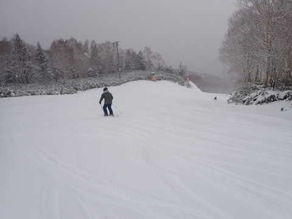

# 2022/12/11(日)の志賀高原焼額山スキー場速報レポート！…朝の積雪5cm，雪のち曇りでゲレンデはGood！リフトは午前中混んだよ

📅 投稿日時: 2022-12-12 00:40:53

ってなことで．

土曜は睡眠1時間半で志賀高原まで

300km運転して，

リフトスタートからストップまで

滑った後に深夜12時近くまで

飲んでいた，Skier_Sです…

そして，今日もあさイチリフトから

ラスリフまで滑って，300km運転して

さっき帰ってきました…

さて．

今から，明日締め切りの仕事するかな(涙)

ってなことなので．

今日も帰宅日恒例の速報モードでレポート！！

えー．

まず．

今日の朝イチは，志賀高原の登り坂の

チェーンチェックを超えるあたりまで

雨でしたが．

そこから登っていくとじき雪になって…

　志賀高原への登り坂はところどころ

　凍結の上に雪が載っている

　デンジャラス道路になるので注意．

と予想した通り，途中からかなりの本格

積雪路になってました…

これは…

道路にこれくらい積雪があるくらいだから，

ゲレンデは新雪でいいに違いない！！

と，あさイチのゲレンデに出てみると…

　朝は人工雪の硬いバーンの上に

　柔らか新雪が載ったいい感じのバーン！

と，ここも予想した通り．←予想があっていることを強調している

圧雪の上に5cmちょいの冷えた新雪が

載った，かなり気持ちいいバーン！！

いや…

雪だ！！

今シーズン初の，天然雪の新雪だ！！

いやーーーー！！

これだ！！

これが雪だよ！！！

柔らかくて気持ちいいバーン…

実に．

実にいつ以来だろう…

と，気持ちよく滑っていられたのは

1時間ほど．

営業開始から1時間近くたった，

9:30ごろには…

うぎゃーーーー！！

リフト待ちがすごいことに！！

そんなに待ちが無かった昨日とは

えらい違いだ…（涙）

まぁ，でも．列はすごい長いけど．

縦長に伸びた列なので，見た目ほど

待ち時間は長くなく．

最大10分が1回．

そのあとは，昼ごろまで5~8分待ち

って感じだったでしょうか…

でも．

リフト待ちは長いけど，コースは幅も

十分あり，ペアリフト1本の輸送力なので

ゲレンデ上はそんなに人が多いわけではなく．

そんなにストレスなく滑れましたよ～！！

そして．

お昼12時前には一気に列が短くなり

この程度になったので．

午後は快適に滑れました～！！

午後は雪も弱まり，うっすら日も射す

タイミングもあったりしたので．

絶好の大回りチャンス！！！

今シーズン初の大回り板で，気持ちよく

かっ飛べます！！

いやーー．

久しぶりに大回り出来たよ…

昼ごろには新雪がちょっとだけモサモサした

ところや，下地の硬い人工雪が出てきた

ところもあったけど．

人工雪対策でエッジをしっかり立てておいた

自分にとっては全く問題なし！

モサモサしたところも雪は重くなかったので，

気持ちよくスピードを出して大回り

出来ました～！！

あぁ…気持ちよかった…

いや．

天然雪が被ったこの広いバーンで

気持いい大回りをやると．

イエティで滑っていたあれは，

「スキーのような何か」

だったとしか思えない…

ってなことで．

午後3時を過ぎるとリフトも飛び乗りで，

後の搬器を見ても人が乗ってないような

状態になってきたし．

こんなコンディションがよくてがら空き

なのに，滑らないともったいない！！！

と，いつも通りのラストまで滑り倒して

きたのでした…

いやー．

午前中にリフトがかなり混んだ時は

どうしようかと思ったけど．

午後はリフトも空いて，雪も止んで

気持ちよかったので．

これだよ！

これがスキーだよ！！

という快楽を満喫できたのでした…

良かった．

楽しかった…

無理してでも行った価値はあった…

ってなことで．

明日詳細レポートやります…！

## 💬 コメント一覧

### 💬 コメント by (炎の北海道民)
**タイトル**: Unknown
**投稿日**: 2022-12-13 19:47:23

最後まで滑って300km帰るって超人ですね。もうこれは長野か北海道に移住するしかないと思います。私の家から10分で「ばんけいスキー場」に行けますよ。

### 💬 コメント by (Skier_S)
**タイトル**: ＞炎の北海道民さま
**投稿日**: 2022-12-14 02:31:13

月山に行くときは，往復1000km日帰りで滑ることもありますから…

早く長野に移住したいです．

ばんけいスキー場のそばなんですか！！

仕事終わりにナイターで人滑りできそうですね…

うらやましい…

