# 12月3，4日の週末のスキー場の天気は…というより，今週末までにスキー場はオープンするのか天気図を見てみた

📅 投稿日時: 2022-12-01 01:20:45

🏷️ カテゴリ: [スキー天気予想](c6554f5c3c106093b511a8daae23757e8.md)

…大変悲しいことに．

かなりのどしゃ降りだった昨晩．

ゲレンデに対するダメージは想像以上

だったようで…

本日，横手山が営業見合わせとなりました（涙）

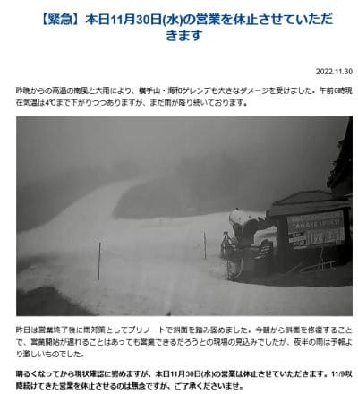

（[横手山ホームページ](https://yokoteyama2307.com/)より）

ちなみに，Facebookによると，

「明日の営業についても、たいへん厳しいと考えています」

とのことで．

12月1日もダメっぽい感じです…（激涙）

そして．横手山どころか．

イエティまでゲレンデ状況悪化のため，

11/30と12/1の営業中止に…！！！（泣）

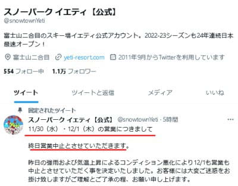

（[スノーパークイエティ　Twitter](https://twitter.com/snowtownYeti)より）

イエティ，11月下旬に状況悪化で

営業休止は史上初では？？？

…[先週の土曜日は，コース幅も結構あり，
雪の厚みもそこそこあったのに](e51a8165898145aa0220c823dc3ea8f2a.md)…

それが2日間営業できなくなるって，

どんだけ雨が降ったんだ？？？

さらに．ウイングヒルズ白鳥も…

これはひどい（落涙）

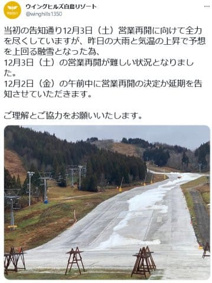

（[ウイングヒルズ白鳥Twitter](https://twitter.com/winghills1350/status/1597845662531432448)より）

この状況の中，軽井沢だけはクローズして

いないようなので．

もしかしたら，今，日本で滑れるのは軽井沢

だけになるのかな？？？

12月1日に，本州でイエティすら営業できず，

軽井沢しかオープンしていないって…

史上最悪の12月スタートじゃなかろうか（激泣）

そして．

今週末オープンのはずの焼額は…

せっかく打った人工雪，ほぼ消滅（涙）

全滅せず，まだちょっと残ってることに

驚いて良いレベルかも．

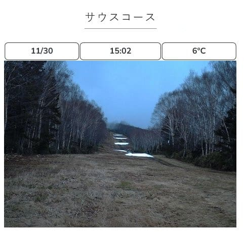

（[焼額山スキー場ホームページ　ライブカメラページ](https://www.princehotels.co.jp/ski/shiga/livecamera/)より）

これ…

あと残る木曜，金曜の2日間でオープン

させられるのか？？？

2日間で天然雪50cmは無いと厳しい…（泣）

12月第1週に焼額がオープンできなかったら，

私が焼額に通うようになってから初めての

事態ですね…

これまで，焼額が12月第1週にオープン

出来なかったことは無かったんじゃない

かな？？

あの，40年ぶりの雪不足と言われた

2016シーズンでも，12月第1週にはこれだけ

雪があって，焼額第2高速が滑れました

から…

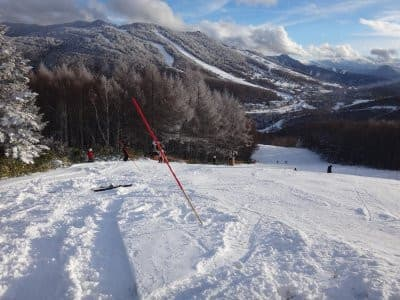

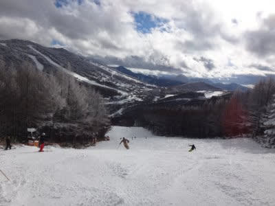

ただ．

今現在，志賀高原は蓮池でも気温は

マイナスまで下がってます！！

人工降雪機，フル稼働できます！！

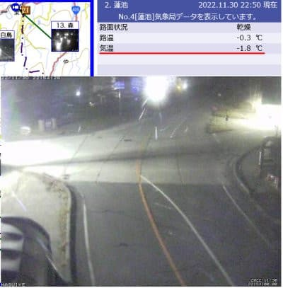

（[北信建設事務所道路気象状況カメラ](http://hokushin.pref-nagano-roadcamera.jp/)より）

ってなことで．

これから2日間で50cm雪が積もるのか．

天気図を見てみましょう！！

まず．

木曜，12月1日の850hpa気温図ですが．

まぁ，0℃線は志賀よりは南．

これはたぶん，よっぽど標高が低くない

限り，だいたいのスキー場で雪になる

気温ですね．

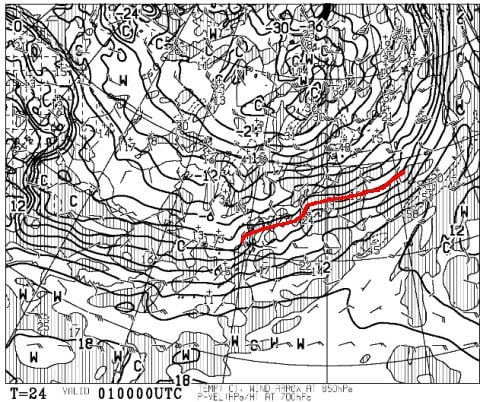

ただ，地上天気図は…

うーん．日本海沿いに降水域があるけど．

それほどの降水量もなさそうだし．

西風だし．

志賀は積もらないな…（泣）

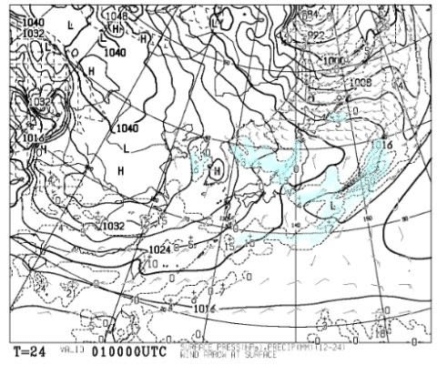

そして．最後の期待の12月2日ですが…

850hpa気温を見ると，この日は赤い

0℃線は太平洋まで下がってます！

冷えます！！

これは，スキー場なら確実に降れば

雪のレベルです！！

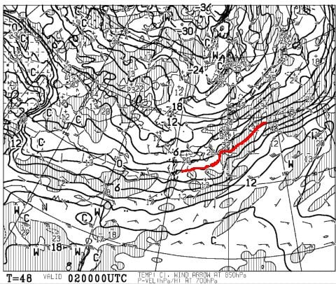

地上天気図は…

これは日本海の広い範囲が降水域に

覆われる，冬型のパターン！

新潟沿岸では18cmくらいの積雪量が

予想されてます！！

…が．

これくらいでは全然積雪が足りない…（涙）

で．大変残念なことに．

この日の天気図を拡大すると…

見事に西風です（涙）

志賀高原では，積もらないパターンです…（激涙）

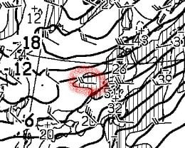

そして，12月3日の土曜日は．

この日は赤い0℃線は志賀よりちょっと

南くらい．

志賀は降れば雪だし．

人工降雪機は動かせるけど…

そんなに冷えない感じ．

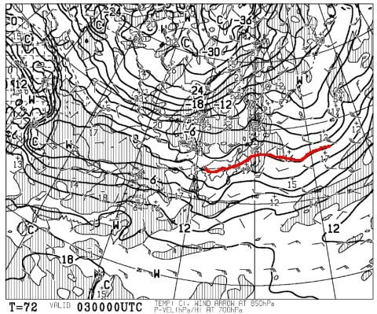

で，この日の地上天気図は，

一応日本海側に降水域がかかっていて，

一見積もりそうに見えますが…

予想される降水量はそれほどでもないし．

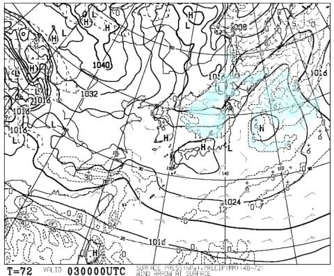

そして，こいつも拡大すると…

見事に西風（涙）

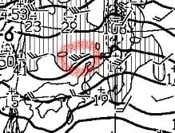

この気温で西風だと…

志賀高原は雪は絶対降らず．

むしろ晴れるくらいのパターンだな（涙）

さらに，12月4日の日曜は…

この日も850hpaの0℃線はギリギリ志賀に

かかる程度．

雨にはならないですが，降ってもぼた雪．

冷え込みはそれほどではないですね（泣）

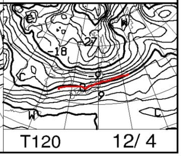

そして，地上天気図は…

うーん．

ギリギリ降水域がかかっているかどうかの

レベルなので．

そんなに積もらないだろうなぁ…

まぁ，人工降雪だのみかな…

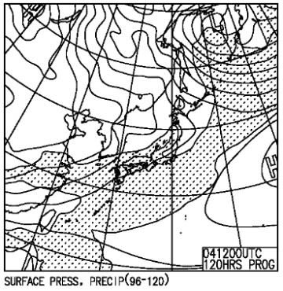

ってなことで．

まとめると．

12/1(木)：朝からボチボチ冷える．

　日本海側や白馬は雪が降る．

　志賀は雪がぱらつくが積もらず．

　でも人工降雪機が動かせるほど

　冷えるので人工降雪機フル稼働！！

12/2(金)：早朝から雪！日本海側や

　白馬は1日で20cm以上積もるか？

　志賀高原は西風なのでそんなに

　積もらない．10cm程度か…

　でも，かなり冷える．人工降雪機

　Maxパワー炸裂！！！

12/3(土)：日本海側は雪が降ったり止んだり．

　志賀は曇り時々晴れ．

　志賀は朝はそこそこ冷えるが，

　積雪期待できず．

　昼間は0℃近くまで気温が上がる．

　志賀は天然雪は期待できないので，

　人工降雪機ガンバレ！！

12/4(日)：おそらく曇り~晴れ．

　積雪期待できず．

　朝は晴れれば放射冷却で冷える．

　晴れなければ気温が高め．

　昼間も気温は0℃近くまで上がる．

　一応人工降雪は志賀高原なら

　終日動かせそう．

…うーん．

自分で書いていて，絶望的な気分になってきた…

とりあえず，これからしばらく，毎日

人工降雪機は動かせそうだけど…

雪がドサドサ積もる予想ではないです(涙)

いや．

今，日本の近くに寒気が放出されてるんですよ．

この図を見ると解るように，赤のバツ印の

北極点から，赤線で囲った日本の方向に，

見事に狙ったように水色で囲ったかなり

強めの寒気が放出されてるんです…

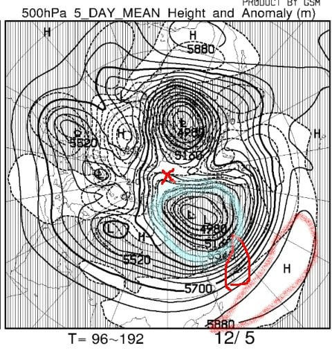

だけど，図の右下にある赤く印した

暖かいサブハイが見事に日本の真南に

居座っていて．

せっかく日本の方向に放出されている

寒気が南下するのを防いでいる

感じなんです…(涙)

この寒気放出で，北海道くらいまでは

すごい冷えるんですよ．

このサブハイがいなければ，これだけの

寒気が日本方面に下がってくれば，

寒気が思いっきり南下して，

激烈に冷えたはずなのに…

…この時期に，こんな強烈な暖気が

日本の南にわだかまっているとは…（泣）

…これはきっと．

誰かいる．

誰か，史上最強レベルに強烈な，

暖まれ暖まれ踊りの使い手がいる！！！

我々の熱い思いのこもった冷え冷え踊りの

効力を阻止する，暖まれ暖まれ踊りの

使い手を探し出して，消さねばなるまい…

## 💬 コメント一覧

### 💬 コメント by (毎日読者K)
**タイトル**: Unknown
**投稿日**: 2022-12-01 05:53:13

ウイングヒルズの近くの、ホワイトピアたかすは大雨を耐え抜き営業継続できてるみたいですよー

### 💬 コメント by (大阪のK)
**タイトル**: Unknown
**投稿日**: 2022-12-01 06:00:12

その踊り手は我が女房かも知れません。

12月4日がゴルフだから…

### 💬 コメント by (オオスギ)
**タイトル**: Unknown
**投稿日**: 2022-12-01 11:05:11

恐らく、その踊り手は、うちの息子が通う小学校の校長先生ではないかと思われ・・・

こんな時季外れに、日光湯元・戦場ヶ原に修学旅行へ行くので・・・

### 💬 コメント by (レインボー75)
**タイトル**: Unknown
**投稿日**: 2022-12-01 19:43:44

ついに後期高齢者。あーあ！

有力な財閥エス様が、とある口座に大金を振り込めば、下手人は確実に消してくれますぜ。でも、下手人が身内の場合はキャンセルしてくださいね。

今日、海和ゲレンデが13時から二時間半だけオープンしてくれました。埼玉の友人によると「でこぼこでしたが、明日は今日よりは良くなると思います」

### 💬 コメント by (Skier_S)
**タイトル**: 焼額今週末オープンせず（涙）
**投稿日**: 2022-12-02 02:02:59

＞毎日読者Kさま

情報ありがとうございました…

今日の記事に反映しました！！

＞大阪のKさま

踊り手はKさまの奥さまでしたか…

だとすると，抹消していただかなくてはなりませんね…

とりあえず，踊れないようにしばらく眠らせておいてみてください．それで冷え始めれば，

闇の踊り手確定です．

＞オオスギさま

こちらにも踊り手容疑者が！！！

しかし，この時期に日光・戦場ヶ原ですか…

ちょいと季節外れですね．

とりあえず，その校長先生も踊れないように眠らせてみてください…

＞レインボー75さま

お久しぶりのコメントですね！！

名前の数字がひとつ進みましたね…

とりあえず，スイス銀行の指定の口座に振り込んでおきました．

レインボーさま，踊り手を消してやってください…

