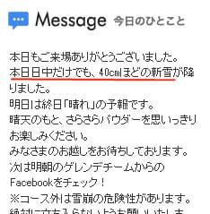
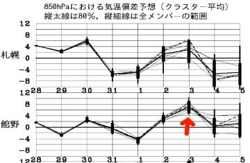
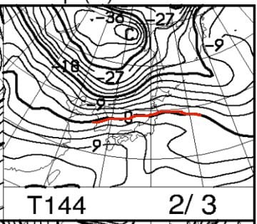
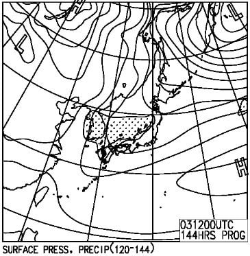

# 早くも2020年度モデルスキーの試乗会情報が流れてきました…

📅 投稿日時: 2019-01-30 02:34:00

えー．

なんと．

本日火曜日．

焼額は，昼間だけで40cmも積もった

ようですね…！

いやーーー．

積もりますね…

しかし．

今週末の，2/3の日曜は…

うむ？

平年比+4℃～+8℃に気温が上がるだと！？？

そして，0℃線が東北まで北上してしまうだと！？？？

がががーーーん！！！

…これは．

日曜はヤバい．

間違いなく，降ったら雨です…（涙）

…ただ，今のところ．

3日の予想，ギリギリ降水域は志賀に

かかっていないので．

日曜は気温は上がるものの，雨にならずに

済んでくれるかな…

と，信じたいところ．

うーむ．

3週間前は風邪．

先々週は法事でスキーできず．

先週は週末を狙ったようにドカ雪になり．

営業開始が遅れたり，早く終わったり，ナイターが無かったりと…

悲しい状況が続いているのに．

これで今週末，さらに週末をドンピシャ狙ったように雨

だったら…

暴れる．

本気で暴れる．

…とりあえず．

今のところは．

日曜に雨にならないよう，冷え冷えになる踊り

を，全身全霊で踊り続けるしか，

できることはありません…（涙）

あぁ…雨になりませんように…

また明日，水曜夜定例の週末の志賀高原天気予想

やりますので．

それまでには，

「昨日発表の，2/3の予想天気図は嘘でした～！」

という天気図になることを祈るばかり…

…ってなことで，本題へ．

1月も終わりに近づき．

スキーシーズンはもう中盤に差し掛かってきましたが．

なんと．

早くもAlpen＆Sports DEPOから．

2020シーズンモデルのスキーの試乗会情報が

DMで届きました…！

うーむ．

もう，来シーズンの話が来る時期になったか…

とりあえず，石井スポーツやカンダハー，

ASPENのWEBページも見てみましたが．

これらのお店は，まだ試乗会の案内が

出ていませんね…

ってなことで．

Alpenの試乗会．

[ここ](https://www.alpen-group.jp/store/event_reserve/2019SKIsijyoukai1)に詳細がありますが．

○2/23,24　ウイングヒルズ白鳥

○3/2,3　札幌国際

○3/9,10　野沢温泉

○3/16,17　上越国際

○3/23,24,25　アサマ2000

○3/30,31　山形蔵王

○4/6,7,8　シャルマン火打

○4/13,14　八方尾根

○4/20,21　一の瀬ファミリー

○4/27,28　札幌国際

○5/11,12　かぐら

と，10か所でやるようです．

とりあえず，私がここ数年参加している，

4/20,21の一の瀬ファミリーは参加確定かな…

でも．

3月中の，まだ雪のいい時期に試乗しておきたい

気もするので…

3/9あたりの野沢か，

3/23の週のアサマ2000に行こうか…

……いや．

ちょっと待て．

ロングの板は今シーズン買ったばかりで．

さらに今シーズンは新雪が多く，ロングの板の

出番がほとんどないため．

まだ，古いX-Raceしか履いておらず，

新しいロングの板は来年までは間違いなくもつはずだし．

そして．

ショートの板も，この正月休みにやっとSXの

次郎君から三郎君にスイッチしたばかりで．

まだ四朗君が全く使われないまま置いてある

状態なので．

…今シーズンは三郎君で乗り切って．

来シーズンは，四朗君が新品でデビューするはず…

となると．

来シーズンは，ロングの板もショートの板も

買わずに済むはずだな…

ってことは．

私は来シーズンモデルの板を試乗する必要は

無いのでは…！？？？？

…と，思ったけど．

再来年以降に，型落ちになった来シーズンモデルを

買わないとも限らないから．

やっぱり来シーズンモデルの試乗会に行っておかねば

なるまい…っ！

と．

自分に言い訳をして．

物欲に負けて，来シーズンに新モデルの板を

買うための情報収集じゃないからな

と，自己抑制の暗示をかけつつ，

試乗会に参加しよう…

と思った，Skier_Sなのだった…

## 💬 コメント一覧

### 💬 コメント by (yama)
**タイトル**: 試乗会
**投稿日**: 2019-01-30 06:39:34

志賀高原の20日21日の試乗会を予約しました。仕事が入らなければ行く予定です。買うつもりはこちらもありませんが…。

### 💬 コメント by (Goku)
**タイトル**: Unknown
**投稿日**: 2019-01-30 19:10:51

毎年恒例の試乗会ですが、たまにはトップシーズンに近い時期に志賀でやって欲しいですね。

それも出来ればヤケビで！

### 💬 コメント by (Skier_S)
**タイトル**: 3月に試乗したい…
**投稿日**: 2019-01-30 21:27:52

＞yamaさま

おっと．

試乗されるんですね…

私も20，21日試乗したいと思っていますが．

この時期の試乗会，雪が悪すぎて板の性能が

よくわからないんですよね…（涙）

＞Gokuさま

そうなんですよ～．

トップシーズンの焼額でやってくれると

嬉しいんですけどね～．

確か，14，5年前は，3月の焼額で

試乗会をやっていた思い出があるんですが…

### 💬 コメント by (若杉勲71)
**タイトル**: 志賀高原情報
**投稿日**: 2019-01-31 20:05:23

昨水曜日は40日を超える今シーズン最高の日で、二ゴンスタートで、奥志賀、一ノ瀬、たかま、ニシタテ、サンバレーと、遠足しましたが、見事に虹じゃない、２時きっかりに帰ったレインボークラブ員でした。

本日木曜日は視界不良でヤケビのみ。非圧雪は表面がカチンカチンで、加藤ご夫妻レベルでないと攻略不能。私が一回でリタイアしたのは言うまでもありません。

### 💬 コメント by (Skier_S)
**タイトル**: 若杉さま
**投稿日**: 2019-01-31 23:18:09

えええ！

水曜，良かったんですか…

サンバレーまで行って，2時にヤケビに戻ってくるって，結構忙しいですよね(笑)．

でも，今日は新雪カチコチって…雨が降って表面が

クラストしてるわけでは無いでしょうから，

ウインドパックされてる感じですか？

