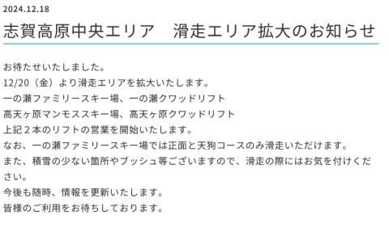
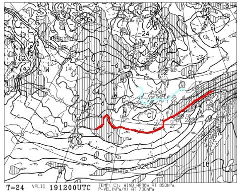
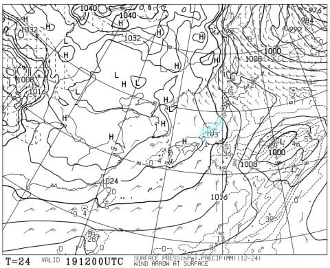
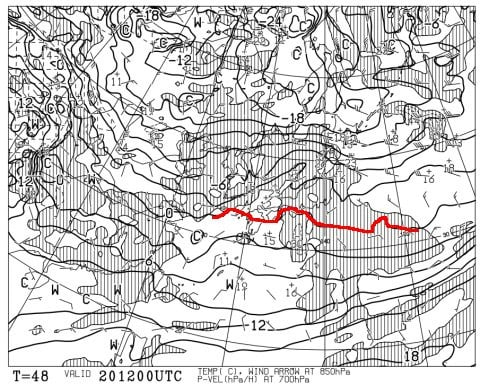
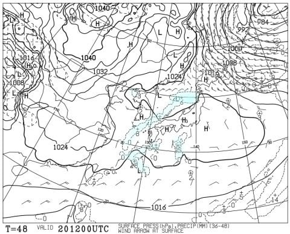
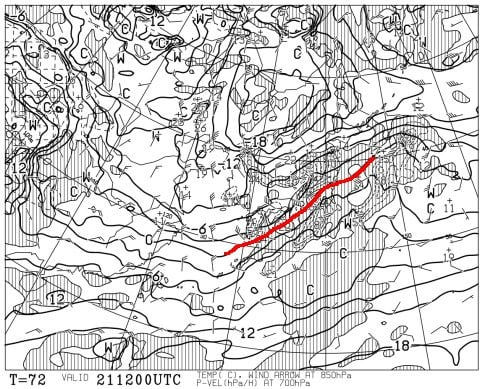
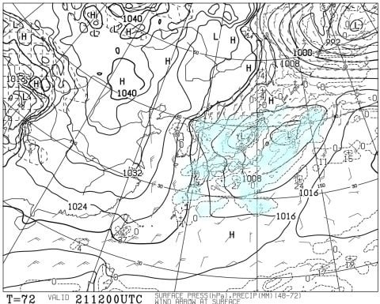
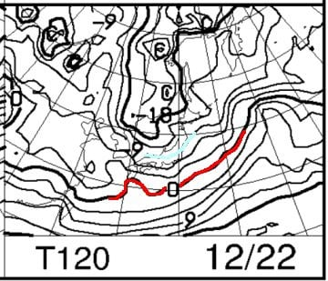
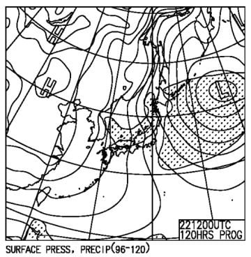

# 12月21，22日の週末の志賀高原スキー場の天気は…土曜は晴れ，日曜は激冷えで雪が結構積もりそうな，極端な天気

📅 投稿日時: 2024-12-19 02:49:45

🏷️ カテゴリ: [スキー天気予想](c6554f5c3c106093b511a8daae23757e8.md)

えー．

一体いつになったらクワッドリフトが動くんだ

と思っていた，志賀高原の一ノ瀬＆高天ヶ原

ですが．

ようやく20日の金曜からクワッドリフトが

動くようです…！

（[志賀高原中央エリアホームページ](https://shigakogen.co.jp/%e5%bf%97%e8%b3%80%e9%ab%98%e5%8e%9f%e4%b8%ad%e5%a4%ae%e3%82%a8%e3%83%aa%e3%82%a2%e3%80%80%e6%bb%91%e8%b5%b0%e3%82%a8%e3%83%aa%e3%82%a2%e6%8b%a1%e5%a4%a7%e3%81%ae%e3%81%8a%e7%9f%a5%e3%82%89%e3%81%9b/)より）

…しかし．

[当初のアナウンス](e1f9029d3508ad3b66941c48209a09566.md)では，高天ヶ原クワッドは

先々週の7日から動く予定だったし．

寺小屋や東館山・西舘山・ブナとかは

当初予定では12月14日から運転だったはず

なのに…

営業開始の案内が全く出ませんね（涙）

うーん．中央エリアもう少し頑張ってほしい…

ってなことで，本題へ．

今日は水曜日なので…

そうです．今回のメインは，水曜深夜恒例，

志賀高原の天気予想です！

まずは，19日木曜の850hPa気温を見ますが．

ふむ．水色の-6℃線が志賀より南にあるレベル

なので…

結構冷え込みますね．寒そうです…！

そして，この日の地上天気図は．

うーん．この日はわずかに降水域が

日本海側にかかる程度．

志賀高原は曇りで，ときどき雪がぱらつく

程度かな…

積雪はほとんどなさそう．

積もってもうっすら．

で，20日の金曜の850hPa気温ですが…

うーん．

この日は赤い0℃線は志賀高原より南だけど，

結構志賀高原に近づいているし，-3℃線が

志賀より北にあがってるので…

木曜より気温が上がってきますね．

まぁ，とはいえ昼間に0℃をぎりぎり超える

程度の暖かさだと思いますが．

この日の地上天気図は…

うん．高気圧に覆われるので，おおむね晴れかな．

そして，肝心な週末，続く21日土曜の

850hPa気温を見ると．

うむむ…この日は20日よりさらに気温が

上がりそう．

昼間は山頂でも0℃を越えそう（涙）

地上天気図も一見日本中が降水域に覆われて

そうに見えるけど．

長野や群馬など，東日本内陸側は降水域に

入ってないので…

この日は志賀は意外と晴れそうな予感．

気温が上がって晴れるので，かなり暖かく

感じそう．

で．続く22日日曜の850hPa気温は…

うおおおお！！水色の線は-9℃線！！

こいつが志賀高原より南にあるレベルなので…

これ，昼間でも-7~8℃，

夕方は-10℃以下まで冷える，激冷えデー！！

さらに地上天気図を見ると．

うほーーーー！すごい冬型！！

これは…積雪量はまだ正確にわからない

けど．かなり降りそう…そこそこ積もり

そう！

ってなことで．

まとめると．

19日(木)：朝の焼額山頂の気温は-7℃くらい．

　積雪はほぼ無し．昼間もそれほど気温が上がらず，

　終日冷える曇り空．ただし時折雪がぱらつく．

20日(金)：朝のうちは雲が多いかもしれない

　けど，昼前には晴れる．積雪は無く，

　朝はかなり締まり気味のスピード

　バーン．

　朝の気温は-7~8℃と冷えそうだけど，

　昼に向かって気温が上がっていき，

　昼間は-1~-2℃くらいにまで上がる．

　

21日(土)：おそらく朝から晴れ．

　リフト営業時間は晴れ．夕方から曇るかな？

　朝は固めに締まったシマシマバーン．

　朝は放射冷却で-5℃くらいまで

　冷えてそうだけど，昼間は0℃をこえる

　くらいまで気温が上がり，日が射すので

　暖かさを感じるほど．

　標高が低いスキー場は雪が緩みそう

　だけど，志賀高原は雪が緩まないかな．

　晴れてあたたかいスキー日和！

22日(日)：この日は土曜と打って変わって

　朝から雪！終日雪．時折かなり強く降る．

　朝の積雪は10~20cm，ブーツパフ，

　気温は朝は-10℃以下．昼間もほとんど

　気温が上がらず，夕方は-10℃以下まで

　下がる．超冷え冷え雪降りデー．

　昼間も10~20cmくらい積もりそうなので，

　午前中からゲレンデはかなり荒れ荒れ

　モフモフになり，風が強かったら

　ほぼ間違いなく根性の無いスキーヤー

　ふるい落としデーになる．

という感じでしょうか…

あ，日曜は朝までにそこそこ

積もりそうだし，かなり内陸まで

雪雲が入りそうなので…

上信越道は軽井沢あたりから

チェーン規制が入るくらいの覚悟を

しておいた方がいい感じ…

日曜朝にスキー場へ向かう人は，高速も

チェーン規制が入ることを見越して，

早めに出てくることをおススメ…

ってな感じで．

土曜は比較的暖かい晴れで，

日曜は激冷えの雪降りという，

かなり極端な週末になりそうです…

まぁ，雪が降らないで晴れるのもいいし．

新雪がガンガン積もっていくのもいいし．

どっちにしろ楽しめる週末になりそう

です…！←あなたはどんな状況でも雪があればシアワセなんでしょ

## 💬 コメント一覧

### 💬 コメント by (レインボー77)
**タイトル**: Unknown
**投稿日**: 2024-12-19 16:19:53

木曜日の志賀高原情報

今日からカラマツコース(第二リフト)オープン。

昨日の降雪が綺麗に圧雪されて、しかも気温が低い。パノラマは今日も快適。カラマツに行くと、なんと太陽の周りに丸い虹の輪が！

これをハロというらしいんだけど、ラッキーです。ハロが出ると天気は下り坂のはずが、その後２時間だけは晴れてくれました。

肝心のカラマツコースは、人工雪で急仕上げしたせいか、予想通り今一つ。コース右側はウェーブの連続で楽しくない。

あとはひたすらニゴンをぐるぐる。11時を過ぎると視界が悪くなったので11時30分終了。

ゲレンデは荒れずに楽しめました。

### 💬 コメント by (アリス)
**タイトル**: Unknown
**投稿日**: 2024-12-19 16:51:48

skier_S様

仕事ズル休み2日目。

2ゴン到着8時15分。常連さんが10名程ゲート前に。最後尾隣には、一ノ瀬ファミリーのレジェンドさん。

今年最初のシマシマバーンスタート。爽快感200%です。本数滑ってもコンディションいいです。

レインボー隊の隊員の板のステッカーを見ると『志賀高原レインボー隊のんびりゆったり』

とありました。→そんな訳ないだろ(^_^;)

唐松もまずまずです。コース幅一杯滑れます。

後半の降雪とガスには悩ませられましたが、やはり志賀高原はシアワセをくれるスキー場です。

### 💬 コメント by (地元民)
**タイトル**: Unknown
**投稿日**: 2024-12-19 20:14:47

木曜日、夕方から里も大雪。中野市内で20㌢。志賀高原は40〜50㌢なのでは？

### 💬 コメント by (モイストシルバー)
**タイトル**: Unknown
**投稿日**: 2024-12-19 22:21:46

本日日帰りで初滑りに行ってきました。皆さん報告の通り、山頂は終始-10℃前後で冷えていて、コンディション最高の初滑りになりました。午後はかなり降っていて、帰り際、何台か登れないクルマがいました。今シーズンは楽しめそうですね。

### 💬 コメント by (Skier_S)
**タイトル**: コメント回答遅れました~！
**投稿日**: 2024-12-21 00:04:14

＞レインボー77さま

唐松イマイチだったんですか…でも2高動いてくれてうれしい！

＞アリスさま

おっと．一ノ瀬のレジェンドさん，シーズンインしましたか…（笑）．

この日は午後は結構降ったみたいですね！

志賀高原でシアワセになれたようで何よりです！！

＞地元民さま

焼額のライブカメラを見ると，昼から夕方までに20cm，夕方から夜中までに20cmくらい積もった

みたいですね…

夜中に止んじゃったので，一晩の積雪はそこまでいかなかったようで，ちょっと残念…

＞モイストシルバーさま

お久しぶりです~！

初滑り，志賀高原へようこそ！

Blog見ましたが，午後降った雪は重かったんですね…

また今シーズンも志賀に通ってください！（笑）

