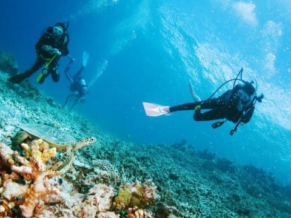

# 小学校5年生（10歳）の娘に，ジュニアオープンウォーターのダイビングCカードを取らせてみた…その2

📅 投稿日時: 2018-09-11 05:09:07

どうでもいいのですが．

この週末．

いろいろ想定外の出来事がありました…（涙）

うーーーむ．

もう，衝撃の事実．

家族全員大ショックのお知らせを

受け取ってしまったところから，

またいろいろなドタバタ物語が始まり

そうです…

…いや，何があったかは．

また明日にでも記事にします．←Blogネタが増えた…

と，喜んでいる場合ではない

ってことで．

本日は精神を落ち着かせて．

娘がジュニアオープンウォーター取得するまでの

体験記の続きをば．

えー．

…前回も書いたように．

Cカード取得のためのカリキュラムは，ジュニアと大人向けで

全く1ミクロンも変わらないので．

この体験記，大人のオープンウォーター取得の

参考としても読めるかと…

で．

オープンウォーターを取るためには．

・学科講習＆テスト（200ページ以上のテキストを読み込んで，

　テストで75%以上正解する必要）←テストは合格点が

　出るまで，その場で何度でもやり直せるという

　緩いシステム(笑)なので，ご安心を

・プール実習（浅い穏やかな海で実施する場合もあり，半日ｘ2回程度）

・海洋実習（海でのダイビング4本）

が必要です．

うちの場合は，

・学科講習は，e-LearningでPCを使って

　自宅で学習，テストを実施

・プール＆海洋実習は，2日間で実施

　1日目…AMプール実習，PM2本海洋実習，

　2日目…AMプール実習，PM2本海洋実習

ということで．

学科はテキストを読むのに多少苦労するけど，

事前に家で学科を終えておけば．

現地実習は2日間で終了なので．

意外と簡単に取れちゃう感じです…

ちなみに，Cカード取得の申し込みは，

Cカード取得コースを実施しているダイビングショップに

お願いするわけですが．

私がお願いした，フィリピン・モアルボアルの

[エメラルドグリーンダイビングセンター](http://www.emeraldgreen-moalboal.com/)

に申し込みする際に，

「学科はe-Leaningで事前に終わらせておけば，

　現地での学科講習が不要になるので，現地2日で

　認定が取れますよ！」

との説明を聞いた瞬間．

なら，モアルボアル滞在3日目からは，

家族3人でファンダイブができるじゃないかっ！！！

…と，

1秒も悩むことなくe-Learningにしました…

しかし．

私がCカードを取ったころは，ショップで

学科講習を受けるしかなかったですが．

最近では，学科講習はe-Learningが前提で．

ショップで学科講習をやらないところも多い

みたいですね…（昔を懐かしむ目）

e-Learningを選んだ場合，ショップからアクセス

方法や認証番号などをメールしてくれるので，

それでPADIのe-Learningにアクセスする

形になります．

パソコンだったら，ブラウザで．

スマホやタブレットなら，アプリをダウンロード

すれば，テキストが読めて，テストが受けられる

ようになります…

学科講習は…

繰り返し書きますが．

ええ．

大事な所なので，何度も書きますが．

テキストが大人用なので，10歳児が理解するのは難しいです．

…っていうか，英文をそのまま訳したような文章で，

大人でも分かりにくい表現があったりして．

残念ながら，ダイビングをある程度知っている

大人の翻訳無しに，10歳児がすべて

理解できるような内容ではありません…

我が家では，テキストの中身を私が説明しながら，

5章あるテキストを，1日2時間くらいずつ，

計10日間かけてしっかり説明しました…

で．

e-Learningのテキストは，PCかタブレットで

見るわけですが．

各章の最後と，テキストすべての最後に

それぞれ確認問題があって．

このテストに75%以上正解すると，

e-Learningの合格証がGetできます．

あー．

テストは一発勝負ではなく，何度でも受けられるので．

75%以上正解するまで，繰り返しテストを

受けて，正解を覚える感じです．

現地で実習を受けるまでに，e-Learningの

合格証をGetしておくことが必須になります．

我が家は，土日にちょっとずつ，一か月ほど

かけてe-Learningを完了させましたが．

かなり手ごわかったです…

大人の場合は，気合いを入れれば1-2日で

終わらせられるかもしれないけど．

（普通，ショップでの学科講習は1日で終わる．

　ポイントを絞って，問題を解くのに必要な

　最低限の知識に絞ればその程度で済む）

小学生の子供の場合は．

そもそもテキストの中身を説明するのに，

それ以前の説明をいっぱいしなくちゃ

いけなかったり．

圧力と体積の関係を教え込むのに2-3日

かかったりするので．

少なくとも，現地に行く1か月以上前

に申し込んでおいて，早めにe-Learningを

始めておくことをおススメ…

大人でも，なかなかまとまった勉強時間は

取りにくいと思うので．

現地で実習を受ける2週間くらい前には，

申し込んでおいた方がいいと思います…

しかし．

今回，娘に教えるためにテキストを読み込んでみたけど．

長らくダイビングをやっている私も

知らなかった(忘れていた）事実が

いっぱいあり．

こんなの，テキストを読まずに試験を受けたら，

500本ダイバーの私でも不合格点になるぞ

と思った，Skier_Sなのだった…

## 💬 コメント一覧

### 💬 コメント by (マルハバ)
**タイトル**: 今の私だったら・・
**投稿日**: 2018-09-11 07:09:15

「ダイブコンピューターに訊いてくれ！」

という解答しか出来ません（汗）

### 💬 コメント by (Skier_S)
**タイトル**: マルハバさま
**投稿日**: 2018-09-12 01:12:36

今のPADIのテキストですが．

完全にダイビングコンピュータを使うことが

前提になっていて，時代の変化を感じました…

ダイブプランの学習も，テーブルを使うやり方と

ダイビングシミュレータを使う方法のどちらで学習するかを

選べます…

時代は変わったなあ…

