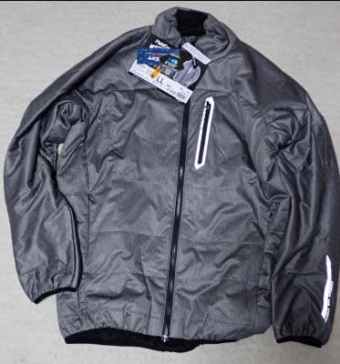

# 登山だけじゃなく，スキーヤーの強い味方ワークマン！スキーに役立つ便利なものがそろってる…

📅 投稿日時: 2023-09-27 03:23:13

そろそろスキーシーズンも近づき．

菅平が予想通り10月21日にオープン

して，イエティがその前のオープンを

狙うとするなら…

スキーシーズンインまで，あと1か月を

切ってます！！

もう1か月ないんですよ！！

もうすぐスキーシーズンインですよっ！！

…ってなわけで．

そろそろスキー道具の準備にかかるわけ

ですが…

やはりシーズンに50～70日ほど滑ると

いろんなものがあっという間に

消耗しちゃいます（涙）

だもんで．

私のことを知っている人は知っていると

思いますが．

私はウェアやグローブは穴があくまで

使っちゃうし，ストックやゴーグルなども

かなりボロボロになるまで使い込みます…

（皆さんご存じ，穴が開いてもテープを巻いてまで使うグローブ）

板とブーツは仕方がないとして，

なるべくスキーにかかわる道具はお安く

済ませたいところ…

そういう時に頼りになるのが，

ワークマンですね…！

最近は明らかに山歩きをする人を

ターゲットにした品ぞろえが増えて

いる，このワークマン．

私が山を歩くときのシャツやズボン，

手袋や靴下などといった，

ザックと靴，サポーター以外のものは

ほぼすべて，安くて品ぞろえも多い

ワークマンで買ってます…

山を歩く時に履いているズボンは

2900円のものだし，冷感ネックウォーマーや

メットの下に被るクールキャップも

結構安く売ってます…！

そして，防寒用のジャケットも，

ストレッチ＆防水なのに，小さくポシェット

状にたためてバックパックに突っ込んで

おける軽量なものが2500円！

実際使ってみても，2500円とは思えない

十分な品質だし．

かなり経済的でお気軽に使える感じ…

ってな感じで．

山にも使えるアイテムが増えてきたワークマン．

これから寒いシーズンになってくると，

スキーに使えそうなものもいろいろ

出てきます！

意外なところで，グローブ．

これは2900円と，ワークマン製品にしては

ちょいとお高めですが…

それでも，ダウン＆発熱素材＆透湿で，

耐水圧20,000mmと，スペックを見ると

スキーに十分使えそう…

…実際に使ってみたところ．

やはりストックを握った感じは，

スキー用のグローブのほうが上ですし．

スキー板を持ったりすることを考えて

頑丈に作られているスキー専用グローブと

比べると，ちょっと手のひらの生地も

薄めで弱い感じですが…

まぁ，2900円と考えればかなり暖かいし，

許せるレベル！

…ただ．

やっぱり私が使うと，1シーズン持たずに

穴が開いてダメになりました（涙）

でも．スキー屋さんで3000とか4000円

くらいで安売りしてるグローブに

比べれば，かなりマシかな！

そして．

このジャケットですが…

これまで，志賀高原のトップシーズンの

寒さに耐えるため，ウェアのジャケットの

下にダウンジャケットを着ていたけど．

ダウンジャケットの代わりにこいつを

着てみようか…と試しに買ったもの．

お値段2900円でしたが…

これ，生地もストレッチしてダウンジャケット

より動きやすい感じだし．

しっかり防風で，断熱性能がかなり高い！！

予想以上に暖かい！

ウルトラライトダウンより暖かいよ…これ．

撥水性もあるので，滑り終わった後に

雪が降るゲレンデでもアウタージャケット

として着用可能だし．

そして，ユニクロのウルトラライトダウンと

同じように，暑くなったら脱いで，小さく

たたんでポーチ状にしてウェアのポケットに

いれて持ち運べるし…

これはいい買い物でした！！

そして．

こいつはレインウェア．

上下セットで4900円という安さ

でしたが…

最近のこういうレインウェア，よくできてる！！

昔のこういう安いレインウェアって，

ビニール製の雨合羽に毛が生えた

ようなものが多かったですが…

これはちゃんとストレッチ素材で，

よく伸びます！

スキーで滑るのに膝やひじが突っ張らない！

…そして，透湿性も25,000g/m2と十分

あって，中が蒸れにくいし…

ちゃんと水をはじいて，汚れも着きにくい

です…

いや．

これをスキーウェアがわりに着ても

いいくらいじゃなかろうか？？？

内ポケットがないけど，左右のポケット

だけじゃなく胸ポケットもついてるし．

寒くない日は，普段のウェアとして使っても

いいレベル…

これが4900円なら，お買い得！！！

（今はもうこのモデルは売ってないみたいです）

で．

さらにこのレインウェアにこいつを

組み合わせれば．

雨の日でも濡れ知らずに快適に滑れます！

こいつもワークマンで1680円で売ってます．

このレインウェアとテムレスを装着すれば．

雨が降ったからと，スキーをやめるのは

もったいないくらい…

何万円もするGORETEXのウェアやグローブが

なくても，5000円のレインウェアと1600円の

テムレスがあれば，雨の中でも快適に

滑れますよ～！

ってな感じで．

これだけのお値段で，レインウェアから

グローブ，そしてミドルレイヤーとして

着れるジャケットまで買えるとは…

ワークマン，おそるべし．

最近はホントにスキーウェアとして

使えそうな防寒ジャケットも売ってるし…

ワークマンは，スキーヤーの心強い味方ですね！

近いうちに，スキー板やスキーブーツも

売り出すかも…！？？←それはない

## 💬 コメント一覧

### 💬 コメント by (カンタロス)
**タイトル**: Unknown
**投稿日**: 2023-09-27 08:23:41

Sさま、こんにちは。

インナー、カッパをワークマンはもはや基本と言っても過言ではないですよね～（笑）

ミドラーのブルゾンはチェックしてませんでした。

情報ありがとうございます!

### 💬 コメント by (スシネコ)
**タイトル**: Unknown
**投稿日**: 2023-09-27 08:54:58

昨年は気のせいか、雨の日が少なかったような気がしましたが、今年はカッパーズの出番が多くなるのでしょうか。

雨の日のヤケビも空いているので好きなんですよね。滑ってる時に「ウヒョーッ！ヒャッハーー！」って声が出ちゃうのが難点ですが。

### 💬 コメント by (副院長)
**タイトル**: Unknown
**投稿日**: 2023-09-27 09:10:28

テムレス最高です。雨のロードバイク、前の車ではチェーン巻き、ゆき落とし、洗車、車のトランクにいつも4セット入ってます。スキーでの欠点は、ゴンドラ乗車回数増えると、板をつかむ手が痛くなります。でも絶対ムレナイ履き心地はほかにありませんね。

一番最初は岐阜のスキー場でパトの方に教えてもらいました。

### 💬 コメント by (Skier_S)
**タイトル**: Unknown
**投稿日**: 2023-09-28 04:59:18

＞カンタロスさま

やっぱりワークマンはいいですよね…

ミドラーに使えそうなジャケット・ベストとかもいろいろあるし，

スキーに行く雪用の靴とか，私の身の回りはワークマンに侵食されてます…

＞スシネコさま

…雨の中ヒャッハーって言ってる人はかなりヤバい人ですが…

私も，雨が降ってる方がすいてるし，春先のストップ雪よりはいいという

ヤバい考えになりつつあります…

＞副院長さま

テムレスいいですよね…

我が家も防寒と普通の奴と2種類が車に常備されてます（笑）

### 💬 コメント by (yu-ki)
**タイトル**: Unknown
**投稿日**: 2023-09-29 10:39:08

こんにちは、レインウェアについてですけど、

ブーツを被せるところって、被りますか・・・？

雨用に、ワークマンを考えたことがあって、実際に見に行ったのですが、

どうも、径が小さく、入らない様な気がして、やめたってことがあったので、興味津々です。

### 💬 コメント by (Skier_S)
**タイトル**: ＞yu-kiさま
**投稿日**: 2023-09-29 23:31:58

コメントありがとうございます～！！

私もそれがちょっと気になったのですが，ストレッチ素材なので

引っ張って伸ばせばブーツにかぶせることができます！

私の場合は大丈夫でした…

