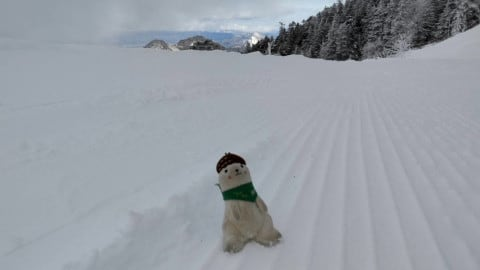
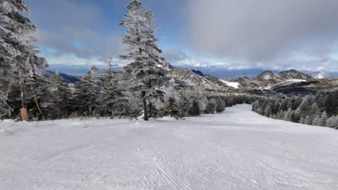
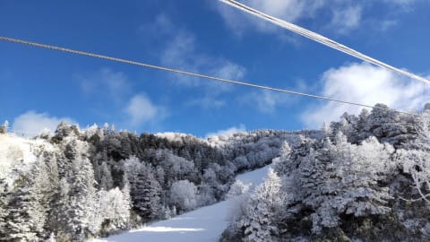
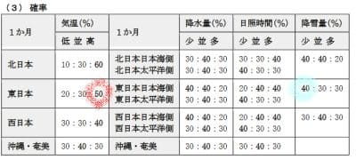
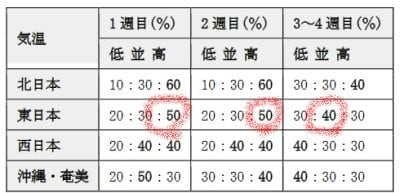
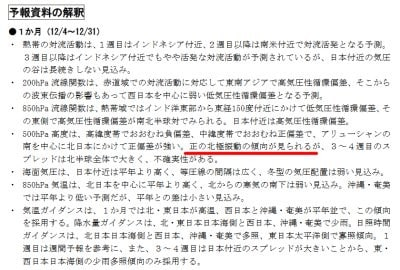
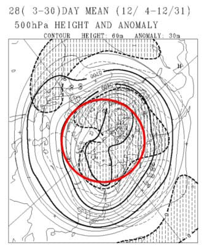
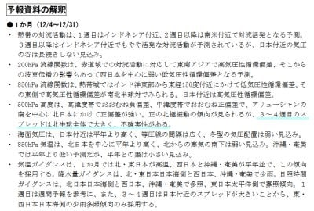
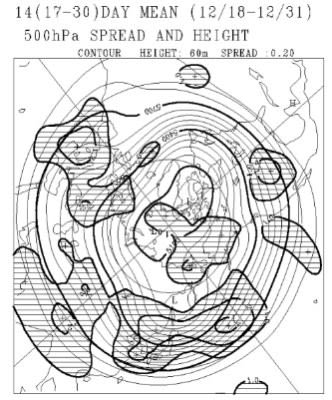

# 1か月予想を見てみると…なぬ？12月の予想が全く変わってるんですが！！12月，暖かくなるの？？

📅 投稿日時: 2021-12-03 00:58:58

🏷️ カテゴリ: [スキー天気予想](c6554f5c3c106093b511a8daae23757e8.md)

えー．

本日の志賀高原．

あさイチは，予想通りちょっと雲が

多かったみたいですが…

午前中から青空が広がる天気で…

それなのに冷え冷えで．

あさイチはガッツリ凍った，

かなり硬めのバーン！

…ちょっと朝のうちはコロコロが

多くて怖かったようですが．

でも，気温は一日中冷えたままで，

日が射した昼になってもバーンがなかなか

緩まない，冷え冷えコンディションだった

ようです…！

うむ．

だいたい，

　12月2日(木)：冷えるけど西風で雪は積もらず．

　終日冷え冷え，人工降雪機フル稼働！

　朝は曇り，昼から晴れそう．

という予想通りの一日だったようですね…

ふははは．今日も予想は当たったのだ！！←自己満足

ってなことで．

この冷え冷えが続けばいいんですが…

冷えて朝までに10cmは積もると予想した4日．

朝までの積雪は10cmは行きそうだけど．

昼間は予想ほどドサドサ積もらず，

夜までにトータル20～30cmも積もって

くれなさそうかなぁ…？

って天気図になってきましたね…（ちょい涙）

まぁ，でも．

予想より積雪量は減りそうなものの．

4日，終日雪降りの冷え冷えなのは

間違いないです！

ということで．

本日木曜は，定番の1か月予報が発表される日なので．

いつも通り，[FCCX92](https://www.sunny-spot.net/chart/FCXX92.pdf)を見てみると…

な，な，な，

なぬ～っ！！！！

12月，気温が高い確率が50％に上がって

るんですが！！

そして，降雪量が少ない確率が40％で

一番高くなってるんだけどっ！！！

どゆこと？？

確か，先週までは．

平年並みか冷える

って言ってませんでした？気象庁さんっ！！？？

とりあえず．

週ごとの予想でも…

12/4～10の第1週，12/11～12/17の第2週とも，

気温が高い確率50％(涙)

12/18-31の3-4週目は，平年並みが40％と

落ち着いてくれるようですが…

でも，1，2週目，気温上がるの？？(泣）

一体どうゆうこと？？？

と．FCCX92の中身を読み解いてみると…

…なに？？？

正の北極振動っ！？？

…正の北極振動．

これは，スキーヤーにとっては，エルニーニョより

怖い言葉です…（ガクブル）

詳しくは，[この資料の別紙2](https://www.jma.go.jp/jma/press/2001/24b/r01shousetsu.pdf)や，

[この論文](http://gpvjma.ccs.hpcc.jp/~tanaka/web/papers/paper220.pdf)を読んでもらえば分かりますが…

「特に、2002年の暖冬は桜の異常開花を

　もたらした。

　本来、関東では入学式頃に満開となる

　ソメイヨシノが、この年には平年より

　３週間も早く卒業式の頃に満開になって

　しまった。この年の異常気象は、まさしく

　北極振動が正に大きくふれたことと

　関係している。」

「雪のない北陸ではスキーやボードに代わって

　真冬のゴルフ場の景気が好調となった。

　（中略）このような暖冬の際には

　北極振動指数は正に転じており…」

（[http://gpvjma.ccs.hpcc.jp/~tanaka/web/papers/paper220.pdf](http://gpvjma.ccs.hpcc.jp/~tanaka/web/papers/paper220.pdf)より引用）

などと．

それはそれは恐ろしいことが起きるのだ…

とりあえず，[QXVV12](https://www.sunny-spot.net/chart/QXVV12.pdf)より，500hpa高度線と

偏差を見てみると…

確かに，赤く囲った北緯60度より北極側が

概ね網掛けの負偏差，

60度線の周りを囲むように，ドーナッツ状に

白抜きの正偏差になっていて…

…これは．正の北極振動の傾向がっ！

（厳密には北極振動は海面気圧偏差だけど，

　500hpa高度も地上気圧偏差と連動する）

うぎゃーーー！！

ヤバい．

やばいのか？

この冬も，暖冬なのか…？？

…ただ．

3-4週にはスプレッドが大きく，不確実性がある…

と書いているので．

3-4週は，正の北極振動傾向が外れるかも？

と思ってるようですね…

確かに，QXVV13から3，4週のスプレッドを見ると．

ほぼ全域に「予想ばらつきが大きい」ことを

表す網掛け領域が広がってます…

スプレッドが大きいので，3-4週は平年並みと

予想する方向を考えているようですが…

…でも．

北極振動っていう基本モードは，数か月の

単位で続くものなので…

もしかすると．

この冬は…

…

…

…

いや．

そんなことはない！！

これからこのBlog読者1億3000万人の皆さんが．

全身全霊の祈りを込めた冷え冷え踊りを

狂ったように毎日踊り続け．

ひたすら休まず寒気の歌を歌い続け．

日ごろの行いを神様のように良くしつづけて

いれば…

…

…そう．きっと．

スキー場は冷え冷えの冬になるはずなのだ！

日ごろの行いを良くするって…

[この記事](eba5747ee46a5d1ca65823a79be6409f3.md)のラストにあるように，

苦しんでいる人にとどめを刺せばいいんだな？←ちがうから

## 💬 コメント一覧

### 💬 コメント by (レインボー74)
**タイトル**: Unknown
**投稿日**: 2021-12-03 12:32:01

金曜日の熊の湯情報

朝の上林3℃　蓮池0℃。

今日から第二ペアが上まで行けるとの情報を、かの○○りん様からいただいたので、いそいそと熊さんへ。

まずは馬の背へ。中央の盛り上がりがカリカリツルツルなのが残念。

下部は固すぎて圧雪が効かないレベル。

ついで、リフト沿いコースのさらに右にある第四イベントコースへ。今シーズン初の急斜面でしたが、状態は良好。

ついで、クワッド沿いを探索しに行ったのですが、横滑りばかりでなんか疲れただけ。

そんなんで今日もレインボー(２時)までもたずに、湯田中の仲よし食堂で激ウマラーメンをいただきました。中盛700円。基本的に水木休みです。

### 💬 コメント by (スシネコ)
**タイトル**: Unknown
**投稿日**: 2021-12-03 15:57:28

ニュースで騒がれている時事の対応をしており、年内はとてもゲレンデデビューできず、皆さまのアップされた写真を見て（涙）。

「正の北極振動」なんて初めて知りました。こんな恐ろしい呪文があったなんて。北斗神拳より怖そう。((((;゜Д゜)))ガクガクブルブル

別紙２を拝見しました。これは分かりやすいですね。いろいろと勉強になり楽しいです。

### 💬 コメント by (Skier_S)
**タイトル**: 今日は睡眠時間2時間で出発だな…(涙)
**投稿日**: 2021-12-04 00:50:28

＞レインボー74さま

熊の湯，圧雪できないほど硬かったんですか！？？

イベントコース，硬かったら滑れたもんじゃない気がするんですが…

とりあえず明日お世話になりますので，よろしくです！

＞スシネコさま

あら…お忙しいのですね．

落ち着いて早くゲレンデに復帰できるよう祈ってます…

で．

正の北極振動．

何だか謎の秘儀の名前みたいですが．

これは怖い言葉です…スキーヤーを即死させるパワーを持った言葉です…

