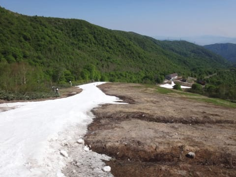

# そして明日も日帰りかぐらへGo!…晴天，暑い一日になりそう．そして，混むんだろうなぁ…

📅 投稿日時: 2017-05-19 22:31:27

ということで．

雪がたっぷりの今シーズン．

かぐらの営業が来週末で終わってしまう

というのが信じられない今日この頃ですが．

…かぐらのライブカメラを見ても，

雪はまだたっぷりあるし．

（[かぐらスキー場HP](http://www.princehotels.co.jp/ski/kagura/livecamera/)より）

とても営業終了一週間前とは思えない状況

ですね…

ちなみに，去年の5月22日の写真を見ると…

そして，比較的雪が多めだった，おととしの5月23日は…

それでも，やはりかなり土が出てますね～

でも，この年も，まだこの時期まで

みつまたが滑っておりれたんですよね．

今週末も，移動用に限定されますが，

みつまたに雪があって，雪を滑っておりれるようですし．

まだメインバーン，幅いっぱい雪がついてますし…

…そもそも，営業終了前日なのに，まだテクニカルコースも

ジャイアントコースも滑れるなんて…

（[かぐらHP](http://www.princehotels.co.jp/ski/kagura/files/pdf/201601226map.pdf)より）

とりあえず，恵まれている今シーズン．

まだまだかぐらは楽しめそうです．

ってことで．

明日も日帰りでかぐらへ行ってきます～！

…すごい混むんだろうなぁ…
