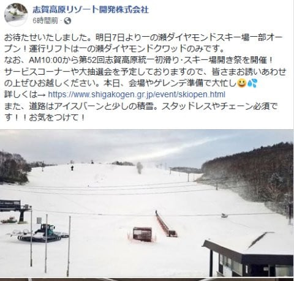

# 12月7日(土)から，志賀高原は横手山オープン！熊の湯も山頂から滑走可能，ダイヤモンドも営業開始…でも，焼額は4ロマのみ（涙）

📅 投稿日時: 2019-12-06 22:18:38

えー．

というわけで．

10cm～20cmの積雪を期待していた

6日の金曜ですが．

…みなさんの寒いギャグ攻撃にも

関わらず．

せいぜい5cmの積雪だったようです…（涙）

…日本海側は，結構な積雪が

あったようなのに…（泣）．

かぐらはそこそこの積雪があり，

かぐらクワッド，ペア，

そして第4ロマンスのパノラマコースが

オープンするようなのですが．

([かぐらスキー場HP](https://www.princehotels.co.jp/ski/kagura/winter/)より）

それに対し，志賀高原は積もってません(涙）

奥志賀もまだオープン日は未定．

焼額も，第2高速は動かず．

4ロマのみしか動かないようです…（泣）

（[焼額Facebook](https://www.facebook.com/yakebitaiyama/photos/a.533933973368620/2563862730375724/?type=3&theater)より）

ですが．

このわずかな降雪だというのに．

なんと，人工降雪機が無い横手山が，

この週末オープンです！！

（[横手山HP](https://yokoteyama2307.com/news/5161/)より）

そして．熊の湯も山頂から滑れるように

なるようですし…

（[熊の湯スキー場HP](http://www.kumanoyu.co.jp/lift/)より）

スキー場開き祭が行われるダイヤモンドも

ダイヤモンドクワッドが営業します！

（[志賀高原リゾートFacebook](https://www.facebook.com/ShigaKogen.Ski/posts/2566978406751680)より）

まぁ，この状況の中．

なんとかボチボチ滑れるように

なってますねぇ…

この週末，少なくとも気温が

冷えてくれるので，雪が解けたり

することは無く，さらに人工降雪の

積み増しも可能なので．

…少なくとも昨シーズンや，3シーズン前の

12月上旬のように．

高温で雪がドロドロになっていくことは

なさそうなのが救いでしょうか…

とりあえず．

この週末は

7日土曜：朝はうっすら積雪道路なので，注意！

　朝から曇りで，終日曇り空が続く．

　朝の気温は-5℃程度，昼間も0℃を上回らなさそう．

　雪は朝イチは人工雪に圧雪がかかったいい感じ．

　昼間も雪はそれほど緩まず．

8日日曜：朝は小雪が舞っているか？もしかすると夜中に

　2-3cm程度のうっすら積雪．

　朝は-7～8℃と冷え込み，締まった

　人工雪のシマシマが楽しめる．

　午前は曇り空，気温が上がらず雪は

　締まったまま．

　午後になると，雲の合間から

　日が射すかも．

　気温が上がらないので，午後は

　ちょっと雪が硬くカリカリに

　なっていくか…

　

という感じでしょうか．

今日もいつものパターンで，

あと4時間後に志賀高原に出発です．

睡眠時間が…（涙）

また明日，志賀高原でお会いしましょう！

## 💬 コメント一覧

### 💬 コメント by (五輪の書)
**タイトル**: Unknown
**投稿日**: 2019-12-07 10:31:01

いつもありがとうございます。

ココだけでいろんなことがわかりますね。

特に天気予報はココだけでしかわからない。

尊敬してます。

クリスマス寒波は必ず来るものと思ってましたが不安な今日このころです。

### 💬 コメント by (Skier_S)
**タイトル**: ＞五輪の書さま
**投稿日**: 2019-12-07 21:36:35

クリスマス寒波，このままの天気図だとヤバいです．

今の天気図が大外れであることを祈るばかりです…

私の天気予想は志賀高原に特化しすぎているのですが，

参考になってますでしょうか？？

また，志賀高原にお越しの機会があれば，志賀高原で

お会いしましょう…！

