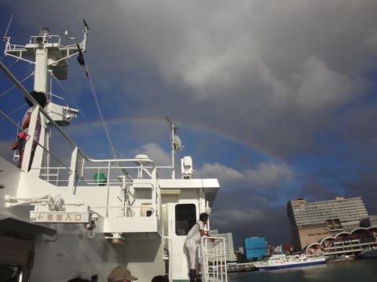

# 2016年8月　子連れ座間味ダイビング旅行記　その15…ファイナル

📅 投稿日時: 2017-07-28 01:27:44

🏷️ カテゴリ: [ダイビング日記](ce3a7a8d424d112fce83ee85c81a0e344.md)

ということで．

虹に出迎えられて那覇港に到着したのは，

もう午後6時過ぎ…

あぁ…

海況が良くて，高速船が運航していたら．

午後早くのダイビングができて．

そして，このフェリーと同じ18時に那覇に着けたのに…（涙）

と，本日午後のダイビングができなかったのに，

那覇到着が同じ時間になってしまう悲しさを

感じながら，港から那覇のホテルまで歩きます…

泊ったホテルは，那覇の泊港からほど近い，

「ロコイン沖縄」

3人がかなり安く泊まれるのに，

我が家が泊まるにしては，かなりきれいな

部類の宿ですね…

で．

無事ダイビングも終わって，あとは帰るだけなので．

お疲れさま会（？）を，ホテルそばの居酒屋さんで決行！

やってきたのは，ホテル店員さんおすすめだった

「やんばる舟」

根曲り竹やら柚子やらサンマやら，

食べ物の嗜好がかなり渋めのわが娘ですが．

この娘の，あればあるだけ食べてしまう大好物に

「海ぶどう」

というものがありまして…

沖縄名産の海ぶどう．

両親の分も…と注文した二皿，

一人で全部食べちゃいました（涙）．

そして，ソーメンチャンプルーもがっついてます(笑)

娘的には結構満足だったらしい，このお店．

おなか一杯になったあと，ホテルに戻ると…

速攻落ちてました…

ということで．

明けて翌朝．

帰宅の朝…

というより．

[出発前のゴタゴタを乗り越えて強引に出発した](ed64b119f037a8b5c038e628d00d6627f.md)ので．

この日の午後に出社しなくては

ならない朝（涙）←この日，台風で飛行機が飛ばなかったり

遅れたりしたらどうするつもりだったんだろう…

あぁ…

最後の日は，ゆっくりしたかったものよ…←いや，普通はそんな状況で

沖縄に来てる場合じゃないから

だもんで．

昼までに会社に着けるよう．

朝5時に早起きして．

早朝6時半には空港に到着して．

出発までのラウンジで…

タダで飲み放題のお酒もグッと我慢し．

…誰もこんな朝早くの便で沖縄から帰る人は

いないわな…

という感じで，待合室にも誰もいない7:40発の

飛行機に乗り込み…

沖縄を後にします．

あぁ…

まともに朝から夕方まで海にいられたのは，

中一日だけ．

ちょっと潜り足りないんですが…（涙）．

そして，今日は午後から仕事か…（泣）．

とても信じられないんですが…

という感じで．

遠ざかっていく沖縄の地を，飛行機の窓

から眺めていると．

座間味のきれいな海が瞼に浮かんできて．

この飛行機が．

いつまでも，いつまでも．

羽田に着かなかったらいいのに…

と．

そんな気分になった，Skier_Sだったのでした…

＃実際は10:10に羽田に着いてしまい．

＃12時に帰宅，ぎりぎり1時出社…

＃そしていつもの深夜帰宅（涙）．

＃ホテルを出てから23時間の長い一日

＃[（この日，一体何時にBlog更新しているんだ？）](d20160810.md)だったのでした…

（おしまい）
