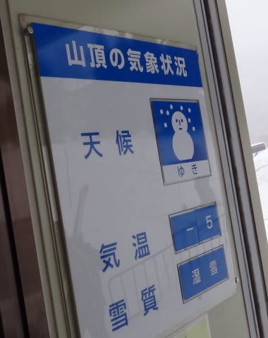
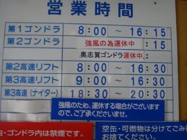
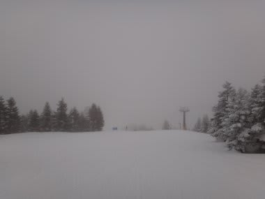
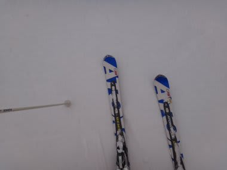
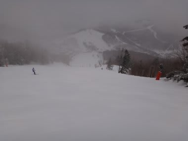

# 2月25日の志賀高原は

📅 投稿日時: 2012-02-25 21:49:32

🏷️ カテゴリ: [2012スキー滑走日記](cca3a0e9524e0203150f790b1fc3c71ad.md)

とりあえず，速報モードで．

天気は終日曇り時々雪，

午前から昼間は0度をわずかに下回る程度で，比較的あったかい感じ．

雪質表記が「湿雪」ってのが，状況を物語ってますね…

あー．

午前中は，焼額第2ゴンドラと奥志賀ゴンドラは強風で止まってましたね．

雪質は，予想通りのアイスバーンの上に湿り気味の新雪．

でも，どぼどぼってほどの雪ではなく，予想よりいい雪質．

それながら，風で飛ばされるほど軽い雪でないのが逆に幸いし，

薄いながらも緩斜面ではアイスバーンをしっかりとある程度はかくして

くれてましたね…

でも．

でも．

一の瀬ファミリーとか，急斜面はだめです．

見事なアイスバーン祭りです．

カリカリと吹き溜まりのミックスの難しい斜面．

…見事に予想通りでしたね

ただし，一点予想を外したのは．

風が午後から強まる，と思ったのに，

午前のほうが風が強く，午後のほうが弱まったかな…

午後はゴンドラの運転が再開してました．

今は…予想通り，明日に向けて冷え込んでます．

ただ，雪はほとんど降ってません…

うーん．

明日までに積もってアイスバーンが隠れて欲しいなぁ．

