# 2021/5/23(日)のかぐらスキー場ファイナルデーの追加レポート！…そして5/24(日)の渋峠スキー場特派員情報

📅 投稿日時: 2021-05-25 02:10:02

🏷️ カテゴリ: [2021スキー滑走日記](c2b0fc073d6357d3b786f6ca655147f7d.md)

ってなことで．

かぐらの営業は終わってしまいましたが．

まだ営業している，志賀の渋峠．

…そして，

「渋峠のリフトが動いているから滑らなくては」

という迷言をつぶやいているのではないかと

おぼしき，まだそこに通っている某特派員．

今日もまずは，この特派員からの

渋峠スキー場レポートからスタートです！

えー．

本日の天気は，曇り空．

朝から気温は10℃越えと高かったようですが…

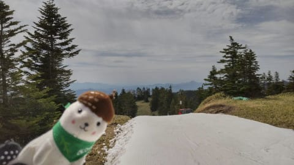

でも，朝イチはシマシマで，板が滑って

楽しかったようです！

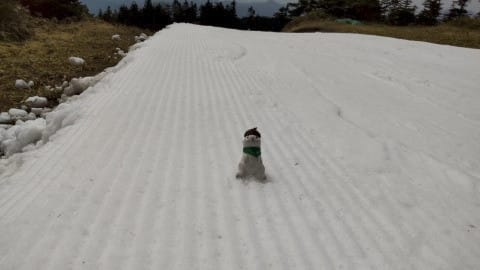

まだ下から見て左側のゲミュートコースは，

雪がそこそこありますね…

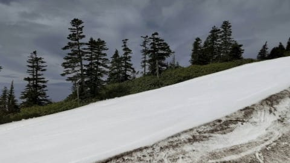

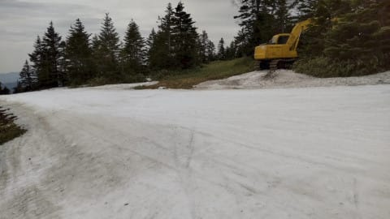

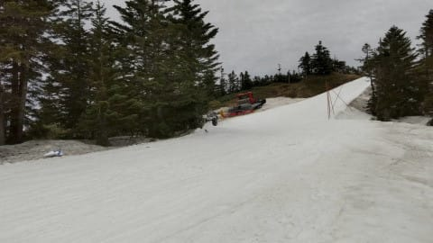

一部細くなってるところもありますが，

もうしばらく滑れそうです…！

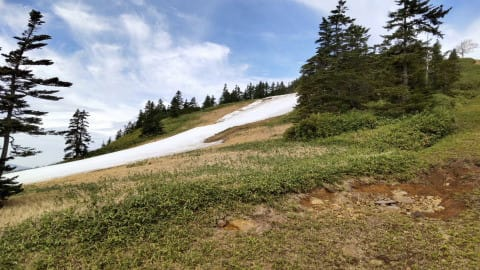

そして．

リフト降り場にも，しっかり雪が

つけてあります！

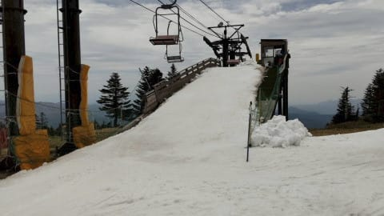

ただ．

土曜になんとかつないで営業した，

ウエイバーコース．

今日までオープンしていたようですが…

もうダメな感じですね(涙）

このコース，今日までのようです…

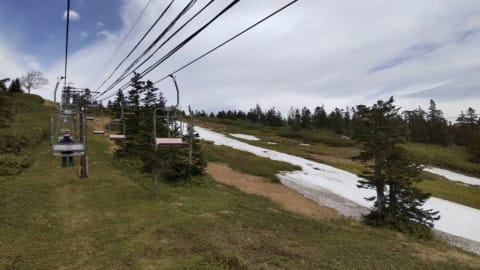

ってな感じで．

ゲミュートコースはもう数日は行けそうな

渋峠ですが．

27日に結構な雨が降りそうで．

その状況によっては，週末まで

もたないかも…

でも．

横手スタッフはかなり涙ぐましい雪出しを

やっているようで…

こんなところからでも雪を集めて，

雪付け作業やってるようです！

すごい…！

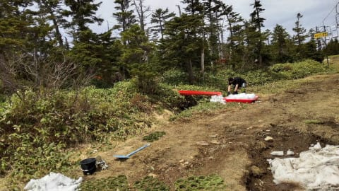

この努力が報われて，無事今週末まで

営業できるのか？？

あるいは週末を待たずに息絶えるのか…

おこみん特派員が一日でも長くレポートを

できるように，皆さん祈りましょう！

(シーズン券が終わっている今，営業日数が伸びるほど

おこみん特派員のリフト券代が積みあがっていくんだけど…)

ってなことで．

前フリが長かったですが，ここからが本題．

昨日，速報レポートをやったかぐら

ファイナルデー．

今日は追加レポートです！

まず，朝7:30のロープウェー営業開始時．

昨日も書いたように，ロープウェーは20分

ちょい待ちでスタートしたわけですが…

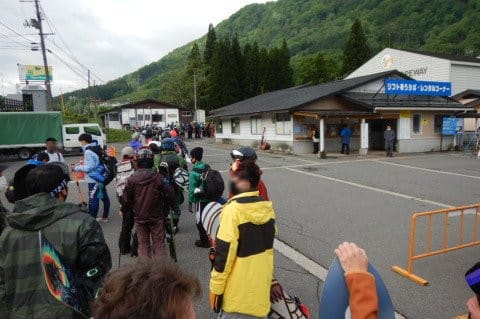

ロープウェーから先，ゲレンデに至るまでは

遥か長い旅路が待ってます．

まず，ロープウェーを降りたら，みつまた

クワッドまで200m程度歩いて…

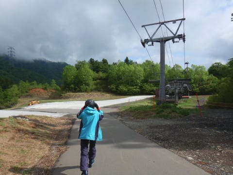

クワッドリフトに乗車！

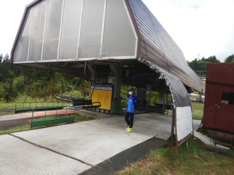

あ，ロープウェー降り場に板や荷物を

置いておけば，ワゴン車がゴンドラ

乗り場まで送ってくれます．

遥かな旅路を，板や荷物をもたずにいられる

のが救いでしょうか．

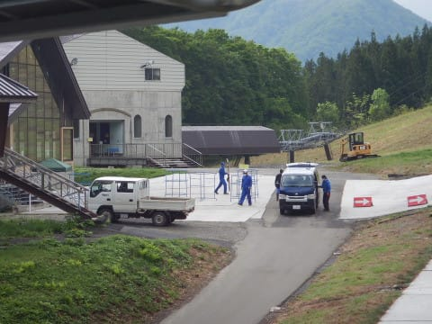

で，クワッドで登ったら…

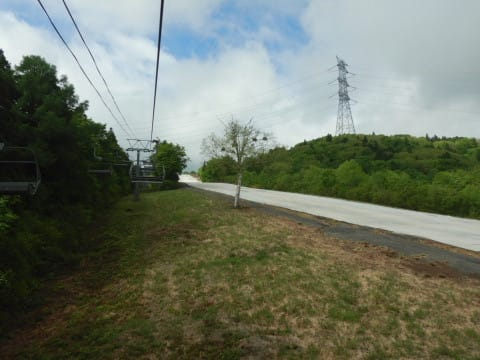

また，クワッド降り場からしばらく歩いて…

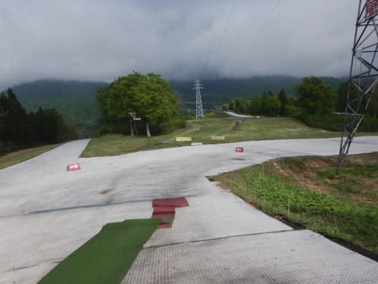

今度は，この先に見える，下りペアリフトに

乗車！

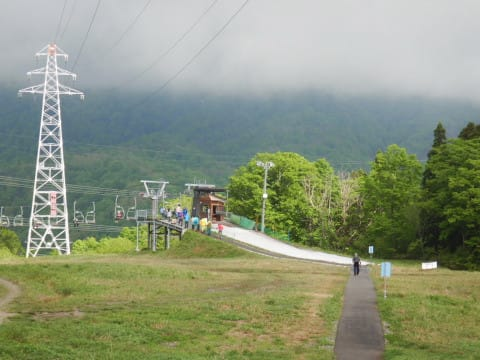

下った先に，ゴンドラ乗り場があります．

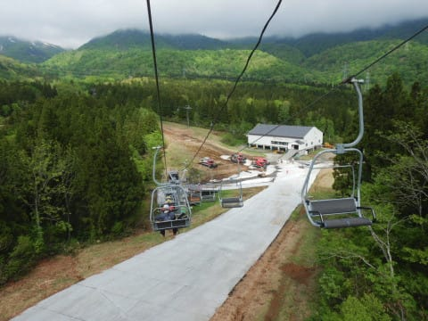

で，ゴンドラ乗り場の前には，

ワゴン車で運ばれた板や荷物が置かれて

いるので，それをピックアップして…

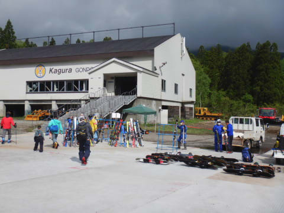

ゴンドラへ乗車！

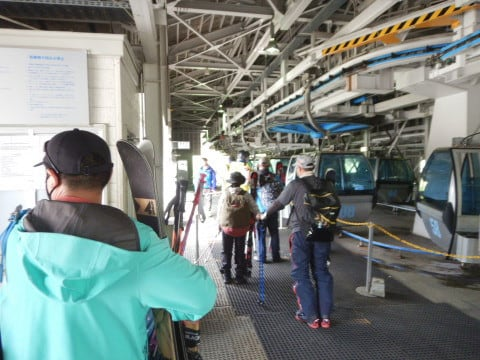

そして，ゴンドラで10分くらい揺られると，

やっとかぐらゲレンデです！

…ここまで約1時間．

遠いよ…

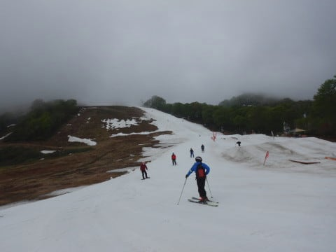

でも，ここからまだリフトに乗らないと

山頂まで行けません．

和田小屋の前を通り抜け，

クワッドリフト乗り場へ滑り降りますが…

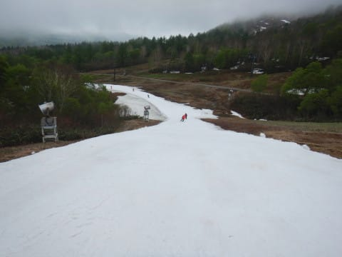

いや．

和田小屋～リフト乗り場までのコース，

完全廊下になりましたね（涙）

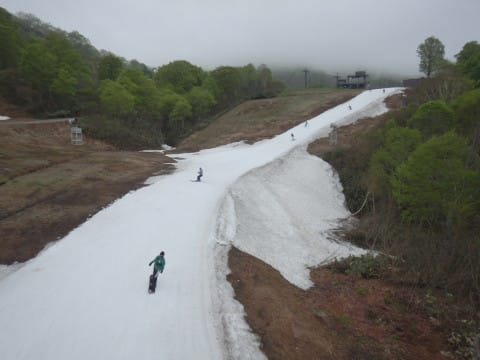

そして，テクニカルコースは完全に

雪が消えて，単なる土の斜面に…(泣）

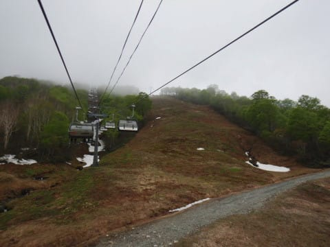

ってなことで，ようやく山頂に向かう

リフトにのったわけですが…

このリフトの中腹から上は，激しい

ガスが…（涙）

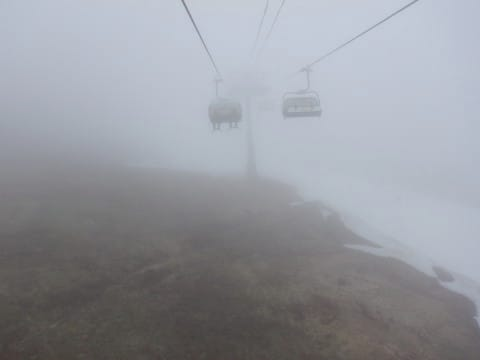

ロープウェーとかゴンドラとか，滑れる

コースより下では全然ガスが無かったのに．

なぜ，滑るコースに到着してから

そこを狙ったようにガスがかかってるの…(泣)

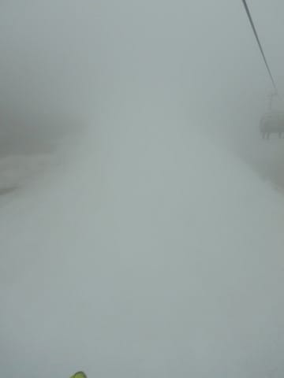

ってなことで．

やっと山頂に到着したのは9時近く．

ロープウェーの列に並び始めてから，

1時間半かかってやっとリフト山頂に

到着です！！

（長くなりそうなので続く…）
