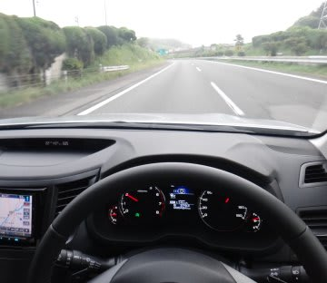

# プロジェクトX第2章…アイサイトのオートクルーズその２，レーン認識能力がすごいよ！

📅 投稿日時: 2013-06-28 01:01:20

🏷️ カテゴリ: [車](cba0e8330b3f2ded7c1addfacc75d4547.md)

って感じで．

先日，[EyeSightのオートクルーズのすごさ](e71fb5273cbe552ab7eb974648253140c.md)を語ったわけですが．

これだけでは語りきれていない，アイサイトのすごさ．

いや，なにがすごいかって．

レーン認識能力の高さがすごいんですよ．

アイサイト君は，どこがレーンで，どの車線に車がいるのかを，

きわめて正確に認識してます．

となりの車線の車を，間違って自分の先行車と認識することが

全く無いのがすごい．

例えば，右コーナーで．

自分の左側車線の車がちょうど目の前に来るようなことがあっても．

アイサイトのカメラはしっかり車線を認識して，となりの車線の車と

正しく判断し．何事も無かったかのように追い抜いていけます…．

そして．

となり車線の車が，目の前で自分の車線に割り込むように

レーンチェンジしてきたような場合．

前の車のレーンチェンジをしっかり認識し，前の車が車線を

ちょうどまたぎ始めたあたりで，自動的にぐぐぐっと減速して，

車間距離を保ってくれます．

さらに．

自車線をゆっくり走っている先行車がレーンチェンジして，

前が開くとき．

ちょうど，先行車がほぼレーンチェンジを終えるかな…

というあたりから．

きわめて自然に自動的に加速を始めて，設定速度まで加速します．

うおー！

すごいぞ，アイサイト！

当たり前ですが．これだけじゃない．

自分の車のレーンチェンジもきわめて正確に判断してくれるのがすごい！

遅いトラックに前を阻まれてゆっくり走っている状態から

レーンチェンジをした場合なんかでも．

自分の車のレーンチェンジが終わったのを判断して，自動的に

加速を始めます．

…さらにさらに．

このアイサイトは．

もっと複雑な状況でも，かなり上手に対応してくれるのだ．

例えば．

前を遅いトラックに阻まれてるとき．

右車線の後ろから追い抜いてくる，すごい速い車をやり過ごしてから

レーンチェンジして，トラックを追い越そう…

ってシチュエーション，よくありますよね．

速い車が横を通過した直後に，追い越し車線へレーンチェンジすると，

これまで前を走っていたトラックとの車間距離より，レーンチェンジして

からの速い車との車間距離の方が狭くなる…

って場合．アイサイト，車間距離を開けようと減速するのでは？

…と，お思いでしょうが．

いやいやいや．

先行車との距離だけじゃなく，速度差もちゃんと見ているアイサイト．

先行車が，自分の車よりかなり速い！

と判断したら．

車間距離が短くても減速せず，ちゃんと加速に移ります．

上手に加速しながら，巧みに車間距離を広げていき，

知らぬ間に設定速度まで加速していくという…

車間距離を保つために無意味に減速しないんです．

逆のパターンで．

レーンチェンジして，移った先の車線にすごく遅い車がいた場合は．

レーンチェンジ前より車間距離が広くなる場合でも，レーンチェンジを

している途中あたりから減速が始まり，過剰な減速Gが

かかることなく，自然な減速で新しい先行車を追尾に

かかってくれます…

いやー．

混んでる高速道路って，かなり頻繁に自車，他車がレーンチェンジして，

めまぐるしく先行車が入れ替わりますが．

どんな場合でもそれを適切に判断して．

自然な加減速で先行車をフォローし続けてくれるアイサイト．

機械の不自然な加減速に耐えられず，人間がついつい

ブレーキやアクセルを踏む…ってことがほとんど無いです．

＃違和感を感じたのは，両側に壁がある首都高の急カーブで，

＃壁に先行車が隠れてしまい加速した，ってときくらいか？

いやー．

よくできてる．

よくできてるよ，アイサイト．

…ホントに．

ホントに，あと望むのは，ただひとつ．

…これで，ハンドルも自動ならば…

## 💬 コメント一覧

### 💬 コメント by (miya)
**タイトル**: さすがですね
**投稿日**: 2013-06-28 08:45:02

アイサイトさすがですね！

各社同様の機能搭載車が増えてますが、

アイサイトが性能が高い、しかも自然だと

友人のD型保有者が言ってました。

やはりA型は割高…。もう買わん…。

ちなみにD型の友人もA型から乗り換えた人です。。

### 💬 コメント by (Skier_S)
**タイトル**: miyaさま
**投稿日**: 2013-06-29 02:58:45

アイサイト，思った以上に良くできています…

なかなかです．

もう，これが無いといけない体になってしまいそうです(笑）．

しかし，その友人の方，BR/BMレガシィの

A型からD型に乗換えですか？

3年で車を買い換えられるなんて…

なんてお金持ちなんでしょう（うらやまし）

でも，BRレガシィは，D型から

「別の車か？」

ってほど変わりましたよね…

