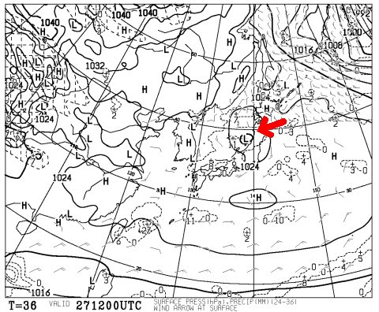

# ということで，土日もヤケビぐるぐるしてます

📅 投稿日時: 2016-02-26 22:28:12

🏷️ カテゴリ: [日記](cc4b5682fb7b8b144980957a978653fb0.md)

えー．

やはり．

今日も，かなりの冷え込みとなったのに．

なぜか冷えると降らない今シーズン．

木曜は午前中だけ10cmほど，

[金曜はほとんど積雪0](https://www.facebook.com/yakebitaiyama/photos/a.133097176785637.26773.116999658395389/942360062526007/?type=3&theater)だったようで…（涙）．

ああ…土日の午後は，同時多発アイスバーンテロ状態か…（泣）．

…気温が高い日は，これでもかってほど雨が降るのに…（涙）．

今週末も，はっきり言って今シーズン最後かも？

という冷え込みが予想されているのに．

…降りませんね…（泣）．

明日の朝も，積雪は期待できなさそう．

なぜ…なぜ，冷えた日に降らないかな～（残念）．

＃なぜか，週末が終わった月曜あたりに降りそう

ただ．

27日の予想天気図．

昨日は予想されていなかった，こんな感じの低気圧が

新たに出現したので…

こいつの動向によっては，天気がコロッと変わりそう．

…この低気圧，ホントに発生するのか？

発生したとして，志賀高原の北を通るのか，南を通るのか？

…それで，土曜の天気が全然変わります．

もし．

この低気圧が予想以上に発達して，

志賀高原の南を通ると…

多少は積雪が期待できるんですけどね～．

…今のところ，志賀高原の北を通りそうなので．

土曜はほとんど雪は降らず，晴れ間も見えそう…

という，一昨日段階での予想のままです．

ちと残念．

とりあえず．

今晩は，気温自体は十分冷えているので．

寝る前に，降れ降れ踊りを踊っておきましょう…

ってことで．

あと5時間後に出発です．

おやすみなさい～．
