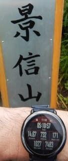

# 2022シーズンモデルのスキー板，試乗レポートその20…VOLKL RACETIGER SL MASTER

📅 投稿日時: 2021-07-13 01:33:25

えー．

昨日は週末お休みということで，

更新してませんでしたが．

週末がやってくる前は，天気図を見つつ

久しぶりの宿題の無い週末なのに，

雨でどこにも行けない（涙）

と嘆いていたところ．

なんと．

日曜がやってくると，

予想外に朝から晴れ！！！

これは日ごろの行いがいいのに，

宿題が無い週末に限って悪天候に

なってしまった私のことを，

神様が憐れんでくれたからに

違いありません！！←いや…だから，違いまくりだって言ってるでしょ…

やっぱり日ごろの行いはよくして

おくものだな！！！

と，神様に感謝しつつ，ちょっと近場に

お散歩に行ってきました…

　

　

昼過ぎには雨の予報だったので，

昼過ぎまでに下山するという

結構忙しいプランながらも，

全行程20kmと，予想外に長い

お散歩を楽しんできました…

今回，とあるアイテムのテストを

兼ねて行ってきたのですが．

またレポート書きますね～！

ってなことで．

本日は，2022シーズンスキー試乗レポート．

今回はフォルクル編です．

では，どうぞ～！

○VOLKL RACETIGER SL MASTER 165cm

基礎小回り用

VOLKLのSL競技用は，選手用モデルに

RACETIGER Worlodup COMP SL，

一般トップモデルとして

RACETIGER SL WCがあり．

基礎小回りモデルはSLモデルと

紛らわしいのですが，

RACETIGER SL MASTERと

RACETIGER SLの

2種類が上級モデルとしてラインナップ

されていて．

WCがつかないこいつは基礎小回り

板になります…

競技用と基礎用は，サイドカーブが

違いますが，そのほかにも

競技用はフルキャンバー，

基礎用はトップロッカーという

違いもあります．

で．

基礎用の2種類．

RACETIGER SL MASTERと

RACETIGER SLのうち．

MASTERがつく，今回試乗した板は

新たに2022シーズンから追加の

モデルになります．

サイドカーブはMASTERがつかない

モデルと同じようですが，

コア材がSL競技モデルと同じになり，

さらにプレートもWC PC Interfaceという，

競技用と同じ本格的なプレートがつきます．

で，板のトップのUVOがつかないんですね…

という言ことで．

来シーズンからの新モデル，期待して

乗ってみますが…

をを！！これは…かなりいい！

足元のしっかり度はかなり高く，

春の雪でもどっしりとした安定度で

滑って行けます．

この板も，雪面への貼りつき感が強い，

良い板ですね…！

スピードを出して行っても余裕が

感じられるのに，それほど高くない

スピード域からたわみが出て，

そのたわみに乗って自動的に谷回りに

入っていく感じ．

…これは，トップロッカーが効いて

いるのかな？

かなりフレックスが強い板なのに，

トップを抑えたり，板を動かしたり

しなくてもオートマチックに谷回りに入り，

そして谷回りで板が勝手にたわんでいき，

板に圧がしっかり溜まっていく感じ．

それも，どこまでスピードを上げて

いっても板が耐えてくれて，ぐっとしなって

しっかり板に圧が溜まって，いい感じで

回っていきます！

ターン仕上げの板の返りも強すぎず

弱すぎず，小回りをするのにいい感じの

すっと早いいい返りが戻ってくるので，

切り替えも楽なのに，アグレッシブな

切替ができる感じ．

前後動は意識せず，くるぶしあたりの荷重で

ひたすら板を抑えていけば，勝手にターンを

始動して行ってくれるオートマチックな

ターン感があるのに，

しっかりした張りの強さ，高速耐性，

いい感じの板のしなり，そしてかなり

強烈なグリップ…

これはいい感じ！

板のトップが内に入っていくような

強い旋回力がある板ですが，

張りが強めなので，スピードを出して

行っても板がたわみすぎて強制小回り

マシンになったりせず，ミドル～小回り

までのターン弧の自由度があります．

ただし，グリップと張りが強いので，

低速ではRACETIGER SLの方が

取り回ししやすいかな…

でも，かなり気に入りました！

スピードを求める小回り板としては，

これまでHEAD e-SL RD，NORDICA SLRが

双璧で，これに対抗するには，

VOLKLだとSL競技用になるな…

と思っていたところ．

これは思わぬ伏兵が出てきました．

VOLKL，来シーズンに向けていい板を

出してきたな…！

## 💬 コメント一覧

### 💬 コメント by (ikkun)
**タイトル**: Unknown
**投稿日**: 2021-07-13 21:17:11

やはり…脚前のさかな？と 私しには少し強いかもしれないですね？「長めなスライタ🎵」に入るかもしれませんね？

### 💬 コメント by (Skier_S)
**タイトル**: ＞ikkunさま
**投稿日**: 2021-07-14 00:46:10

この板，スピードを出した領域が楽しいので，あまりスピードを出さない人には

ちょっと強く感じるかもです…

