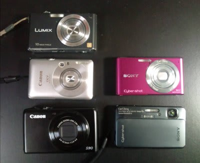

# 我が家のデジカメが…

📅 投稿日時: 2011-11-29 00:19:25

🏷️ カテゴリ: [PC,カメラ&小物](c0d8caed13e597efe97b661a8ae56bed0.md)

ということで．

ちょっと以前のネタですが．

[以前書いたよう](e38787d602a04193de6393f34154f0b04.md)に，TX10のバッテリーと充電機をGetするため，

SONYのサイバーショット W530を買ったわけですが．

おかげで

こんなことになってしまった…

一体我が家に何台デジカメがあるんだ…

左上…3年前購入のLUMIX FX35．

　2万枚程度撮影したけど，あまりもの酷使に，電池蓋破損，

　撮像素子表面にごみ多数，ズームレバースプリング不良，

　…など．息も絶え絶えのカメラ

左中…昨年購入のIXY 210IS

　妻のメインカメラ．

左下…昨年購入のPowerShotS90 

　水中用カメラ．

　カメラを酷使する私が陸上で使うとあっという間に

　壊してしまうので，水中以外ではなるべく使わないようにしてる．

　（水中カメラを壊すと，水中用ハウジングやワイコンを取り付ける

　レンズアダプタなんかも買い替えになってお財布に痛い)

右上…今回購入のW530

右下…今年3月購入のサイバーショットTX10

　普段使い用メインカメラ．

　気がつくと，このカメラですでに9000枚近く撮ってる…

でも，実はまだデジタル一眼が欲しかったりする．
