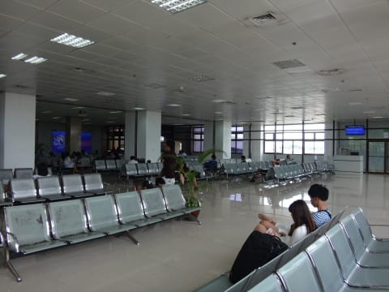
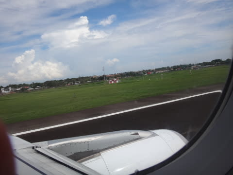

# 2015年8月　子連れでモアルボアルでダイビングファイナル…無事帰国

📅 投稿日時: 2016-08-08 04:20:28

沖縄に来ているのですが．

でも．

書きためておいたモアルボアル旅行記，投稿！

…長かった…

旅行から1年経って，やっと書きあがったよ…

ということで．

モアルボアル旅行記，ファイナルです！

---

って感じで．

ホテルからワゴン車に揺られること，

およそ3時間．

…と言っても．

私はそのほとんどの間，意識がなかったのですが…（笑）

午前11時過ぎ，セブの空港へ到着しました．

で．

空港でチェックインして，パスポートコントロールを

抜けるときに…

今回は，出国審査でも．

また，[いつもの，特別室での別インタビュー](e3f297dded27f560b2aa0917a23a321a0.md)（涙）．

私が一体何をしたというのだ…

"Could you tell me why I'm here?"

と強烈に問いたいところ（泣）．

＃というか，いつも実際に問うているのだが…

10分間ほどの特別質問のあと．

やっと解放されて，搭乗待合室へ…

…今回の帰国は，セブ～成田の直行便．

13:45セブ空港発，19:30成田着の飛行機です．

少し時間があるので，いつもの待合室横の

カフェで軽く昼食をとりますか…

その後．

あまり大したものの無い免税店＆お土産屋さんを

冷やかして．

＃セブの国際線ターミナル，セキュリティを超えると

＃この2つしかお店がありません…

…って感じでぶらぶらしてると．

20分ほど遅れたものの，搭乗時間がやってきました．

…そして．

やはりフィリピン航空機．

セブ直行便は，機内エンターテイメントシステムがありません（涙）．

娘「やっぱりテレビないね…」

とかなり残念そう．

登場してしばらく．

飛行機はセブの大地を飛び立ちます…

さようなら～！

また，戻ってくるからね～！！

フライト時間は4時間半と短いので．

飛び立って，機内食を食べて…

（大人用ミール）

（やはり，チャイルドミールの方がおいしそう…）

食後に軽くくつろいでいると．

あっという間に日本上空です…

そして．

ほぼ定刻の夜7時半，無事成田空港に帰ってきました…

ああ．．．

帰ってきた．

帰ってきちゃったなぁ…

車で夜11時近くに帰宅して．

ダイビング器材やら何やらを片づけると，

かなりの深夜のいい時間．

あぁ…

明日から仕事行きたくないなぁ…

…でも

だけども．

がっつりリフレッシュしたし．

これで明日からしばらく，

仕事をする気力がチャージされたはず…っ！

と信じて．

布団に入った，Skier_Sなのだった…（完）
