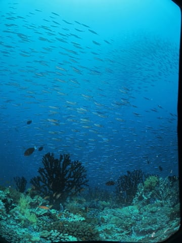
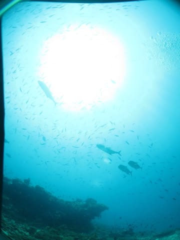

# 2012年　子連れモルジブ　ダイビング旅行記　その13

📅 投稿日時: 2012-11-01 02:18:38

🏷️ カテゴリ: [ダイビング日記](ce3a7a8d424d112fce83ee85c81a0e344.md)

スキーシーズンになって．

ようやっと徒然「スキーヤー」日記になったかとおもったところ．

あー．

今日もまたダイビング日記です…

-----

ということで．

よい子がまねをしてはいけない，冷や冷やの1本目が終了したあとは．

ボートの上でジュースを飲んで．

ココナッツスライスを食したりしつつ．

しばし休みます．

…このボートでは，なぜかダイビングの合間にココナッツスライスを

必ず配ってくれるんですよね…

で．

しばし休憩したら，続けて2本目の時間．

2本目のポイントは…

「ホルバドゥー・ティラ」

ってポイントのようで…

-30mのところにぽつんと突き出た隠れ根で．

この狭い根の上でほとんどの時間を過ごすらしいんですが…

エントリーしてみたところ．

うむ．

ちょいと流れがあるな…

久しぶりのカレントフック出動！

って感じで．

根のトップ付近に，カレントフックでぶら下がりながら

群れものを眺めるスタイル．

うーむ．

コモドの北エリアに近い感じだけど…

それより透明度が半分以下で．

魚影もちょいとコンパクトかな…

でも，流れが強めって言っても，そんなに強くなく，楽だし．

イソマグロとか…

ロウニンとかもやってくるし．

こんなのもいたりしたし．

結構楽しめたかな～

今度もほぼ1時間のロングダイブ．

でも，エアの残圧をちゃんと30くらい残して浮上しましたよ．

＃…それがあたりまえだってば

んで．

2本目のダイビング終了後，ボートで20分ほどかけてリゾートに戻りますが．

その途中．

「イルカ！イルカっ！」

の声で，水面を見てみると．

イルカジャンプ発見！

ボートはしばしイルカのジャンプを追いかけて走りつつ，リゾートへ戻ります．

リゾートに到着したけど…

…やっぱり，桟橋に娘は迎えに来ていないなぁ…

…これは，また…

と．

プールに行ってみると．

やっぱり，娘はプールで泳いでました．

…お前は，ホントに．

…飽きんやっちゃなぁ…

## 💬 コメント一覧

### 💬 コメント by (マルハバ)
**タイトル**: Unknown
**投稿日**: 2012-11-01 08:21:18

私もココナッツスライスは

ドーニの上でしか食べた事ありませんよ。

### 💬 コメント by (Skier_S)
**タイトル**: マルハバさま
**投稿日**: 2012-11-02 00:40:50

そんなにおいしい物ではないんですけどね～．

でも，モルジブに来たなぁ，って気分になりますね．

でも，モルジブでも他のリゾートやダイビング

クルーズではココナッツスライスは出たこと

ない気が…

