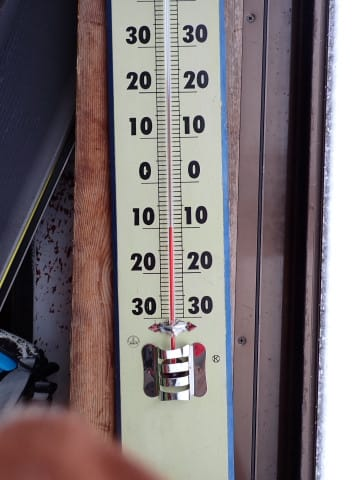

# 2023/2/25(土)の志賀高原スキー場は…曇り時々雪，ちょっとだけ混んだけど冷え冷え雪のいいコンディション

📅 投稿日時: 2023-02-26 00:11:26

🏷️ カテゴリ: [2023スキー滑走日記](cd943df30cfcc3d0896469e2ff98720cd.md)

ということで．

本日も志賀高原で滑ってました～！

いつも通り，8:30から通常営業開始の

焼額第1ゴンドラで山頂に向かいますが…

予想通り朝から雪降りの一日で，ちょい

視界が悪め…(涙)

でも，朝イチの山頂の気温は-10℃と，

昨日の記事に書いた

　-10℃を下回る冷え込み

という予想ギリギリながら，そこそこの

冷え冷えデー！

昨日からの積雪は10㎝程度あったのかな…

朝イチの圧雪バーンは，かなりしっかり

締まった圧雪の上に1-2㎝の冷え冷えの

軽い雪が乗った，滑りいいバーンです！！

うほーーーー！！

[先週の日曜](ef6a90307a844f7822e74153e866bdbf1.md)があまりにも悲惨な一日

だったので…

冷え冷え雪，最高っ！！

シマシマバーンじゃないけど，

志賀高原のトップシーズンらしい，

冷え冷えの軽い雪！！

…これで，視界さえよければ…

と，気持ちよくしばらく滑っていると．

営業開始から1時間後，9時半過ぎには

早くもゲレンデの人口密度が高くなりはじめ…

そして，10時には…

ゴンドラ待ちがちょっと伸びてきました(涙)

まぁ，それほどひどい列じゃなく，最大5分も

待たないので我慢できるレベルですが…

ただ，第2ゴンドラは10分を超える待ち時間

になり，第2高速リフトも結構な列になって

ました（泣）

でも，第3高速リフトはそこまで待ちは

なかったし．

意外と早く，11時にはゴンドラ待ちも

解消されたので…まだましだったかな．

しかし，昼休みタイムが終わった後，

またちょっとゴンドラの人が増えてきて…

午後はゴンドラ待ちが時折ゲートの外に

出ることがある程度で，そこまでの

混雑ではないものの，いつものがら空き

レベルから見るとちょっと混んでたかな～…

混雑するところは，コース上の人もちょっと

多めでしたね…

とはいえ．

リフト待ちは午後はずっとこんな程度で，

そこまで混んでなかったし．

人の少ないコースとタイミングだと，

こんな感じでガラガラだし．

さらに，午後になっても冷え冷えで．

雪質は最高によくて．

下地の圧雪バーンが結構しっかりとした感じで

（アイスバーンではなく，よくしまった圧雪)

午後になってもコースは全然あれる気配は

なかったので…

結構よかったかな！！

天気は残念ながらすっきり晴れとはいえず．

時折雪が舞ったり…

時折うっすら日が差したり…

といった感じの曇り空ベースの

天気でしたが．

ガスって怖くなるほど視界が悪くなったり，

暗すぎる曇り空でバーンの凸凹が見えなくなる

ということもなく．

バーン状況もよくわかるうっすら曇り空で．

そして，ラストリフトまで，バーンコンディションは

大回りしたい放題のフラットバーンが続き…

今日も薄暗くなる最終リフトまで，ひたすら

滑り倒したのでした～！！

いや．

すっきり晴れではなかったし．

ガラガラというわけでもなかったけど．

バーンは見える程度の明るさで，

ゴンドラも5分以上待ったわけでもなく．

先週日曜日に比べれば天国

というコンディションで一日滑れました～！！

明日も朝は雪が舞い，朝までに10～15㎝くらい

積もってるかな…

かなり冷え冷えの一日です！

そして，終日雪がぱらついたり(時折強く降るかも？）

止んだり，うっすら日が差したり…

という天気だと思うので．

ちょっと寒くて，すっきり晴れにならないのは

残念だけど．

終日いい雪で滑れる冷え冷えデーです！！

…来週は気温が上がるので，もしかしたら

これだけの冷え冷え雪で滑れるのはラストかも…

…いや．来週を乗り越えれば．

それ以降，3月も冷え冷えになるはず！！

これがラストの冷え冷え雪なんてことはないはず！！（願望）

ってことで．

明日も焼額滑ってます～！

## 💬 コメント一覧

### 💬 コメント by (レインボー75)
**タイトル**: Unknown
**投稿日**: 2023-02-26 19:20:32

日曜日の志賀高原情報

朝のニゴン待ちでいつも挨拶している人が、このブログの愛読者と解って盛り上がりました。物欲選手権の下手人も紹介できました。

新雪30cm。太板にすればよかった。後の祭りさ(美空ひばり)

朝圧雪の白樺も15以上。オリンピックは膝下パフ。GSはガタガタだったらしい。結局ベストは三高。仲間がみーんな集まりました。

でも寒すぎる。唐松がよかったけど、手が冷たすぎて二度は滑れない。

まあサムーい一日でした。エブリデイスキーヤーには明日からが本番。今日は早々にひきあげました。

明日はこのパウダーが圧雪されて平日スキーヤーをお出迎えしてくれることでしょう。

エス様の帰った後の志賀は、おそらくパラダイス！

### 💬 コメント by (べー)
**タイトル**: Unknown
**投稿日**: 2023-02-26 23:14:07

Ｓさん

正月は志賀高原からの二度目のスキーですが尾瀬岩鞍に浮気してしまいました…移動距離を考えるといいスキー場です。

でも今シーズンもう一回位は志賀高原で滑りたい…

### 💬 コメント by (Skier_S)
**タイトル**: 今日は寒かったよ
**投稿日**: 2023-02-27 01:24:02

＞レインボー75さま

物欲選手権の黒幕（？）が明らかにされたんですね(笑)．

GSはちょっとガタガタでしたね…3高のイーストが良かったですね！

明日は晴れて冷え冷え雪で最高だと思いますよ！

＞べ―さま

あら…浮気しちゃいましたか．

次こそ志賀高原で！春は志賀高原の雪質の良さを改めて思い知らされる

シーズンですから…

