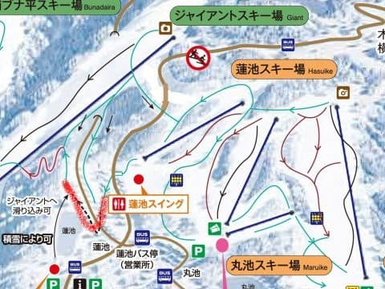

# うむ？志賀高原中央エリアのマップが，さりげなく2019シーズン版になっている気がするのだが…

📅 投稿日時: 2018-09-15 09:32:21

昨日は帰宅後死んだように寝てしまったので．

朝に更新…

てなわけで．

車ネタとダイビングネタの宝庫，

徒然スキーヤー日記をご覧いただきありがとうございます←開き直り

でも．

今日は．

実に久しぶりのスキーネタなのだ！

もう，読者の皆さんも，ここがスキーBlogだということを

忘れちゃってるんじゃないか心配なのですが．

一応，スキーブログですから！！

…ってなわけで．

本日．

志賀高原リゾート開発のウェブページを見ていた時…

[中央エリアのマップのページ](http://www.shigakogen.co.jp/highlight/896-2)をクリックすると．

んんん？

…これは…

マップ，新しくなってる？？

（[志賀高原リゾート開発ウェブページ](http://www.shigakogen.co.jp/highlight/896-2)より）

どうやら．

ひっそりと2019シーズンのマップに入れ替わって

いるようなので．

…2018シーズンから，一体どこが変わったのか！？？

と．

マップを隅々まで読み込むという，

20000mクラブのメンバーなら反射的にやってしまう，

本能ともいえる反応をしてしまったのでした…

ってことで．

[2018シーズンの同じマップ](http://www.shigakogen.co.jp/information/4318.php)と比べてみますと…

志賀高原に慣れていない人には，

ほとんど違いが分かりませんね…

かなり高度な間違い探しの問題として使えそう(笑)．

とりあえず，じっくり読みこんでみたところ．

昨シーズンは3本もリフトが減ったし，

今シーズンはもっとリフトが減るんじゃないか…

と心配してたけど．

思ったほど大きく変わってないようで．

ちょっと安心…

とりあえず．

私が気づいた変更点は2か所のみ．

まず，一番大きな変更点は…

ここですね．

ブナ平スキー場．

志賀高原マニアレベルは，一瞬で何が変わったか

分かると思いますが．

そうじゃない人は分からないと思うので．

2018シーズンマップの同じ場所を

拡大すると…

そうです．

赤く囲ったブナ平クワッド．

こいつが消えてます…！

このリフト．

2シーズン前から，休日でも止まっていることが

多くなり．

ついに昨シーズンは一度も動いているのを

見なかったので．

廃止されるだろうなぁ…

と思っていましたが．

ついに廃止ですか…

まぁ，ここは想定の範囲内．

…でも．

人気のなかった，ここの七曲り．

気持ちいい一枚バーンから，狭い

急カーブになって，滑りにくいうえに

雪付きが悪くなって不評だったのに．

七曲りのまま残るようですね…（涙）

そうして．

もう一つの変更点が，ここ．

蓮池ですが．

さぁ．みなさん．

どこが変わったか分かりますか？？

20000mクラブな皆さんなら一瞬で

「やっぱりな…」

と見抜く変更点．

2018シーズンマップをみると…

そうです．

蓮池→ジャイアントに抜けるためのロープトゥが

無くなりました！

…まぁ，ここも去年は．

地図に乗っているものの一度も動かず

じまいだったので．

無くなるだろうなぁ…と思ってましたが．

ついに正式に廃止です．

こいつが廃止になったので．

蓮池・丸池・サンバレーエリアからジャイアントに

帰るためには，スキーを履いたままで

移動できなくなり．

この赤く印した部分をとぼとぼとスキーをもって

歩かなくてはならなくなりました…

うーむ．

連絡が悪くなった蓮池・丸池・サンバレーエリア．

さらに人が減っていきそう…

来シーズン，リフトが無くならないことを

祈るばかり…

まぁ，せめてもの救いは．

サンバレーと丸池は，まだナイター表示が

残っているので．

お客さんがあまりにも少ないサンバレーエリアの

ナイター営業，無くなるのでは…？？？

という心配は，杞憂に終わったようで．

ちょっと一安心…

ってな感じのところが，私の気づいた変更点ですが．

まぁ，昨年よりは変更点が少ないとはいえ．

やっぱり毎年，リフトが減っていくという

寂しい状況が続いてます…（ちょっと涙）

何かいいニュースがないかなぁ…

と，一生懸命探しましたが．

新しい何かが追加されているという，

いいニュースは全く無さそうです（泣）

うーむ．

まだマップが出ていない，焼額や奥志賀，

横手山＆熊の湯エリア．

いい方に変わっていることを期待…

新しくリフトが追加されるとか．

コースが増えるようなことはほとんど

期待できないけど

## 💬 コメント一覧

### 💬 コメント by (Goku)
**タイトル**: 大違い
**投稿日**: 2018-09-15 14:09:19

ゴンドラを掛け替える野沢とは大きな違いですね(T_T)

観光協会、索道協会、下の温泉街まで含めた大規模な改革が必要かと。

もうこれ以上の衰退は見たくありません。

### 💬 コメント by (すぎぃ)
**タイトル**: クローズコース
**投稿日**: 2018-09-15 14:52:29

リフトの減少もしかりですが

いつ行っても下記の通りクローズしている

コースも増えました。

小生のお気に入りコースばかりで

へこんでしまいますわ。

　　　　　　　＜記＞

丸池・・・ウルトラコース、ジャンプ台コース

横手山・・・ジャンボコース上部＆下部

### 💬 コメント by (アル)
**タイトル**: 蓮池
**投稿日**: 2018-09-15 23:54:38

1988年、高校のスキー研修が蓮池でした。初めてのスキーで2日間蓮池でストックなしで練習して最終日にようやくジャイアントへ移動した時にロープトゥーを使ったような記憶。志賀高原の衰退具合はほんと残念です。

### 💬 コメント by (Skier_S)
**タイトル**: いいニュースないかな…
**投稿日**: 2018-09-16 01:48:53

＞Gokuさま

このままだと．

サンバレー，蓮池，丸池もいつ営業が終わっても不思議じゃないし．

渋峠とかもヤバい気がしてます．

この際，外国資本や大手資本を入れるのもやむなし…

と割り切らないと，志賀全体の地盤沈下が防げない気がします．

プリンスが来るときにかなり反対がありましたが，

焼額が無かったら今の志賀高原，もっと地盤沈下

していた気が…

＞すぎぃさま

そうですね～．

地図上は残っていても，クローズしているコースも

結構ありますよね…

丸池のジャンプ台コース，恥ずかしながら一度も

滑ったことありませんが(笑)．

横手山も，トップシーズンに行くことはほとんどないので

知らなかったんですが，ジャンボコースがシーズン中もクローズしてるんですか？

うーん．

縮小の一方ですね…（涙）

＞アルさま

私の印象では，蓮池ロープトウは結構新しいイメージが

あったのですが，もう20年にもなりますか…！

昨年のダイヤモンドのベルトコンベア代わりのリフトは別として．

志賀高原で最後に新設されたリフトって何年前ですかね…

あ，ジャイアントのリフトや横手第3みたいな架け替えは別として．

純粋な新設で言うと…

歴史を紐解くと，1999年だったかくらいの

高天ヶ原第3トリプルのような気がします．

ただ，すでに廃止されましたが(笑)．

この頃に，高天ヶ原がクワッドリフトになり．

西館の下のリフトもクワッドに架けかわったのが，

華やかな時代の終わりだったのかもしれません…

なんだか残念な感じです．

### 💬 コメント by (yumi)
**タイトル**: 今さらですが・・・
**投稿日**: 2018-10-23 08:13:40

Ｓさぁ～ん🎃⛷️🎊

タイトル通り、今さらなんですが、

こちらの記事をFBでシェアさせて頂きました。

SNSのルールがよくわからなくて、スミマセン💧

問題が有れば削除しますので、叱って下さいね。

実は、この 良くできた 素晴らしい記事を、NZから 毎年 志賀高原に滑りに来るお友だちに 見て欲しくて、おもわず貼り付けちゃいました✨

ちなみに・・・

昨日、イエティ デビューしました🎵

仮装してリフト券が半額でした🎵

ピカチュウで滑りました🎵

### 💬 コメント by (Skier_S)
**タイトル**: yumiさま
**投稿日**: 2018-10-24 01:16:54

いえいえ，公開しているBlogですから，

ご自由にシェアしていただいても構いません…

どうぞご自由に拡散してください～！

Yetiに行かれるんですね…

楽しめましたか？？

また土日にも遊びに来てください．

しかし，ピカチュウですか…（笑）

