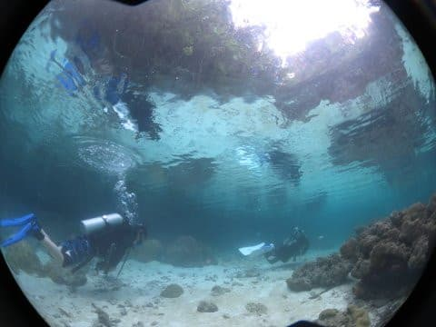

# 2017年8月，小学生の子連れでパラオ再訪！その20…4本目のエキストラダイブ

📅 投稿日時: 2018-10-14 02:21:01

ということで．

先週，人生最大の契約を終えたあと．

今週は引っ越し前の不要物の始末や

新居の家具などの購入に忙殺され，

この週末も遠出ができないSkier_Sです（涙）

先週はそれでも強引に山に行ってきたものだ…

でも．

来週からYetiに行くことを考えると．

今日明日中に，新居で不足する家具をすべてリストアップして，

購入しきってしまわないと！←いろいろ無理があるスケジュール

ってな感じで．

とてもじゃないけど．

来週の今頃には，もうシーズンインしていると

全く信じられないような状況です…

だもんで．

本日も，書きためたダイビング日記へ，Go！

前回は新居が決まってから5日で引っ越しという日程で，良く引っ越せたものだ…

---

ってなわけで．

本日の3本のダイビングを終えて，ショップへ

戻ってきましたが…

うーむ．

雨が降ってますね…

そんな中．

エキストラダイブに行くメンバーは，

雨の中，またボートに乗り込んで…

4本目のダイブへ向かって，出航！

ポイントに近づくころには．

うーむ．

ちょっと晴れてきたかな？

ってことで．

到着した4本目のポイントは「マリンレイク」

その名の通り，

外界とは幅数mの水路でつながっているだけという，

周りを陸に囲まれた池のようなポイント．

深度もせいぜい数mと浅いです…

ってなことで，

すごく浅い海へエントリー!

外海に止まったボートから，

通路を通り…

池（？）へ到着！

ここの砂地はハゼ天国！！

閉塞された海で，大型魚が入ってこず，

外敵が少ないからか．

ギンガハゼが，半径1m内に数え切れないほど！

これはオバケインコハゼの仲間と言われたけど．

ちょっと違うように見える…

そして．

珊瑚の周りには，マンジュウイシモチが

自ら動かない，飾りのようにじっとしていて…

そこらじゅうに大量にいます．

そして．

これが本日のメインディッシュ．

ニシキテグリ！

もう，サンゴの影をちょこまかと動くので．

大変写真に撮りにくくて．

大量にピンボケ写真やら，サンゴの陰に

隠れた写真ばっかり撮ってしまったのですが…

とりあえず，背びれにとげのあるオスの写真と．

とげのないメスの写真を無事Getできて．

顔がちょっと隠れちゃったけど，オスメス

ペアの写真も撮れました～！

ってな感じで．

たっぷりとニシキテグリを撮影した後は…

こんな感じで，非常に浅い海なので．

一旦水面に出てみます．

いやー．

ホントに周りを囲まれて，池みたい．

海とは思えない…

ってな感じで．

後は水面を移動して．

外海に通じる，狭い通路を通って…

ボートに戻ってきました．

いや．

ブルーコーナーの大物ガンガンのあとは．

いろいろマクロものが楽しめるこういうポイントも

いいですね～！
