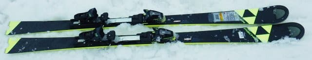
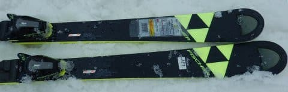
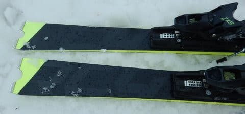
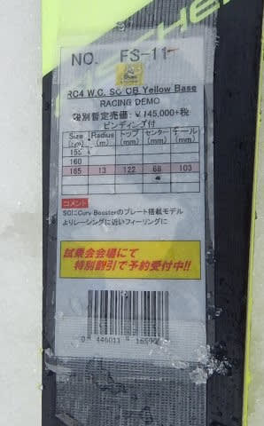
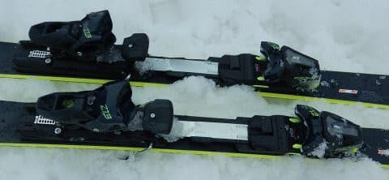

# 2020シーズンモデルのスキー板，試乗レポート…FISCHER編その3

📅 投稿日時: 2019-06-14 03:33:01

🏷️ カテゴリ: [スキー板試乗](c0bd8048615710cee890e403a36cc9a2b.md)

ってなわけで．

今日もご無体時間（涙）

来週…

来週のピークを乗り越えれば何とか

なるはず…（ホントかな…）

とりあえず．

本日も書きためておいた

2020シーズンモデルのスキー板の

試乗レポート．

今日はフィッシャー編です．

では，どうぞ～！

○FISCHER WC SC Curve Booster YellowBase 165cm

基礎小回り

この，FISCHERのWorldcup SCですが．

プレート＆ビンディング違いで2種類あります．

[前回](eae8a1cc9ea1e51e240a6b17a4cde658a.md)は，Racetrackビンディングが着いた，

比較的優し目のWC SC Racetrackでしたが．

今回は強めのCurve Boosterが着いた，

ガッチリした方のモデル．

WC SCでも，Yellow Baseという呼び名に

なるようです…

試乗したコンディションは夕方の，

かなりザブ雪になったコンデションだったのですが．

柔らかい雪では，ちょっとこの強いほうの

モデルは実力を発揮しきれない感じ…

重い雪だと，ちょっと板が動かしにくく

感じました．

でも．

締まった雪のところに行くと…

ガッツリ板が雪面を捉え，

良くたわんでグイグイ曲がって，

ターン後半では張りの強いテールが

頑張って，

最後はきれいに板が次のターンに抜けていきます．

ガンガンスピードが上がって行っても，

板が窒息する感じはなく．

「まだまだ大丈夫ですよ～」

という余裕をもってたわんでいく感じ．

そして，たわんだサイドカーブに乗って，

グググっと回り．

最後はテールのエッジまでしっかり使い切って，

すっと抜けていく感じ．

谷回りでトップを抑えこむというより，

センターよりテール側を積極的に使っていく感じで．

キャンバースキーのはずなのに，ロッカーっぽい

操作性を感じたので．

ATOMICのSX乗りとしては，安心して乗って行けました…

全体的に，反応が早く，返りのばね感も強く，

かなりレベルの高い板ですが．

山回りで板を動かしてコントロールしに行く

自由度もあるので．

SL板よりは扱いやすい感じ．

ただ，Yellow Baseは，比較的テールの張りが

強く感じるので．

柔らかい雪だと，板が十分たわまず，

残念ながら，荒れた雪での快感度はちょっと落ちるかな…

そういう意味では，柔らかい雪や荒れたコンディション等で

いろんな小技を使うなら，SC Racetrackの方が

小技が使えたかな…

でも．

ハイスピードカービングマシンという観点なら．

Yellow Baseの方が上です．

整地でトップスピードでガンガンカービングをしたいのか，

いろんな斜面で小技を使っていきたいのかで，

Yellow BaseとRacetrackを使い分けるのかな…

Yellow Baseがもう少し荒れた斜面での

コントロール性が高ければいいんだけどな～．
