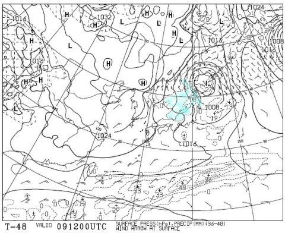
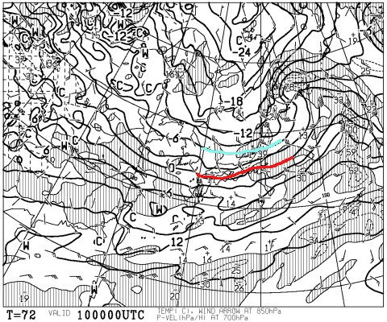
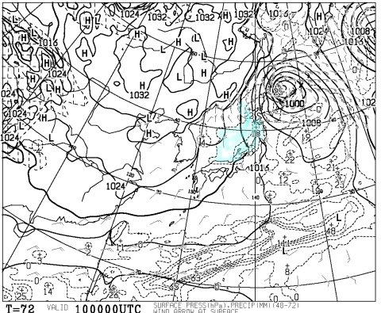
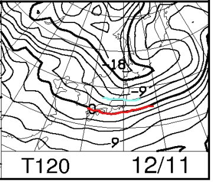
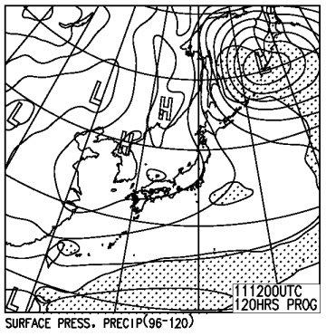

# 今日も天気予想です．．今週末，12月10，11日の志賀高原スキー場の天気は？

📅 投稿日時: 2016-12-08 01:27:39

えー．

なんだか，ここしばらく．

天気予想ばっかりやってる気がするんですが．

…だって，気になるんだもん．

週末のスキー場がどうなるか…

ってことで．

本日は，水曜夜の定例．

今週末の天気予想です～．

の，前に．

まだ，白馬山麓のオープンは正式に決まってませんが．

八方は，今週末あたりオープンしそうな気配ですね…

そして．

かぐらは昨晩から積雪があり．

今週末から田代もオープンするようですね…

熊の湯も，今週は山頂から滑れそうな気配ですし．

とりあえず．

木曜：運が良ければ，前日夜からこの日の朝にかけて，

　天然雪が10cmくらい降ってくれるかも…

と昨日予想しましたが．

この，運が良いほうになって．

今晩から明日の木曜の朝にかけて，

積雪の積みましがありそう！

…昼間は予想通り晴れちゃいそうですけど…

そして．

9日，金曜は…

をを！

冬型の気圧配置だ！

昨日の予想では，ほとんど積もらなさそうな

感じだったけど．

…これなら，ドサドサと言わないけど．

10～20cmは積雪がありそうな感じ…

で．

週末の天気，だ．

土曜の850hpa気温図を見ると…

うむ．

志賀高原には青くマークした-6℃線が近づくので．

この日は冷えます！

昼間も気温が上がらず，真冬の寒さです．

昼間は-5度程度までしか気温は上がらなさそう…

そして，地上天気図は…

うむ！

この日も冬型！

昨日の天気図ではなかった，

水色に塗った日本海側の降水域が予想されています！

朝のうちは西風にならなさそう．

…これなら，金曜夜から土曜朝にかけて，

結構積雪があるかも！？？？

日本海に近い，かぐらや白馬山麓は

そこそこ積もりそうな感じ！

続いて，11日，日曜の850hpa気温を見ると…

この日も志賀高原は-6℃線がかかっており．

冷えそうですな～．

そして，地上天気図を見ると…

うーむ．

この日はあんまり降らなさそうかも…

でも．

終日冷え冷えで，雪質はいいかな！

ってことで．

まとめると．

土曜：前日から10cm，運が良ければ20cmの

　冷え冷え積雪あり！

　道路は完全雪道なので注意…

　朝は山頂で-8℃近くまで冷え込み，

　朝イチのゲレンデは柔らかい冷え冷え

　圧雪の上にうっすら軽い新雪．

　終日曇り，時々小雪がぱらぱら舞う天気．

　志賀は日中は積もるほどの強い降雪は無く，

　時折日が射すくらいかも．

　でも，昼間も寒いよ！最高でも-5度程度と，

　真冬の寒さなので，あったかい格好をして

　いきましょう…．

　雪が柔らかいので，午後はコースが

　荒れていくかも…

　今シーズン初の，冬っぽい週末になりそう！

日曜：前日からの積雪は期待できないけど，

　冷え冷えなので人工降雪機はガンガン動く．

　人工降雪されたコースは，朝は人工雪が圧雪

　された，締まったバーン状況でスタート．

　天気はまだよくわからないけど…

　曇りのち晴れかな．

　この日も終日冷えて，コンディションは良さそう！

　…人工降雪の氷コロコロが無ければ…

　一日しっかり締まったフラットバーンで滑れそう．

　

ということで．

この週末．

どっさり積雪で，一気に滑れるゲレンデが広がる…って

ことは無さそうだけれども．

昨日の予想とちょっと変わって，

土曜朝にかけて，天然雪が少し積もりそうなので．

そこそこ恵まれたコンディションで滑れそうかな…？
