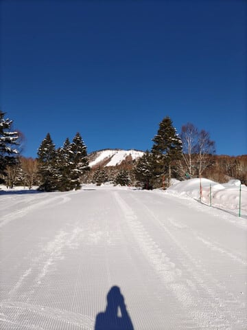
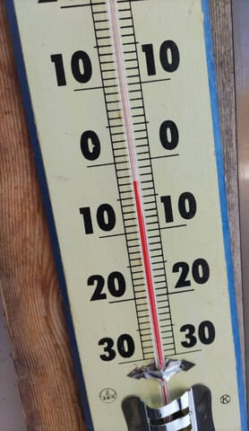
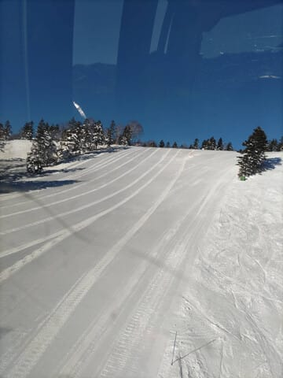
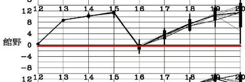
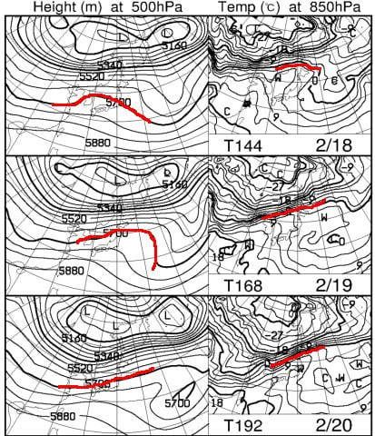

# 本日の志賀高原は晴天・高温だったみたい…高温は15日木曜まで続き木曜夜は雨（泣），その後18日からまた高温で20～21日に雨になりそう（涙）

📅 投稿日時: 2024-02-14 04:51:09

🏷️ カテゴリ: [日記](cc4b5682fb7b8b144980957a978653fb0.md)

えー．

本来なら，本日は日曜の詳細レポートを

書こうかと思ったけど．

仕事をしてるとも深夜（朝？）4時半過ぎ…

なので，手短に更新！

で．

本日の志賀高原ですが．

特派員レポートによると，一日晴天で，

朝は最高のシマシマだったようです…！

うーん．

うらやましい…

でも，気温は高く，朝から-3℃（涙）

今日は雪はそこまで緩まなかったよう

ですが，10時過ぎには焼額山頂でも

気温がプラスにまで上がり，

11時過ぎで+2℃と，かなり気温が

上がった，温かい一日だったようです…（涙）

で．

これから先の天気は…

16日に一瞬冷えて雪が降る以外．

ずっと異常高温が続きそうです（泣）

13～15日も4月並みの気温だけど，

18～20日も，グラフの上を突き抜ける

平年比+8～＋12℃を越える，激しい

高温の予想です（激泣）

とりあえず．

ここまで高温になることはそうそうない

という異常高温が，15日と20日の2回も

やってくるという，異常x異常の

超異常事態です（涙）

天気図を見ても，絶望しかない…

果たして，16日の1日だけの冷え込みで

どこまで雪が積もってくれるのか？

この1点に，この週末の雪質がかかっています…

で，今週末を無事乗り越えたとしても，

さらに来週は．

右側の850hPaの0℃線が北海道より北まで

上がっちゃうし．

左側の5700m特定高度線が本州にかかるなんて

GWくらいの天気図なんですが？？

こんなことが2月にあっていいのか？？

という，きわめて悲しい感じ…

あぁ…

普通ならトップシーズンの2月なのに．

なぜこんな，5月に入るGWみたいな

天気図なのか…

今シーズンは一度も太ももとか腰パフの

深いパウダーにあたってないし．

これからもディープパウダーに

なることなく今シーズンが終わって

しまいそう…

さらに．

この週末の雪質も気になるけど．

このままだとGWどころか4月の営業すら

ヤバいかも？？

という雪の量なのがヤバい．

とりあえず．

これから3，4月が奇跡の冷え込みになって，

3，4月は毎週末冷え冷えディープパウダーが

降るように祈ってみます…！←無理だから

## 💬 コメント一覧

### 💬 コメント by (レインボー76)
**タイトル**: Unknown
**投稿日**: 2024-02-14 18:26:23

水曜日の志賀高原情報

朝の上林0℃　蓮池-3℃。今日も快晴、スキー日和。

ダイヤ、山の神は非圧雪でがたがた。ヤケビはすべてパーフェクト。奥志賀エキスパはやっぱりこの時期のベストプレイス。

週末の子供の面倒の疲れがまだとれず、こんな好条件でも昼あがり。毎日が極楽です。

帰路の高天+5℃　蓮池+10℃　上林+10℃。４月まで雪があるイメージがわきません。

### 💬 コメント by (レインボー76)
**タイトル**: Unknown
**投稿日**: 2024-02-15 13:54:43

木曜日の志賀高原情報

朝の上林+3℃　蓮池+2℃。暖かすぎる！もう４月は絶望的な悪い予感。

ブーツを履くときに苦労している人は多いと思いますが、今日、シリコンスプレーをシューっとしてから履いたら、あらスルリ。

私はあゆ釣りの時にタイツやらを二枚履きするのですが、二枚目の内側にシューっとしてます。何でその応用を今朝まで思いつかなかったのか！もはや大脳があまり機能しなくなっているとしか。

シリコンスプレーはホームセンターで簡単に入手できますが、注意点が一つだけ。

床に飛び散ると滑ります。

ちなみのブーツを脱ぐ時もスルリ。

朝のダイヤは極悪圧雪カリカリで、快感度ゼロ。ヤケビはさすがの技術です。どこも快適だけど、古傷の膝が痛むうえ、R24のワックスレス板にうまくマッチできず、不完全燃焼の一日でした。

奥志賀エキスバはいつもながら素晴らしかったけど、昼前のダウンヒルでは、出ました妖怪板つかみ。陽のあたる緩斜面は全滅でした。

### 💬 コメント by (Skier_S)
**タイトル**: ＞レインボー76さま
**投稿日**: 2024-02-16 08:32:43

レポートありがとうございます～！

今日の雪で，ゲレンデの状況が改善しているといいんですが…

下地はガリガリかなぁ…(泣)

