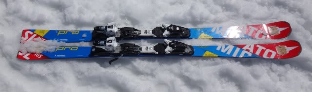
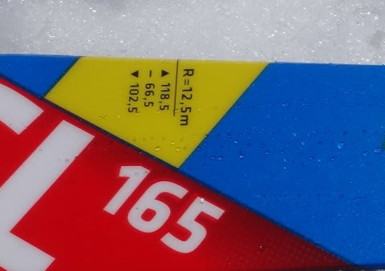
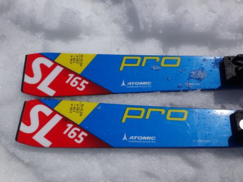
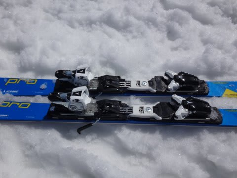

# 2016シーズンモデル，スキー試乗レポート第15回…ATOMIC編その2

📅 投稿日時: 2015-04-24 01:27:39

今日も続く，2016シーズンモデルのスキー板，試乗インプレッション．

本日は，アトミック編．

ちょいと時間が無いので，1機種だけです．

では，どうぞ～！

○ATOMIC BLUESTER SL PRO 165cm

基礎小回り．

いわゆる「皆川賢太郎モデル」です．

BLUESTER Doubledeck SXよりも，さらに強さを増した

技術選にターゲットを置いた小回りモデル．

REDSTER FIS SLをベースにした，DoubleDeckがついてない

SL板を技術選選手向けにモディファイした板だということですが…

この板．ビンディングは，強めのVARビンディングが標準です．

で．履いた感じ，やっぱりATOMICかな～．

荷重ポイントは，比較的テール寄り，くるぶし～かかとって感じですが，

キャンバー板なので，トップがグリップして内側にステア

してくる感じは，SXより強く感じます．

SXはテールのグリップが主体で，トップが浮き上がるように

回っていく感じだけど．

この板は荷重ポイントがテール気味でありつつも，

谷回りでトップがグリップして内に入ってくる

感じがあります．

返りはそこそこ速いですが，フレックスは想像したほど強くないです．

…いや，強いんです．強い板だけど，予想の範囲内．

SALOMONのX-RaceやROSSIGNOLのDEMO ALPHA R21と比べると，

やさしく，動かしやすい板です．

たわませられないと，R=12.5という板にしては比較的

まっすぐ走りますけど，割とたわませやすく，

たわませれば意外と小さい半径で回っていきます．

たわませる際の荷重ポイントは明確にかかと部分．

谷回りでも，トップを抑えなくていい感じ．

ヒールピース部分を押していくと，板全体がきれいにたわみ，

谷回りでトップから食い込み，たわみに乗って

予想以上の小さい半径で回っていくターンができます．

ATOMICらしく，テールの張り・粘りが強く，

ターン後半は，しっかりテール荷重で仕上げて

次のターンに向かって走らせていける板です．

ずらして滑っても楽しくないかな～．

ゲレンデで履くオールラウンド用，ってよりは

やっぱり整地小回りスペシャルです．

ATOMICの方曰く，全日本技術選でも，この板を履いたのは

トップ4人だけらしく．

それ以外の選手は，BLUESTER Doubledeck3.0 SXを

履いたようですね～．
