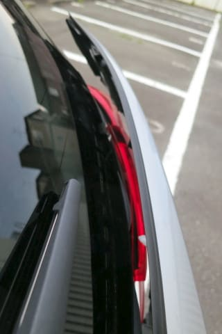
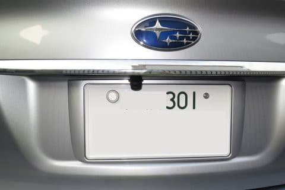

# プロジェクトX2第2章…LEVORG E型にリアカメラをつけてみた・リアガーニッシュの外し方＆カメラ本体を取り付けるっ！

📅 投稿日時: 2018-07-31 02:34:03

えー．

先週も仕事でご無体時間が続いていたため．

スキーシーズンじゃないのに，疲れが

溜まっていたのか…

土曜日から日曜に掛けて．

14時間寝る

という．

かなりの睡眠時間を取ってしまいました…

いやーーー．

かなり疲れてたんだなぁ…

だのに．

日曜の夜も10時前に寝てしまうという…

いや．

実に健全な土日でした…

ナビ取り付けにも追われず（なんのこっちゃ？）

Blogも書かないと，こんな健全な時間に

寝られるのか…という感じです．

…どうでもいいですが，前回のリアカメラ取り付け

記事は，原稿用紙16枚以上の文字数の長編で．

おまけに解説図まで作って，執筆に3時間以上かかった

力作でした…（涙）←なんのためにそこまで手間暇かけてBlog記事を

書いているのか，時々分からなくなる

ということで．

ようやっと記事を書く時間が取れたので．

本日はLEVORGへのリアカメラ取り付け記事，続きです…

では，どうぞ～！

--

ってなわけで．

[前回のレポート](e0d61a04608a6a32ac684b08fc69da0f4.md)にあるように．

C型LEVORGまでにしか使えないことを知らずに

作ってしまった，特製ハーネス．

なんとかE型LEVORGで利用できる方法を思い

つき，作業を継続できることになったのですが…

長かった．

これまで長かった…

まさか，カメラ取り付けに至るまでに，

記事4本を消費するとは思わなかった…←どれだけ大変だったかを，記事の本数で表すのね…

では，

さっそくようやく，

カメラ本体の取り付けに参りましょうか！

リアカメラは，大体このあたりに取り付けるわけですね…

で．

リアカメラ取り付けのためには，リアガーニッシュを

取り外さなければなりません．

ってなわけで．

リアガーニッシュの外し方ですが…

まずはリアゲート内側．

左右2本ずつ，このボルトを外します．

そのあとは，分かりにくいここの2か所．

のぞき込むと，ボルトが見えるので…

この2本のボルトも外します．

そして．

忘れちゃいけないのが，このハーネスのコネクタを

外しておくこと．

こいつは，リアガーニッシュについている，

リアゲートオープンボタンやロックボタンに

行ってる配線用コネクタです．

拡大すると…こいつです．

こんな感じで．

忘れないように外しておきましょう．

これだけの計6本のボルトが外れれば．

あとはクリップ止めなので．

引っ張れば外れます．

このあたりに指を突っ込んで…

引っ張っていけば…

こんな感じのクリップで止まっているだけなので

ボコボコと外れていきます．

結構力がいるので，慣れてないと

ビビるかもしれません．

何度か引っ張っていると…

ボコっと外れますが．

ここで手を離してはいけません！

リアガーニッシュには，こんな感じで，

リアゲートからのハーネスがつながってますので…

矢印部分のグロメットを外さないと，

リアガーニッシュがハーネスで宙づりに

なります…

だもんで．

このグロメットを外してやって…

これで，晴れてリアガーニッシュが

分離します！

この時．

リアゲートを開くボタン．

こいつがリアガーニッシュごと車から外れているので，

操作できなくなってます．

リアゲートを完全に閉めると，開けられなくなります．

だもんで，閉まらないようにカーペットを挟むなどの

対策を取っておいた方が良いでしょう…

ってな感じで．

めでたくリアガーニッシュが分離したので．

次は，こいつにリアカメラを取り付ける

わけですね…

リアガーニッシュの下側を見てみると．

この赤矢印がゲートオープンスイッチ．

青矢印が，純正リアカメラ取り付け位置となっていて．

カメラ取り付け用に，ちょっと広いスペースが

準備されているのが分かります…

ここにこんな感じでカメラをつけるわけですが．

配線を通すための穴を開けなくてはなりません．

…穴というより，切り欠きですね．

だもんで．

こいつでガリガリと切りましょう．

ええ．ガリガリと…

ってことで．

切り終わりましたが…

ケーブルが通るミニマムの切り欠きに

留めました．

後は形を整えて．

これで，こんな感じでケーブルが

ガーニッシュの裏に抜けられるように

なります．

切り欠きができたら，

次はカメラの固定です．

カメラの固定具についている

強力両面テープ．

こいつだけで結構な固定力があり，

ねじ止めしなくても行けるようなので．

両面テープの剥離紙を剥がして…

カメラを固定！

こんな感じで，リアガーニッシュに

カメラが固定できました…

次は，カメラのケーブルを車内に通すための

準備です．

こんな感じの四角いゴムグロメットがボディ側に

ついてるので…

こいつにカッターで切れ目を入れます．

こういう時に，カメラコネクタが小型だと，

切れ目が小さくて済むのでいいですね～．

むふふ．

苦労して，KENWOOD専用カメラコネクタで，

純正先行配線ハーネスを使えるようにした

かいがあったというもの…！！←こうやって自分を誉めないとやってられない

ここまでやったら，リアガーニッシュを

再び本体に合体させるのだ！

この，左側がカメラケーブル．

カメラケーブルをグロメットに貫通させて，

車内側に引き込みます．

車内側から見ると，こんな感じ．

このあと，テープかコーキング材みたいなもので

防水処理をしておきましょう…

右側の，ゲートオープンスイッチ類の

ハーネスのグロメットもはめ込んで…

この段階で，ゲートオープンスイッチ類の

コネクタを繋いでおくことをおススメ．

こうしておけば，ゲートをガチャンと閉めても，

ボタンで明けられるようになります…

後は元通り，クリップを押し込んでやるわけですが．

ここでゲートをガチャンと閉めて固定された状態で

やった方が，力が入れられていいです．

ってなわけで．

リアゲートのクリップをはめると，

ほぼ完全元通りに見えますね…

後は，外したボルトを元通り締めて行けば…

カメラケーブルはまだぶら下がったままですが…

これで，カメラの固定は完了です！

まぁ，こんな感じかな…

カメラの角度調整と，ケーブルの繋ぎこみは

ナビ本体がついてからの作業ですね．

これにて，連載5回にも渡ったリアカメラ取り付けは，

ようやく一段落です…←でも，カメラ取り付けそのものの記事は今回だけだった気がする…

いやーー．

思わぬトラブルにより．

リアカメラ取り付けだけで，1日以上かかっちゃったよ…

後のナビ本体取り付けは，順調に進むはずだよな～…

…順調に進むっ！進むはずだっ！！

…

と．

これから先はノートラブルであることを強く

願っていた，Skier_Sなのだった…

が，世の中はそんなに甘くなかった…

## 💬 コメント一覧

### 💬 コメント by (ほっぽ)
**タイトル**: リアカメラ
**投稿日**: 2018-07-31 06:48:07

Ｓさん

レヴォーグはガーニッシュ側にカメラ固定するんですね。

ＢＰレガシィはリアゲート側への取り付けでした。

これであとは順調に作業が進むはず、と願っていますが、

このblog記事からすると、今後も波瀾万丈なんでしょうか。(^^;

### 💬 コメント by (kobudaiski)
**タイトル**: ガーニッシュカメラ
**投稿日**: 2018-07-31 09:25:58

Sさん

こんにちは、暑い中本当にお疲れ様でした。

今回の記事も大変参考になりました。

　私は過去、内装(外装)外しに中々勇気と決断

がなく何度かトライ(破損も経験)してパキバキが

怖くて最近はついつい販売会社やショップにたよってしまっています。

　ご多忙の所、申し訳なく思いましたがどうしても?なところがありコメントさせていただきました。すみません。

　早速ですがガーニッシュにリヤカメラの台座の取り付けスペースがあるのにゲートグロメットへの引き込みになぜのこぎりでガリガリしなくてはいけないのか不思議でたまりません。スバルの設計がそうなっているのか・・・。

　販売会社では　のこぎりの大変な作業なく処理

しているはずだと思うのですが何か別の方法でとりつけているのでしょうか?

　お時間ごさいましたらご教授くださいませ。

暑い中、よろしくお願い致します。

### 💬 コメント by (Skier_S)
**タイトル**: カメラ固定方法
**投稿日**: 2018-08-01 01:25:34

＞ほっぽさま

そうなんです．

BRレガシィから，リアガーニッシュ取り付けになってます…

リアカメラはこれで無事取り付けられたのですが．

それ以外の部分も，なかなか一筋縄ではいってくれませんでした…（涙）

＞kobudaiskiさま

ご丁寧なコメントありがとうございます…

実は，純正リアカメラ取り付けの場合は．

カメラ自体をリアガーニッシュに隠すために，

ケーブル引き込みだけの切り欠きではなく．

カメラがすっぽり入る巨大切り欠きを作るように，

ガバッと切り取ります…

だもんで．

その切込みのためのケガキ線が，カメラ取り付け部には

描かれています．

純正カメラを使わない人には，そんな巨大な穴が

開いているとかっこ悪いので，最初から

穴をあけておかないのかと思いますが…

いちいち穴を空けるのも大変そうなので，

蓋か何かにしてもいいのでは…？？

と思ったりもします．

https://www.subaru.jp/accessory/catalog/pdf/levorg_acc.pdf

のオプションカタログには，見にくいですが

純正リアカメラの取り付け状態の写真が

あります…

コーナーセンサーやら，フェンダーコントロール（コーナーポール）やら

フロントリップスポイラーやら，

現場でボディに穴を開けたり削ったりしなくては

ならないオプションが結構あるので．

ディーラーオプションをつける現場でも，結構いろいろ

ガリガリしていると思います…

### 💬 コメント by (yumi)
**タイトル**: 反応する所が･･･
**投稿日**: 2018-08-01 17:01:07

Sさぁ～ん🎆🎆🎆

私、皆さまと反応する所がかなり違って･･･

車🚗の事は、ちんぷんかんぷんで、ましてやナビやら、バックカメラ📷やらをselfで取り付けが出来るなんて、信じられないです。

つい、先日までガソリン⛽️タンクの開けかたも･･･

えっ❗️レバーって、どこに有るの⁉️状態です💧

･･･で、

今回、反応したのが、綿密に作り込まれた解説図とか、何時もながらの洗練された文章、関西人も顔負けするツッコミ🔫敬服致します✨

あの解説図はパワポかなぁ～❓とか、

何時間かかってんのかなぁ～❓とか、

いったい、いつ寝てんのかなぁ～❓とか。

お身体、大切にしてくださいね。

それと、Ｓさんに教えて👂？欲しい事があるのですが、10月20日頃のイエティって、冬タイヤが必要ですか？

今年は一度行ってみようかと･･･

### 💬 コメント by (Skier_S)
**タイトル**: yumiさま
**投稿日**: 2018-08-01 23:26:35

スキーシーズン以外の記事も読んでくださっているのですね…

ちんぷんかんぷんな記事が続くかもしれませんが，

引き続きご愛読のほどお願いします(笑)．

解説図はパワポで作りました～．

記事書くのに，かなりの時間がかかってます…（涙）

おかげで，夜の睡眠時間が短くなっている気が…

さて．10月20日ごろのYetiですが．

完全夏タイヤで問題なし

です．

11月下旬になるまでは，冬タイヤが必要になる

ようなシチュエーションはほとんどないと思います…

安心して夏タイヤでお越しください！

