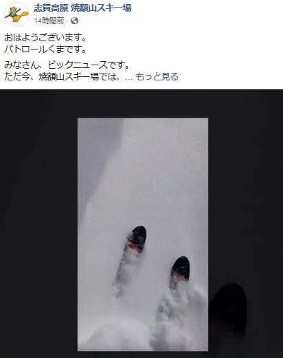

# 今週末も志賀高原！…29日土曜は曇り，午後には晴れ間も！1日日曜は終日曇り．土曜午後の日当たりのよい一部を除いて，冷え冷えのいい雪で滑れそう！

📅 投稿日時: 2020-02-28 23:43:42

えー．

本日は，焼額特派員から，いろいろ

うらやましい連絡が飛んできた一日

でした…

本日金曜の朝，

「昨晩からの積雪が，10～20cmはありそう」

と予想した通り，

20cmの積雪があったようで…

（[焼額山Facebook](https://www.facebook.com/yakebitaiyama/?hc_ref=ARTBvGYF8yutMBWeaJubzBgLRjQ489tORdLlJoFmycDZAHOuMV9pqRU-vR2H1UQX8c8&fref=nf&__xts__[0]=68.ARDI_LysSnXllt4yoKJiwTcthpCR1ucZ-LTsrmLYC4HFo44oQdkTRbjf8aN1PepwD9W4WDJSIWOso96dQrLAJnLXZ42a__VYXCrWRS7Fii4st5BLCF2cc7ECG4QEHkyCeggTq4UmgV6GSYXjmbK2WtUktA0XMCtQIHts6LbheSLMrFEkclHr5MlcoDREpb3ri5geKijFE2SR94Zebx7cdABWiCGWkEongk5AC0bGqnc_3ocjU8YBj6P-8unZ_Whinz-kudpbTGRst7vt9KCylgOXscaSpxGPVYqydjBN9TNemtLTcpEh_rPKXuDt45_VHNzvf5w4ncYvxFKb8lY1DhSLtt1IaWgfjH0AHQ&__tn__=kC-R)より）

あさイチの非圧雪コースは，

いい感じのパフパフだったようですね！

「朝は多少雲が残るかもしれないけど，

　じき晴れ」

という予想の通り，朝まで雪降りだったけど，

昼間は晴れたようで…

で，まさに

「この日は終日気温が低く，雪質は最高のまま

　晴天という恵まれたコンディション

　シーズン最高級の一日」

と予想した通りの一日だったようですね…

…あぁ…

今日滑れた人，良かったですね…（羨望の目）

滑りたかった…

でも．

明日もいい雪で一日滑れそうで．

もしかすると，午後に晴れ間も出てくるかも？？

…ちょいと気温が上がりそうなので，

あんまりすっきり晴れない方が

雪質的にはいい気もするんだけど…

とりあえず，土日の直前予想は，

土曜に晴れ間がのぞきそう…ってところと，

日曜明け方にちょっと雪が降るかも？

ってところ以外，

水曜夜の予想の通りです．

29日（土）：この日の朝は-5℃前後．

　天気は曇り空．

　あさイチは冷え冷えの締まった圧雪！

　昼間の気温は0℃前後まで上がる．

　昼過ぎには日が射すタイミングも

　ありそうなので，昼間の日当たりが

　いい斜面は雪がちょっと緩むかも．

　でも，大体ほとんどのバーンは

　終日いい感じの雪をキープ．

　午後はちょっと凸凹したバーンになり，

　急斜面の一部はコブ溝に硬い

　下地が出てきそう．

1日（日）：朝の気温は-3℃くらいかな？

　終日曇り空．

　明け方，リフト営業開始のかなり前に

　チラチラ雪が降り，1-2cmほど

　うっすら積もるかも．

　あさイチは締まったいい感じの

　シマシマバーン！

　この日も昼間は０℃前後まで

　気温が上がるけど，

　終日曇り空なので，日差しに

　やられず，雪は終日いい感じを

　キープ．

　午後は多少凸凹するものの，

　それほど荒れず割とフラットな

　バーンを飛ばせそう．

　太陽は顔を出さなさそうな一日．

…というところでしょうか．

ってなことで．

私はいつも通り，朝イチから焼額を滑ってます～！！

…そしていつも通り，あと4時間後に出発．

また睡眠4時間切りか…（泣）

## 💬 コメント一覧

### 💬 コメント by (m&t)
**タイトル**: Unknown
**投稿日**: 2020-02-29 14:38:39

Sさん！今日は1ゴン御一緒出来て楽しかったです。しかも8人全員がSさん繋がり！凄すぎです。Sさんの人柄ですね。ご一緒したはなげ親分ご夫妻、まーくんとお仲間さんまたお会いしましょう!

明日も滑ってます!

### 💬 コメント by (m&t)
**タイトル**: Unknown
**投稿日**: 2020-02-29 17:55:04

ただ今5時45分東館より。ホンダ夫妻SさんGokuさん4人がヤケビナイターに向かうところを発見!皆さん流石です。我々は明日に備えて休息です。

### 💬 コメント by (Skier_S)
**タイトル**: ＞m&tさま
**投稿日**: 2020-03-01 04:41:52

今日はゴンドラご一緒できましたね…

そして，にぎやかなゴンドラに巻き込まれましたね(笑)．

なんだか最近，いつの間にか集まった人で1ゴンがあふれるほどに

なってしまうことが増えてきました．

そして，ナイターに行くところみられてましたか(笑)．

