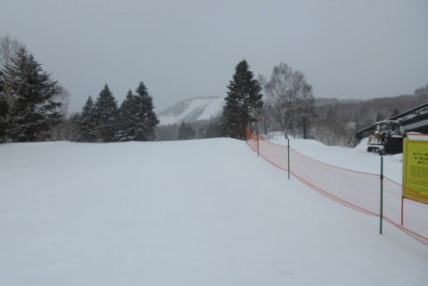
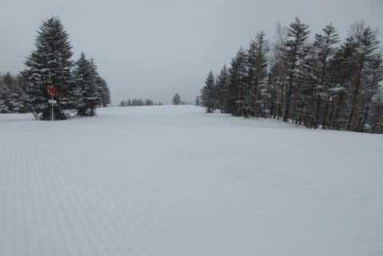

# 今日の志賀高原は雪！…かなり重い雪だけど（涙）．そして8日の志賀高原は雪にならず，週末は気温が高そう…

📅 投稿日時: 2022-04-05 05:47:18

🏷️ カテゴリ: [日記](cc4b5682fb7b8b144980957a978653fb0.md)

ということで．

今日もなぜか更新がこんな時間になって

しまったので．

手短に更新…

これまで，この時間でもまだ暗かったけど．

もうこの時期になると，完全に日が

昇ってますね（涙）

ってなわけで．

特派員から送られてきた本日の志賀高原の

状況ですが…

午前は曇り～雪降り．

下地がカリカリの上にとてつもなく

重い雪が積もって，すごい滑りにく

かったようで．

午後には雪も止んだようですが，

湿った積もった雪が融け始め，

板に貼りつく雪になって難渋したらしく．

決して楽しい一日ではなかったようです…

うーん．

残念…

このあとの志賀高原．

気温が高い日が続きそう…

金曜の雪が降るかも？と，昨日書いたけど．

雪の確率は無くなりました…

気温も高く，何も降らなさそう（涙）

少なくともこれから10日の日曜まで，

昼間の気温は+5℃～10℃くらいに

上がる，晴れか曇りの日が続きそう

です…

あぁ…シーズンが終わっていく…

贅沢は言わない．

あと一度．

今シーズン，せめてあと一度だけでいいから．

冷え冷え激軽の腰までの深さの

最高パウダーを，晴天の中で

一日中滑りたい…←そりゃ凄いゼイタクだよ…

そして4月にそんなことがあったら異常気象だから．危ないから

## 💬 コメント一覧

### 💬 コメント by (レインボー74)
**タイトル**: Unknown
**投稿日**: 2022-04-05 08:07:56

今朝は乗り場はゆるゆるです。

でも、オリンピックだけは夕方圧雪なので、他とは雪質が違うとのことです。

皆様おきをつけて！

### 💬 コメント by (レインボー74)
**タイトル**: Unknown
**投稿日**: 2022-04-05 12:32:16

火曜日の志賀高原情報

朝の上林+5℃　蓮池+4℃。イチゴン乗り場は朝から柔らかくて

フワフワ。

従業員によると、オリンピックだけは夕方圧雪なので、他とは雪質が違うとのこと。

まずはGS。魔法の絨毯のよう。

GSをおかわりしたら、もう踏み跡が深い。

あとはパノラマからの遠回り。昨日のように足掴みがいないだけでも大満足です。どこそこのどなたかのように、腰パフふかふかなんて大望は抱きません。

柔らかくて、どんどんブカブカになっていくけど、止まらないというささやかな幸せだけを味わいながら、何本も繰り返しました。

昼前にオリンピックへ。入ってみると意外といい。ぼこぼこになってないし。急斜面もそれほど荒れてない。

でも、これで業務終了。ベタベタ雪なので足が疲れます。老人は怪我する前に退散です。

今日も東館で食事。ブルジョアの仲間入り？

### 💬 コメント by (モイストシルバー)
**タイトル**: Unknown
**投稿日**: 2022-04-05 21:21:47

本日日帰りで参戦しました。レインボー74様の仰せの通り、朝のオリンピックコースはフラットで固めのバーンで感激モノでした。パノラマも悪くなかったです。まだまだ雪があるので、また伺いたいと思います。

### 💬 コメント by (Skier_S)
**タイトル**: コメント回答遅れました
**投稿日**: 2022-04-07 02:45:03

＞レインボー74さま

春の重い雪は怪我をしやすいのでお気をつけて…

東館のステーキ，私も食べてみたい…

＞モイストシルバーさま

コメントありがとうございます～！

日帰り志賀お疲れ様です．

雪はまだまだあるので，GWまで志賀にお越しください！！

