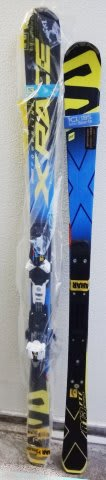

# 第6回，物欲選手権！その3

📅 投稿日時: 2016-10-01 06:19:32

🏷️ カテゴリ: [スキー雑談](c1f9d2cb7478308da16419928ea3945e9.md)

土日祭日が5連続出社になっているSkier_Sです（涙）．

今日もこんな時間に帰宅…

外はもう明るいよ（泣）．

ってことで．

物欲選手権，第6回の勝負やいかに？？

まだ，その1を見てない方は[こちら](e7e02015f03823884a3522a56c651a398.md)から．

その2は[こちら](eaaeda9e3778e907e346756df54a64c29.md)

では，どうぞ～！

-----

アナウンサー　「そしていつものお店にやってきた，

　Skier_S選手ですが…板をチューンナップに出しましたよ？」

解説　「あぁ，神田に来た本来の目的，板のチューンナップを

　お願いしていますね～」

アナウンサー　「そして…ブーツの当たり出しもお願いしたようです．

　店員さんが当たり出し個所を確認に入ってます．

　…

　…

　…板尾さん，Skier_S選手．

　出しましたね～，

　板をチューンナップに…」

解説　「板のチューンナップに1万円近くも払ったということは，

　この板を来シーズンもメインで使うということを

　覚悟した，ということですね…

　さらにブーツも当たり出しに出したということは．

　これも新規購入は無いでしょう…」

アナウンサー　「なんと！！Skier_S選手．

　予想に反して．あっさりと板とブーツを

　チューンに出したということで．

　今シーズンの板とブーツ，来シーズンも

　継続利用が決定です！！

　ということで．今回，大物の買い物は

　無いようです…！」

解説　「Skier_S選手，これで小物も我慢すれば，

　歴史に残る，初勝利となりますよ…」

アナウンサー　「さて．Skier_S選手．

　小物も我慢して，

　初の物欲選手権での勝利を手中にできるのでしょうか！？」

解説　「しかし，もう，品物を見るつもりはないようですね…

　店員さんとダベッてます…」

アナウンサー「さぁ．Skier_S選手，ざっと店を見まわしています．

　『せっかくここまで来たんだから』という思いに

　駆られているのでしょうか？

　はたして，何も買わずに神田を立ち去ることができるのか？？

　ついにこのまま，初勝利となるのか！？？」

解説　「…まさか，物欲大魔王のSkier_S選手に限って，

　このまま手ぶらで帰ることはないと思うんですが…」

アナウンサー　「Skier_S選手．もう品物を見ることなく，

　店員さんと話し続けててます…

　…あれ？」

アナウンサー　「あれ？店員さん，電卓をたたいてますね…」

解説　「叩いてますね…」

アナウンサー　「Skier_S選手，驚いてますね…」

解説　「そして，うなずいてますね…」

アナウンサー　「店員さんが何かを持ってきたようですが…」

解説　「持ってきましたね…」

アナウンサー　「これは，私の目の錯覚でなければ．

　スキー板のように見えるのですが…？」

解説　「いや…私にもスキー板に見えます．

　目の錯覚ではないです．これは，スキー板です」

アナウンサー　「なんてことだ～っ！

　お金を支払ってます！板の代金を支払っているようです！

　どうしたことだ～っ！！！？？

　板をチューンナップに出したというのに．

　Skier_S選手．

　さらに板を購入してしまったようですっ！！」

解説　「これは…

　なんという，予想を超える意志の弱さ…！

　ある意味，期待を裏切りませんね」

アナウンサー　「これはいったい，どういう展開だったのでしょう？」

解説　「どうやら今回，小回り用のSXをチューンに出したけど，

　大回り用のX-RACEをどうしようか悩んでいたところ．

　昨シーズンモデルのX-RACEが想像よりずっとずっと

　安い金額だったので，1秒も悩まず即決だったようです」

アナウンサー　「…今回買う予定の無かった板を，

　1秒で即決ですか…

　この物欲の抑えられなさ．

　さすがとしか言いようがないですね…」

解説　「彼は．やはり．我慢という概念を，

　どこかはるか遠くのアンドロメダ星雲あたりに

　置き忘れてきているようですね…」

　

アナウンサー　「ということで，

　　第6回 スキーヤーの物欲を刺激する街神田に来て，

　物欲にまみれたスキーヤーが買い物をせずに

　我慢できるか選手権　　

　グローブもパンツも我慢したのに，

　やはり板という大物に行ってしまった

　Skier_S選手．

　きわめて予想通りの完敗ということで．

　幕を閉じました．

　では，また第7回選手権でお会いしましょう！」

解説　「…やっぱり，まだ続くんですか…」

ーーー

…ということで．

想定外に，買ってしまいました，

'16 X-RACE 175cm．

なんてったって，

'15 X-RACE 165cmが結構いい板だったので…

しかし．

旧モデルのX-RACE，ここまで安いとは．

物欲に，負けたっ！！

## 💬 コメント一覧

### 💬 コメント by (yama)
**タイトル**: 予想どうり
**投稿日**: 2016-10-01 08:10:58

やはり物欲に負けましたね。連日の勤務ご苦労様です。こちらも先週は勤務、今日も仕事に行きます。シーズンインは21日のナイターを予定しています。休日では22日と30日を考えていますが、勤務の関係で確定ではありません。直前にまた、メールしますので都合が合えばご一緒できたら嬉しいO(≧∇≦)oです。11月には庭の柚子も渡せると思います。

### 💬 コメント by (Goku)
**タイトル**: やっぱり
**投稿日**: 2016-10-01 11:26:30

やっぱり完敗ですか(笑)

それにしても、175のX-RACE ですか。

もう、そのスピードにはついていけそうもありません。

でも、物欲選手権はこれで終わりではないですよね。

ついでに、やっぱり小物も買ってしまいました。

って、落ちがあるはず…

### 💬 コメント by (Skier_S)
**タイトル**: 完敗です…
**投稿日**: 2016-10-02 23:59:53

＞yamaさま

予想通り，大回り板行っちゃいました…

こちらはこの土日もやはり会社でした（涙）．

Yetiは29.30日の1泊2日で行こうかと

考えています…

まだ行けるかどうかわかりませんが（悲）．

＞Gokuさま

完全に完敗です．

165cmのX-RACEを買ったときの半額

でしたから…

で．165cmのX-RACEでも，新品の時は

驚くべき高速耐性でしたから，

今シーズンの朝イチヤケビは，さらにパワーアップ

間違いなしです（笑）

