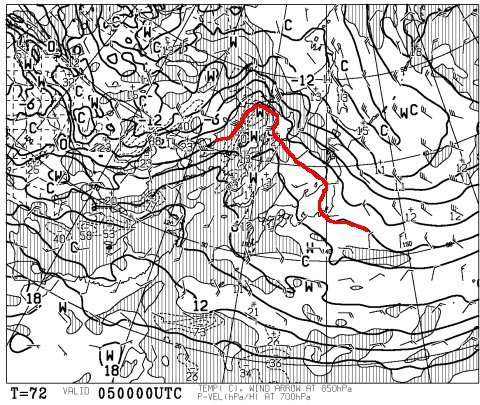
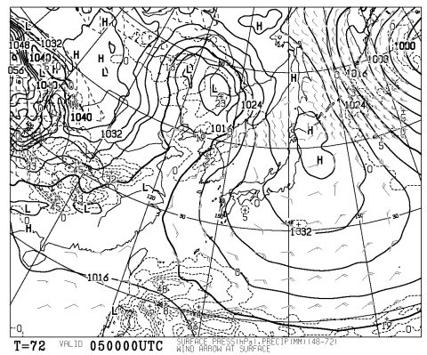
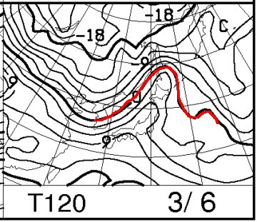
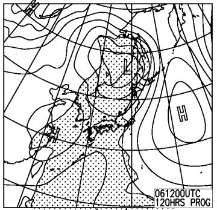
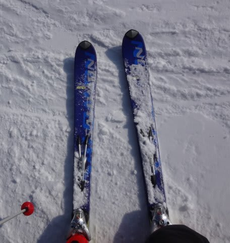
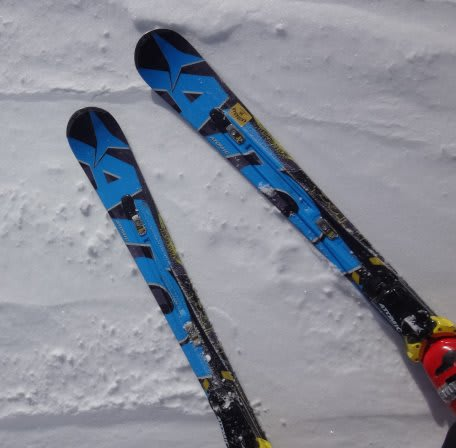

# 今週末は，何とか雨は回避されたか…？　そして，15年前の板を履いてみた

📅 投稿日時: 2016-03-03 01:00:02

🏷️ カテゴリ: [日記](cc4b5682fb7b8b144980957a978653fb0.md)

ということで．

…普通ならトップシーズンの，

1月最終週から3月第1週まで．

この，6回の週末のうち，4回の週末で雨の危機

がやってくるという，

ありえない状況を迎えつつある今日この頃，

皆様いかがお過ごしでしょうか．

…ということで．

今日の段階での最新天気図を見てみると．

うーむ．

土曜5日の850hpa気温予想は…

相変わらず，0℃線は，志賀高原より北だよ…

で．

地上天気図はこんな感じなので．

高気圧に覆われて，終日晴れかな…

晴れるのは嬉しいけど，

すぐに気温が上がって，強烈な日差しで

春の雪になっていきそうなパターン…（涙）．

そして，日曜の850hpa気温図は…

うぐぅ…（屍）．

やっぱり，気温は上がる予想のまま．

強烈な南風で，+10℃近い，4月下旬並みの気温になるか…（泣）．

日曜の地上天気図を見てみると．

うむ！！

降水域予想の網掛けは，志賀高原にかかってません！！

これは…

今の段階の予想でも．

日曜は雨は降らずにもちそう！！

そこは救いだなっ！！

ってことで．

現時点の予想も．

土曜は晴れ．朝イチはいいけど，気温が上がり春の雪．

日曜は晴れ→曇り．午後は強烈な南風の高温．夜から雨

という感じですか…

とりあえず，明日．

また詳細天気予想をやりますので…

…ってことで．

これで終わると，また3日連続天気予想ネタになるので．

今日はちょいと小ネタを．

えー．

この週末ですね．

一緒に滑った人が珍しい板を履いていて．

んで，たまたまブーツサイズが一緒だったので，

その板を履いてみたわけですよ．

…その板というのは．

これです！

そう…

懐かしの2001年モデル，

SALOMON SUPERAXE10 PILOT．

なんと．

15年熟成済みのモデルです．

いやーーーー．

懐かしいなぁ…

たしか，SALOMONが前年にPILOTのプロトを出して，

この年から大々的にPILOTを売り出したんだよなぁ…

当時試乗してみて，異常に重くて，異常に柔らかい板だと思ったんだけど…

とりあえず．

滑ってみると．

をを！

最近，超重量級の板にばっかり乗っているからか．

…昔は重いと感じたこの板．

すごく軽く感じる…

そして．

…最近の板のように，ターン始動時にトップが自動的にインに

入ってくるような，そういうオートマチックさは無いけど．

かなりきれいにたわんで，上手くカービングできるじゃないか！

結構いいよ！この板！

…と，15年前の板の性能に感動していたけど．

…ちょっと待て．

この板，15年前の板だよね？？？？？

15年履いてたんだよね？？

結構しっかりした張り，返り，エッジグリップ．

…

…ぜんぜんヘタってないんですが…

15年前の板より，2年前の私のSXの方が，

よっぽどマイルドで，返りがなく，グリップしないんですが…（涙）

【今回分かったこと】

　　年に数回しかスキーに行かない普通のスキーヤーは，

　　15年経っても板がヘタらない

私が履くと，なぜか自然に強烈な勢いで板がマイルド化してしまうという，

不思議なスキー板劣化能力を備える私にとって．

「15年前の板が，まだ使えるなんて…っ！！」

と，大変うらやましく思った，Skier_Sだったのでした…

＃毎年スキー板を買わねばならないのは，経済的にツライ…

## 💬 コメント一覧

### 💬 コメント by (Kon Suke)
**タイトル**: 20000メートルクラブ
**投稿日**: 2016-03-10 11:08:57

会長

こんにちは、Ｋｏｎ　Ｓｕｋｅです。

２００００メートルクラブのシールを企画しています。

私のブログに、画像を載せました。

ご意見・あるいは良い案があればよろしくお願いいたします。

http://ameblo.jp/unbalance1/entry-12137622593.html

### 💬 コメント by (Skier_S)
**タイトル**: Kon Sukeさま
**投稿日**: 2016-03-10 20:23:26

うぉぉ！

20000ｍクラブのシール作っちゃうなんて…

すごい…すごすぎる！

板に貼れるサイズとのことですが、寸法はどのくらいなのでしょうか？

まだ職場なので、またのちほどコメントさせてもらうかもしれません。

というか、今晩の記事のネタにさせてください…

…しかし、会長って…(^^;)

### 💬 コメント by (Skier_S)
**タイトル**: Kon Sukeさま
**投稿日**: 2016-03-11 01:13:23

原案じっくり見させていただきました…

シンプルで素晴らしいデザインだと思います…

もう，これ以上の案は私には出しようがありません（＾＾；

費用も共同出資させてください…

あと，今晩の記事のネタにさせてもらいました…

ありがとうございます．

