# 3月20日(月)の志賀高原特派員情報！…晴れて気温は上がったけど，意外と良かった一日

📅 投稿日時: 2023-03-21 02:29:46

えー．

明日も祭日ですが．

行けません．

志賀高原には行けません…（涙）

ダメです．

週末2日かけても仕事が終わらず，

今朝も朝6時まで仕事してたのに．

明日も丸一日かけないととても終わらない

作業量…（涙）

なんということか…

っていうか．

今晩も寝る時間が取れるのか？？

乞うご期待！！←何を？

で．

なんとか今週末の土日は，死んでも滑りに

行くつもりなので．

今後の天気が気になるところ…

とりあえず，21日の明日は昨日の予想通り．

晴れて気温がグングン上がる春スキーの

一日になりそうです…．

そのあとの22日の水曜は，

　液体が降りそう

と書きましたけど…

どうやら，今の天気図では．

リフト営業期間中は降らずに

済みそうですね…

むしろ，22日も昼間は晴れてるかも？？

雨の降り始めは当初想定より遅めの，

22日深夜~23日明け方になりそうで．

23日の木曜は，一日かなり強い雨が降り

続けそうです(涙)

23日はかなり修行の一日となる覚悟を…(涙)

そして，また雪が解けていく…（泣）

で．

23日終日降った雨は…いつ止むのかは

現時点では正確な予想が難しいですが．

24日のリフト営業開始には止んでそう．

24日は雨にならないとはいえ，雨の

あとのザブザブ雪の一日ですね…

そして．

最新の予想天気図を見ると．

25日に降ってくるのは固体ではなく，

液体になるの危機

が迫っています…！！（激泣）

週末に液体が降るのは勘弁してくれ～！！！

もし，25日に降ってくるのが液体なら．

26日の日曜は冷えるので．

雨で融けた雪が凍った，ガリガリの

アイスバーンになる可能性が…（涙）

なんと…

私が滑れない日に天気がよくて，

滑れる日にコンディションが最悪になりそう

とは…！！！

いや．

大丈夫．

今週末は，日ごろの行いが激烈にいい

私が滑りに行くんだから，

志賀高原は最高の冷え冷え雪の晴天に

なるはず…！！！（確信）

そして．

私が滑りに行けない祭日の明日の

志賀高原では，大量音槍や爆弾が

降り注ぐはずなので．

明日滑りに行く方はご注意を…！←何に注意すればいいんだ？？

ってなことで．

今日は平日というのに．

多くの特派員が志賀高原に行っていたようで．

また，大量の写真が送られてきました！！

…結構，飛び石連休の谷間で休んでいる

人が多いみたいですね…

私は朝9時から夜9時まで，途中昼休みもなく

14:00から30分だけあいていた以外，

ずっとびっしり会議だったのに…（恨み節）

とりあえず．

本日も最初はおこみん特派員からの

写真ですが…

今日も見事な晴天だったみたい

ですね…（遠くを見る目）

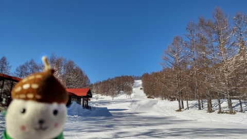

で．

朝から気温は高めとはいえ，マイナス気温で

スタートしたので．

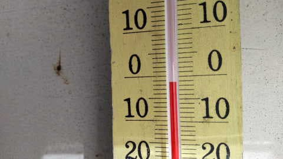

バーンコンディションは結構良かったみたいです！

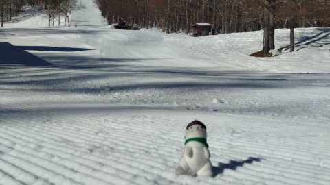

…

ぐはぁ…っ！！！

なんだ，このシマシマはっ！！！

滑りたい…っ！！！！

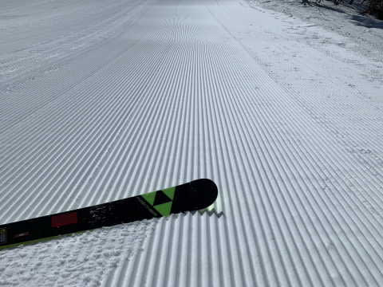

ぐほーーーー！！

これはうらやましすぎる～！！

がーーー！！

滑りたい！！！

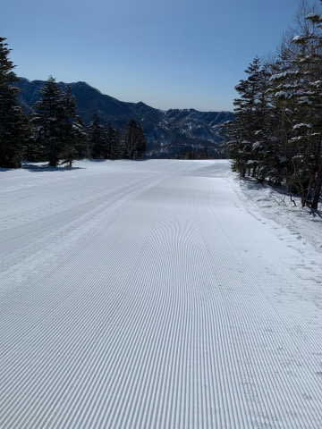

飛び石連休の谷間だったので，

普段の平日に比べれば人は多かった

ようだけど…

でも，ガラガラ！！

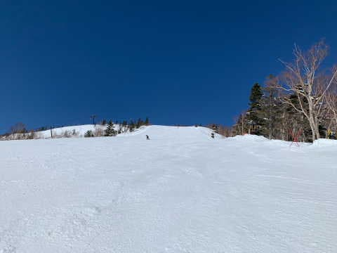

うらやましいほどの晴天ガラガラ！！

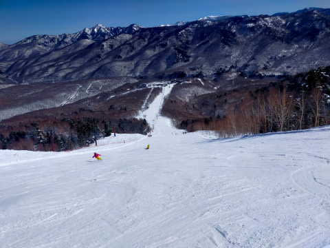

そして，午前中は雪も良かったみたいです…

あぁ…

滑りたい…

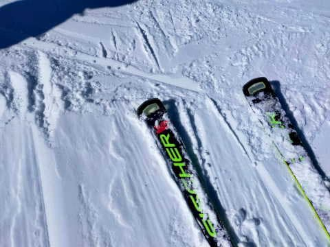

ただ，さすがに午後は気温も上がったので，

雪もかなり緩んで荒れてきたようです…

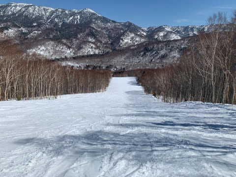

そして…

一部，かなり雪が薄くなってきた

みたいです…（泣）

この写真，分かりにくいけどコース上に

一部雪が薄いところが…（涙）

3月のこの時期に，もう土が出始めるって

ちょっとヤバすぎるんですけど…！！？？

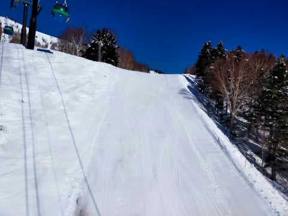

焼額のオリンピックコースも，ごく一部，

そろそろ圧雪をかけるのがヤバい雪の

薄さになってきてるようで…

うーん．GW，大丈夫か？？

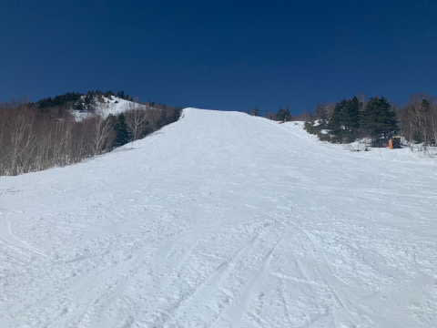

とはいえ．終日すっきり晴天で，

景色も良く．

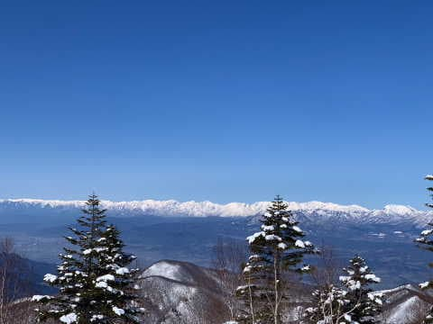

人が少なかったので，そこまでひどい

ボコボコにならず．

多少荒れたものの，昼間も張り付いて

滑りが悪いほどにはならず，板も走った

ようなので…

楽しめた一日だったようです！！

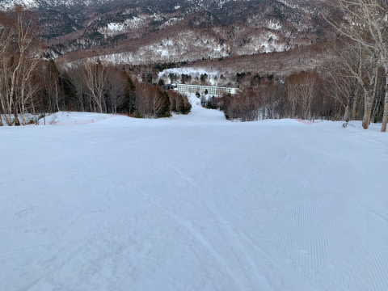

いいなぁ…

滑りに行きたい…

私は明日も泣きながら，家のPCの前に

一日張り付いてます…

焼額特派員の皆さんは，槍や爆弾が

降り注ぐ写真を私に送ってきてくださいます

よう，お願いします（強制）．

## 💬 コメント一覧

### 💬 コメント by (レインボー75)
**タイトル**: Unknown
**投稿日**: 2023-03-21 12:25:31

火曜日の志賀高原情報

今日は私は野球応援のため休場したけど、ゲレンデがらがらだったそうな。雪はよかったけど、11時頃から、唐松中段から妖怪板掴みが出たそうです。

長岡の町なかも、人がいない状況だったとか。

おかげで私は明日もスキーは休場です。

### 💬 コメント by (レインボー75)
**タイトル**: Unknown
**投稿日**: 2023-03-21 12:36:02

明日は、さらにゲレンデはがらがらになるかと思いますよ。

### 💬 コメント by (Skier_S)
**タイトル**: ＞レインボー75さま
**投稿日**: 2023-03-22 04:56:24

21，22日と晴れて，23日から雨が降りそうなんですが…

ちょうど晴れた日にWBCで，それが終わったら悪天候とはついてない感じですね（涙）

