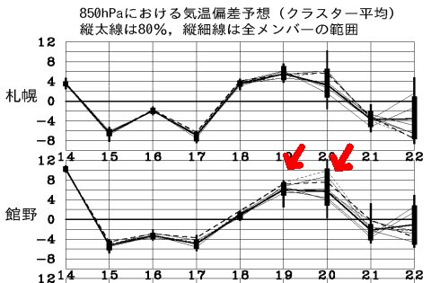
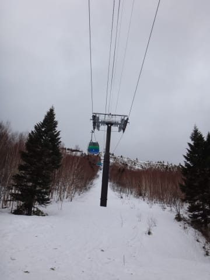
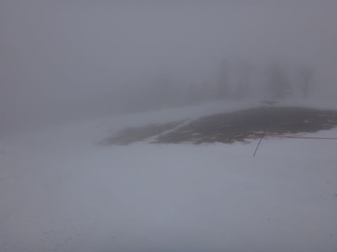
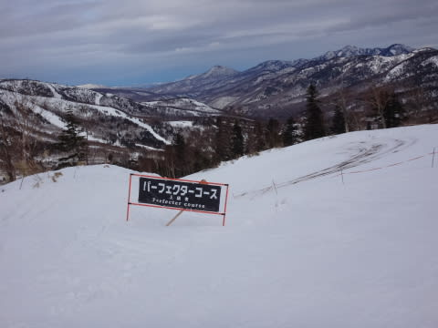

# 2月14日，日曜の志賀高原詳細レポート…2月としては人生最悪のゲレンデ状況．まさに壊滅（涙）．

📅 投稿日時: 2016-02-16 02:07:27

えー．

昨日の大雨で雪が溶けてしまい．

本日，[焼額のオリンピックコースがクローズ](http://blog.princehotels.co.jp/yakebi/2016/02/15/)

してしまったようですが．

でも，今日の昼間に20cmほど積もったおかげで，

[また明日からオープンになる](https://www.facebook.com/yakebitaiyama/posts/936623549766325)ようですね～．

とりあえず，このあとしばらく，

そこそこの寒気がやってくるのですが．

…ですが．

…なんだ，これは…？

…

またか…

また，この週末．

平年比+10℃レベルの高温になるということか…（涙）．

なぜ，狙ったように週末に…（泣）．

とりあえず．

あまり良いニュースが無い今日この頃ですが．

…はい．

行きます．

行きますよ．

この日曜の，ゲレンデレポート．

はい．覚悟してください．

…悲しい現実を，ご覧ください…

ってわけで．

まず，日曜の朝ですね．

雨です．

雨ですよ．

もう，志賀高原の登り道も雪はありません（涙）．

＃トンネルの中は圧雪が溶けずに残っているので，夏タイヤでは無理ですが

そして…

予想通り，強烈な南風（涙）．

朝8時過ぎに駐車場についた段階では，

「1ゴン，2ゴンとも運転見合わせ中」

という，「やっぱり…」な状況でしたが…

なぜか，朝8時半直前に

「2ゴンのみ，減速運転ながらも運転開始」

という情報が！

「どしゃ降りの中，雨に濡れながら

リフトに乗るしかないのか？」

と，思っていたので，ゴンドラが動くだけラッキー！！

ってことで．

超減速運転な第2ゴンドラで山頂へ出ると…

気温は+5度（涙）．

2月の志賀高原ではありえない気温ですが…

でも．

どしゃ降りな南風強風の本日．

もう，+5度くらいの気温じゃ驚かないぞ…

そして．

ゲレンデに出てみて．

いきなり，ゴンドラ乗り場の周りが

GW並みの汚れた雪でも，驚かないぞ…

そして．

ゲレンデがシマシマじゃなく，圧雪車のキャタピラ跡や，

穴ぼこがいっぱいあっても，驚かないぞ…

と，雨が降って視界が悪いゲレンデで

滑り始めると…

え？

なに？？

これ？？

…ゲレンデの真ん中に，水たまり！？？

水が…

水が，ゲレンデの真ん中に溜まってるよ！！

ダメだっ！

どんなことがあっても驚かないつもりでいたけど…

これはダメだっ！

もう，驚きを通り越してしまってるよっ！！！！！

…驚愕っ！

だ，ダメだ～っ！！！

と，悲しみつつ．

雨に煙るゲレンデを1時間ほど滑っていると…

…うむ？？

雨が，止んだ？？

ちょっと，空が明るくなってきたよ！

＃天気が悪いので，誰も滑ってない…

そして．

風も弱まってきたので，

午前11時前には，第1ゴンドラも営業準備に入り始めました！

（搬器を準備し始めて，登り側のみ搬器がついてる第1ゴンドラ）

で．11時から営業開始した第1ゴンドラで，GSコースへ

飛び出すと…

うむ．

雪はひどいものの．

まぁ，シマシマだな．

…でも，かなり穴ぼこだらけのシマシマだな…（涙）．

そして．

朝10時に雨が止み，風も弱まっただけではなく…

あら？

11時過ぎには，日も射し始めてきましたよ？？

昼ごろには，結構明るくなるタイミングも！

いや，今日は一日雨にやられると思っていたから…

晴れてくれるとは思わなかったよ！！

…でも．

これだけ気温が高い日に．

さらに強い日差しは，雪にとって最悪の条件なのだ（涙）

雪が…雪が板に張り付いて，強烈なブレーキが…（泣）．

雨が降っている間は水が浮いてて板も走るけど．

太陽が出てくると，板に雪がねばりつくんですけど…（涙）．

もう，雪質は多くを語るレベルではありません（悲）．

…ってか．

雪質云々のレベルじゃなくて．

第3高速降り場のミドルコース取りつき部分…

え？

これ，ヤバくない？？

そして．GSコースも…

ところどころ，雪が薄くなってきてるよ…（涙）

さらに，オリンピックコースは…

え？

なんですか？

これは？？？

ダメじゃん！！

まともに滑れるレベルじゃないんですけどっ！！（爆泣）．

ああ…

なんてこった…

また，雪不足に逆戻りか…

そして．

せっかく雨が止んで，時折晴れていた天気も．

午後2時にはまた視界が悪くなりはじめ…

そんな中，あまりにも焼額のコンディションが悪いので，

一の瀬方面を見に行こうか…

と，移動する途中の白樺コースも．

…あぁ．

ダメか…

そして．

一の瀬へ行って，昨日までかなり良かったパーフェクターコースを

見に行ってみると．

…取りつき部分．

昨日から比べると，すごいことに…

ちなみに，昨日の同じところはこんな感じ．

（昨日のパーフェクター取りつき部分）

…い…一日で，こんなになっちゃったのか…（涙）．

で．

取りつき部分だけじゃなく，コース途中も…

え？何？これ？ブッシュ？？

…それだけじゃなく．

パーフェクターコース，雪が薄くなったので，

圧雪を放棄したのか…？

って感じの荒れ具合．

あぁ…

一の瀬も，メインバーンは大丈夫ですが．

ところどころダメな感じになってます（涙）．

さらに追い打ちをかけるように．

午後3時過ぎに，再び雨が…っ！！（悲劇）

うがーーーー！！

なんだ！

なんなんだ！この週末はっ！！

これが，2月の半ばの週末か！

って感じで．

一の瀬もダメなことを確認して．

悲しみに暮れつつ焼額に戻り…

雪不足の中，雨＆ガスで前が全然見えないという

悲惨な状況に悲しみつつも．

こんな状況でもなぜかリフトストップまで滑り続けた，

Skier_Sだったのでした…←やっぱりそれでも最後まで滑るのね

あぁ…

今，2月だよね？？

2月に間違いないよね？？？

なぜ…

なぜ，こんなことに…（涙）．

あ，そうか．

たぶん．

きっと．

神様が，2月と5月を取り違たんだなっ！？

5月のGWには，2月並みのいい雪質の雪が，ドサドサ降るに

違いないっ！！！！←違う．絶対違う

## 💬 コメント一覧

### 💬 コメント by (まいる)
**タイトル**: 雨でも・・・
**投稿日**: 2016-02-16 18:56:32

お疲れ様です(^^)v　雨でも滑りに行くんですね・・・(-_-;)　私は、土曜日に南会津で滑り、15時くらいに雨になり滑るの止めちゃいました。

来月、三連休に渋温泉泊まりで志賀高原に行くのですが、雪がまともになってることを祈るばかりです。

### 💬 コメント by (FCAMEL)
**タイトル**: こんな状況でも・・・
**投稿日**: 2016-02-16 19:42:38

リフトストップまで滑り続けレポートし続けてくださるSさんのあまりの前向きさに頭が下がります。

私は土砂降りの中、早朝にそそくさと引き上げました。

道に少しだけ残っていた雪が雨でスケート場みたいに滑って怖かったです。。。

今年はほんとに呪われてますね。

### 💬 コメント by (Skier_S)
**タイトル**: どんな天気でもリフトストップまで（笑）．
**投稿日**: 2016-02-17 02:30:33

＞まいるさま

雨でも槍でもテポドンでも，何が降ろうが滑りますよ（＾＾

南会津は，土曜から雨だったんですね…

志賀高原は土曜はナイターまで降らずに済んだので

助かりました．

来月の3連休ですか…

これから1か月後ですね～．

うーむ．

まだ雪がどうなるか，想像つかないですが．

激烈に改善していることを祈るばかり．

＞FCAMELさま

先週はお世話になりました～．

日曜，早朝を乗り切れば9時半すぎには一旦

雨はやんだので，そのあと2時過ぎまでは

雨にぬれずに滑れたんですが…

でも，雪がすごいことになっていたので，

あまり楽しくなかったですけど（＾＾；

…この日曜で，かなり雪が薄くなったので，

このままシーズンが終わってしまわないことを

祈るばかりです…

