# 1月15日の志賀高原詳細レポート…激冷えエンドレスパウダー供給デーなれど…遭難するかと思ったよ

📅 投稿日時: 2017-01-17 04:34:58

えー．

志賀高原は現在も，すさまじい降り方で

雪が積もっているようで．

今日も，奥志賀ゴンドラ・第2ペア・第4ペア，高天ヶ原クワッド，

寺子屋なんかは運休だったみたいで…

さらに．

熊の湯の急斜面や一の瀬のパーフェクターは

『雪崩の危険のためクローズ』

だったようで…

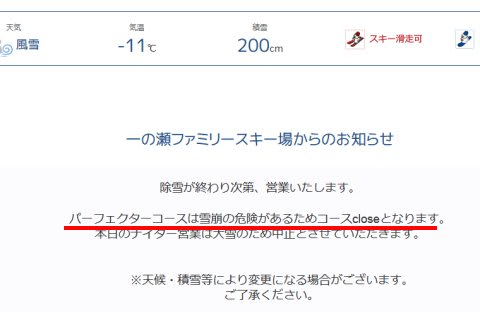

（[志賀高原索道協会HP](http://www.shigakogen-ski.com/lift-operation/detail?place-id=12)より）

こんな感じで，なんだかすさまじい降雪が

続いている今日この頃．

皆様いかがお過ごしでしょうか．

この降雪ですが．

18，19日はひと休みしそうだけど．

20，21，22日と，また降りそうな予感…

今週もまたパウダーデーかな？？

…ってことで．

昨日速報した，日曜の志賀高原の状況，

詳細レポートをば…

えー．

まずですね．

朝，宿の外に出てみると…

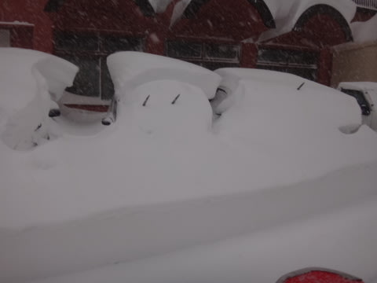

なんだか，すごい積雪なんですけど…！

原型が車と思えないほどに，

オブジェ化してるんですが…

で．ゲレンデに出てみると…

うはーーーー！！

麓での積雪，すでに40～50cm！

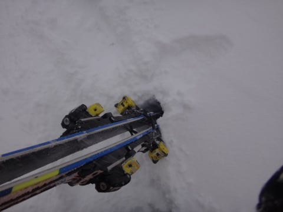

で．

珍しく本日も一の瀬スタートだったので．

激しく雪が吹き付ける中．

圧雪されているはずのゲレンデにも関わらず．

新雪をラッセルしながら

一の瀬のリフト乗り場に向かいますが…

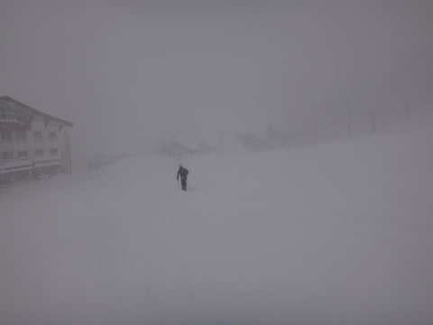

「除雪作業終了後に運転します～」

と言っていた一の瀬ファミリーの営業が．

ひたすら遅れそうな気配だったので．

8:40に動き出したダイヤモンドリフトに乗って，

さっさと焼額へ移動！

＃一の瀬ファミリーは，9時ごろにようやく動き出したらしい…

焼額第2高速リフトも，多少営業開始が遅れたようですが．

8:45には無事動いており．

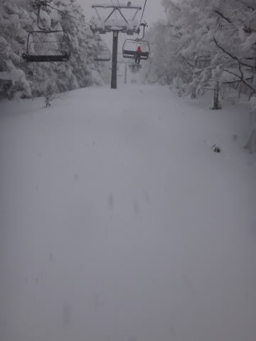

うーむ．

昨シーズンは完全に隠れることがなかった

リフト下の笹薮．

今回の積雪で，完全に隠れましたね～．

…ようやっと，平年並みの積雪になったか…

で．

焼額ゴンドラで山頂へ行くと…

ほう．

そうですか．

気温は-17℃ですか．

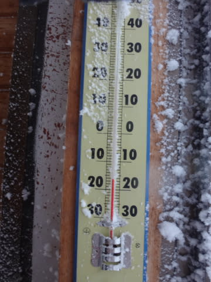

…寒いよ…

そして．

山頂は．

マイナス17℃の風に乗って，激しく雪が

吹き積もっています．

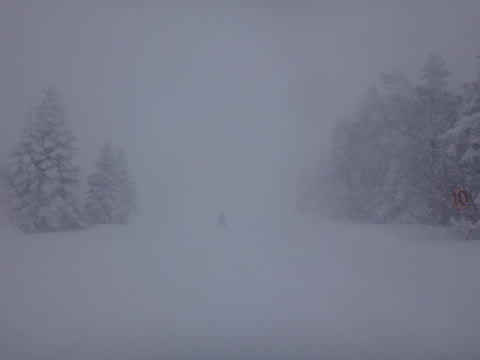

さーーーーむいです．

ゲレンデは，圧雪コースでも10～20cmの新雪が！

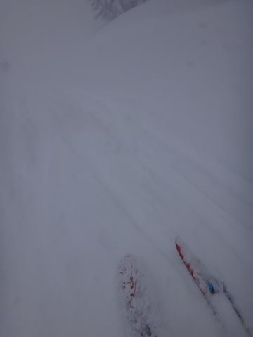

もう，ゲレンデ全面パウダー！

とても朝に圧雪したコースとは思えない，

ブーツパフの新雪！

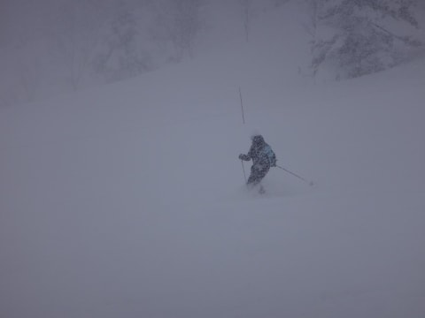

…で．

ここは当然．

新雪モフモフなはずの，オリンピックコースへ

向かうのだ！

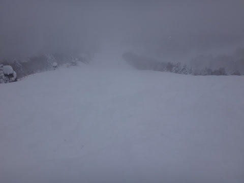

オリンピックコースは…

うむ．

膝～太ももパフ！！

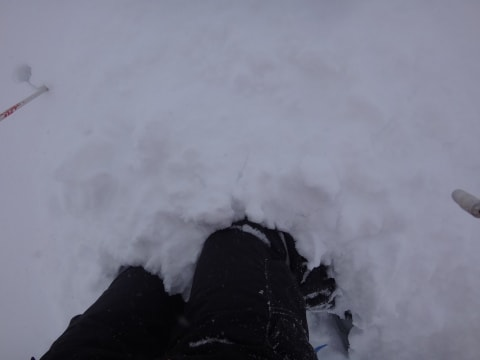

昨日と同じく，ちょいと重めの雪だけど…

いただきま～す！！！

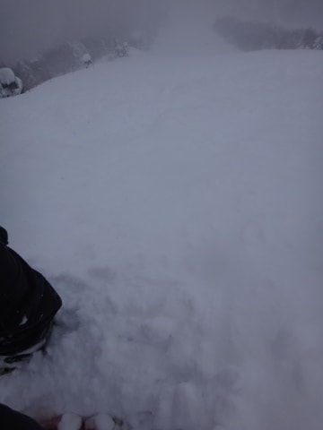

いやっほう！

朝イチパフパフ！

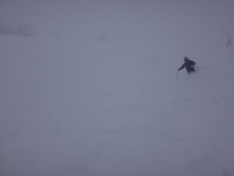

最高っ！

パフパフ最高！

＃165cmのSXで滑ると板が潜りすぎて，かなり重く感じたけど…

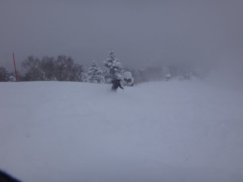

…ただ．

雪があまりにも激しく降り続け．

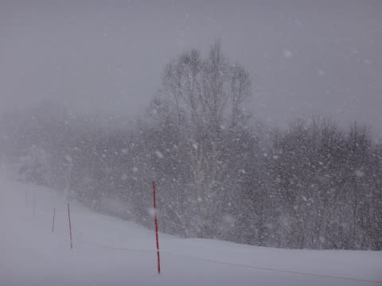

視界が悪く，足元の雪がどんな状態か

よくわからないので…

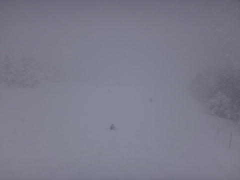

雪が踏まれて荒れてくると，

かなり楽しくない斜面になってしまいましたが…

しかし．

こんな状況にもかかわらず．

焼額第1ゴンドラの乗客．

午前中は，昨日より多かったですね～

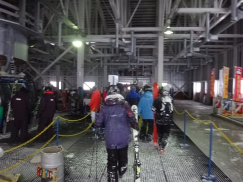

とはいえ，普段はほぼ飛び乗り，待ってる時でゴンドラ搬器3台待つか

どうか…という程度で．

どっちにしろガラガラなんですが（笑）

係員の方曰く，昨日は平日より少ないくらいだったらしいけど．

今日は奥志賀が全面運休になっちゃったので，人が

流れてきたみたいですね～．

そして．

午後になっても，気温はマイナス17～18℃と，

朝よりもむしろ気温が下がったくらいで．

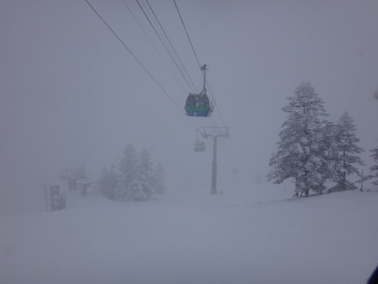

ニットキャップやらフェイスマスクやら，さらには

ゴーグルまで．

あらゆるものが凍り付いて．

寒いというより「痛い」レベル…（泣）．

そのうえ．

さらに激しく雪が降り続け．

なんだか，限りなく視界が0に近づいてきたのですけど…！？？（涙）．

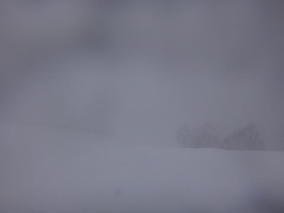

…おかげで．

午後1時過ぎには，ゲレンデに

ほとんど人がいなくなりました．

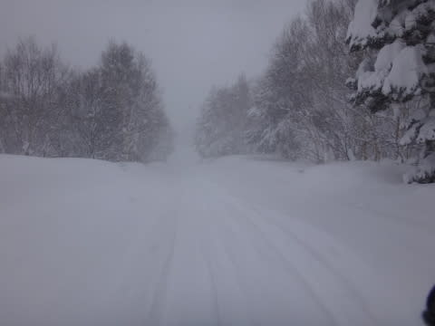

…まぁ．

そうだわな．

普通の神経をしている人間は，こんな状況じゃ

滑らないわな．

＃おそらく，滑っているのはスキーサイボーグと

＃人型スキーロボットだけ

で．

人が少なくて，雪が激しく降り続ける，というのは

どういうことかというと…

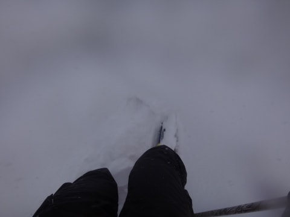

…午後になっても．

圧雪コースでこんな感じで．

どこがコースだかわからないくらい，

そこらじゅうが新雪にリセットされていきます…

えーっと．

ここ，コースなんですか？？

人が滑っているはずの圧雪されたコースが，

こんなになっちゃうんですか？

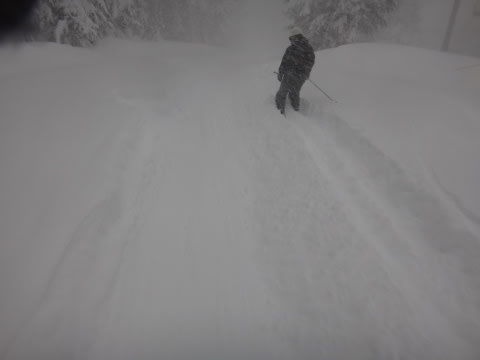

それも，比較的重めの雪なので．

緩斜面は人のシュプールについて行かないと，

止まっちゃう…（涙）．

さらに．

午後2時半を過ぎると…

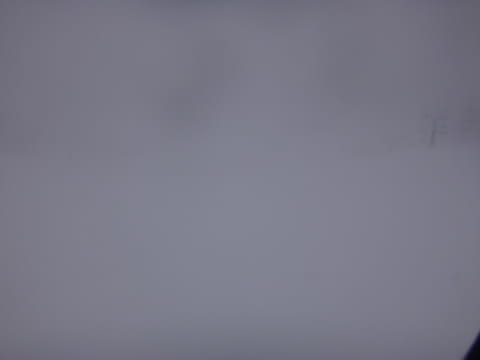

…完全にホワイトアウト（涙）．

そして，

見えない中適当に滑ると…

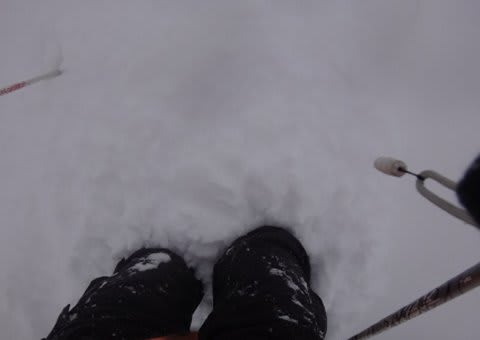

圧雪コース上なのに，いきなり予期せぬ

吹き溜まりに突っ込みます（泣）．

コースを知っている人はいいけど．

コースに慣れてない人は，新雪に突っ込んで進めなくなると，

どっちが斜面の下かわからなくなっちゃうし．

コース外に外れちゃったと勘違いするかも？？

ってな感じで．

ゲレンデが

コース上で遭難できるレベル

の危険な状況になってきたので．

焼額は，ゴンドラが3時に，リフトも3時半に終了（涙）．

一の瀬ファミリーも，クワッドが昼過ぎに，

ペアリフトも3時ごろには終わっていたようで…

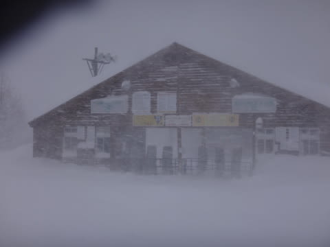

まぁ．

ゲレンデがこんなだから．

仕方ないわな…

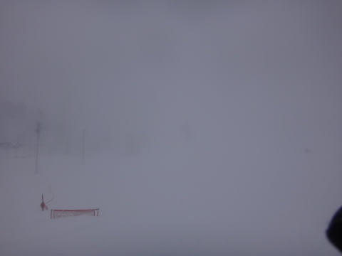

ってことで．

リフトも終わっちゃったし．

帰ろうか…

と，思ったところ．

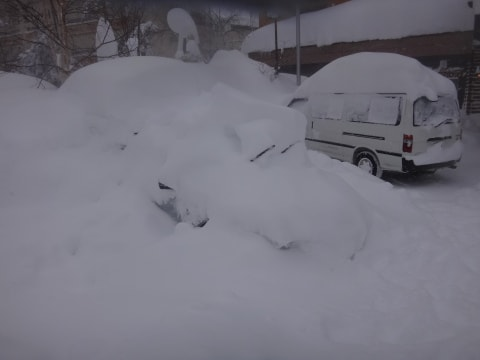

え？

ええ！！？

…こ，これが，我が車か…

我が車．前衛芸術と化してますね．

ってか．

こっちから見ると．

もう，どこが車かわかりませんね（涙）．

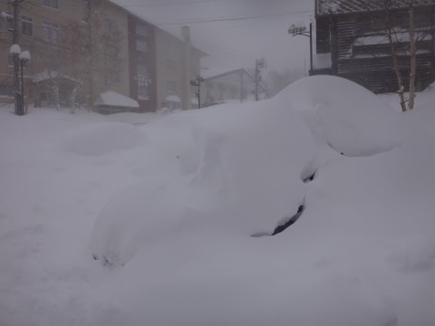

ドアを開けられるレベルに掘り出すのに，

どれだけかかったことか…（泣）．

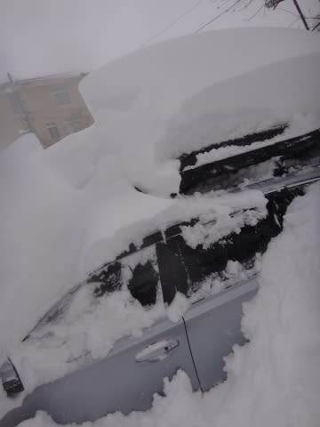

（必死に発掘作業中）

そして．

道が見えない中，下山して…

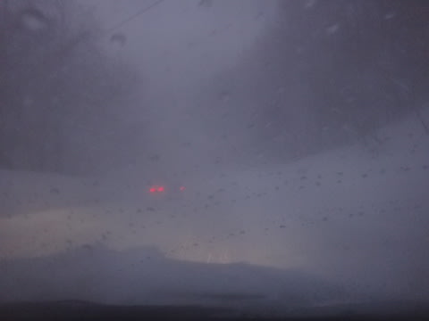

佐久までチェーン規制がかかっている，

本格雪道の高速を運転して，帰宅したのでした…

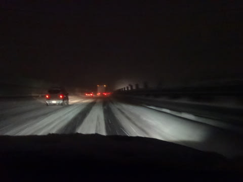

しかし．

この2日間，降った．

ありえないくらい積もりました…

…雪が降ってくれるのは嬉しいけど．

何事も限度ってものがあるよな

と，思ったSkier_Sなのでした．

余談：

　この猛吹雪＆ホワイトアウト＆リフト営業短縮の中．

　某20000mクラブな方．

　「え？お昼ご飯？食べてませんよ」

　と言い放ち．

　休憩することなく10000m以上の標高差を滑っていたという…

　やっぱり，20000mクラブのメンバーは違う．

　何かが，違う．

## 💬 コメント一覧

### 💬 コメント by (Unknown)
**タイトル**: Unknown
**投稿日**: 2017-01-17 11:41:30

一の瀬ファミリーペアは 15:30 で終了でした。

浅野学園ゼッケンも最後までゲレンデにいました。

彼らを目印にしないと斜度感がなくなりそうでした。

### 💬 コメント by (Skier_S)
**タイトル**: Unknownさま
**投稿日**: 2017-01-18 01:21:28

一の瀬ペアは，15:30までやってたんですね．

私は15:30ちょっとすぎに一の瀬に戻ってきたんですが…

もう少し早ければ，あと1本乗れたのか…（残念）．

しかし．ホントに斜度感を失う天気でしたね～！

